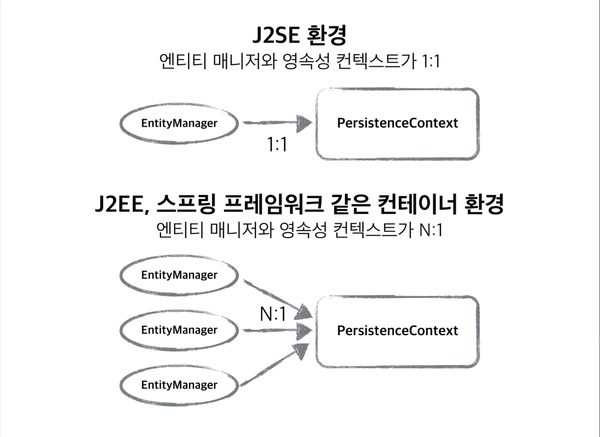

## 로맨틱한 JPA

<br>
<br>

## JPA 란 무엇인가?
__JPA(Java Persistent API)__

JPA는 여러 ORM 전문가가 참여한 EJB 3.0 스펙 작업에서 기존 EJB ORM이던 Entity Bean을 JPA라고 바꾸고 JavaSE, JavaEE를 위한 영속성(persistence) 관리와 ORM을 위한 표준 기술이다. JPA는 ORM 표준 기술로 Hibernate, OpenJPA, EclipseLink, TopLink Essentials과 같은 구현체가 있고 이에 표준 인터페이스가 바로 JPA이다.

ORM(Object Relational Mapping)이란 RDB 테이블을 객체지향적으로 사용하기 위한 기술이다. RDB 테이블은 객체지향적 특징(상속, 다형성, 레퍼런스, 오브젝트 등)이 없고 자바와 같은 언어로 접근하기 쉽지 않다. 때문에 ORM을 사용해 오브젝트와 RDB 사이에 존재하는 개념과 접근을 객체지향적으로 다루기 위한 기술이다.


| 버전 | 연도 | 설명 |
|---|:---:|---:|
| `JPA 1.0(JSR 220)` | 2006년 | 초기 버전, 복합 키와 연관관계 기능 부족 |
| `JPA 2.0(JSR 317)` | 2009년 | 대부분의 ORM 기능 포함, JPA Criteria가 추가 |
| `JPA 2.1(JSR 338)` | 2013년 | 스토어드 프로시저 접근, 컨버터, 엔티티 그래프 기능 추가 |

<br>

## JPA를 써야하는 이유

#### 생산성
* JPA를 자바 컬렉션에 객체를 저장하듯 JPA에게 저장할 객체를 전달.
* INSERT SQL을 작성하고 JDBC API 사용하는 지루하고 반복적인 일을 JPA가 대신 처리해준다.
* CREATE TABLE같은 DDL문 자동 생성
* 데이터베이스 설계 중심의 패러다임을 객체 설계 중심으로 역전

<br>

#### 유지보수
엔티티에 필드 추가시 등록, 수정, 조회 관련 코드 모두 변경
JPA를 사용하면 이런 과정을 JPA가 대신 처리
개발자가 작성해야 할 SQL과 JDBC API 코드를 JPA가 대신 처리해줌으로 유지보수해야 하는 코드 수가 줄어든다.

#### 패러다임 불일치 해결
* 상속, 연관관계, 객체 그래프 탐색, 비교하기 같은 패러다임 불일치 해결

#### 성능
* 중간 계층이 있는 경우 아래의 방법으로 성능을 개선할 수 있는 기능이 존재한다.
    * 모아서 한번에 요청을 처리하는 버퍼링 기능 
    * 읽을 때 쓰는 캐시기능
* JPA도 JDBC API와 DB 사이에 존재하기 때문에 위의 두 기능이 존재한다.


#### 데이터 접근 추상화와 벤더 독립성
SQL이 각 DBMS(MySQL, Oracle)에 따라 만들어져서 독립적이다, 방언으로 인한 격차를 해소한다고 이해하고 있다.

<br>

## JPA는 DB에 종속적이지 않다.

#### hibernate.dialect 속성 지정하기

바로 위 `JPA를 써야하는 이유` 부분에서 "데이터 접근 추상화와 벤더 독립성"를 언급했다, JPA를 사용하기위해선 `src/main/resources` 디렉토리 안에 `META-INF/persistence.xml` 파일을 생성해야 하고
그 안에 JPA 관련 설정을 적어주어야 한다.

persistence.xml 파일안에 `<property name="hibernate.dialect" value="org.hibernate.dialect.H2Dialect"/>` 라는 속성이 있다.
중요한 속성이고 내가 사용하는 DB의 종류에 따라 value가 달라진다. 예로 적은 코드에서는 H2를 사용하는 경우이다.

JPA는 DB에 종속적이지 않다, 극단적으로 db를 mysql에서 oracle로 변경해도 큰 어려움없이 교체 가능하다.
DB마다의 특성이나 조금씩 다른 sql 쿼리를 가지는데 (예를들어 mysql에선 limit, oracle에선 rownum) 이런 개념을 JPA에서는 방언(dialect) 이라 표현했다.

하이버네이트는 40가지 이상의 데이터베이스 방언을 지원한다.

```
h2         : org.hibernate.dialect.H2Dialect
Oracle 10g : org.hibernamte.dialect.Oracle10gDialect
MySQL      : org.hibernate.dialect.MySQL5InnoDBDialect
```

## persistence.xml 살펴보기

```
<?xml version="1.0" encoding="UTF-8"?>
<persistence version="2.2"
             xmlns="http://xmlns.jcp.org/xml/ns/persistence" xmlns:xsi="http://www.w3.org/2001/XMLSchema-instance"
             xsi:schemaLocation="http://xmlns.jcp.org/xml/ns/persistence http://xmlns.jcp.org/xml/ns/persistence/persistence_2_2.xsd">
    <persistence-unit name="hello">
        <properties>
            <!-- 필수 속성 -->
            <property name="javax.persistence.jdbc.driver" value="org.h2.Driver"/> <!-- 무슨DB를 쓰는지 -->
            <property name="javax.persistence.jdbc.user" value="sa"/> <!-- 유저이름 -->
            <property name="javax.persistence.jdbc.password" value=""/> <!-- 비밀번호 -->
            <property name="javax.persistence.jdbc.url" value="jdbc:h2:tcp://localhost/~/test"/> <!-- 접근URL 경로 -->
            <property name="hibernate.dialect" value="org.hibernate.dialect.H2Dialect"/> <!-- 하이버네이트 방언 지정-->

            <!-- 옵션 -->
            <property name="hibernate.show_sql" value="true"/> <!-- 실제 구동하는 SQL 쿼리를 보여줌 -->
            <property name="hibernate.format_sql" value="true"/> <!-- 읽기 조금더 편하게, 코드를 이쁘게 포맷팅해줌 -->
            <property name="hibernate.use_sql_comments" value="true"/> <!-- 실행된 SQL 쿼리가 어느객체에서 실행되는지 보여줌 -->
            <!--<property name="hibernate.hbm2ddl.auto" value="create" />-->
        </properties>
    </persistence-unit>
</persistence>

        <!--
            hibernate.dialect 속성 지정하기
            h2         : org.hibernate.dialect.H2Dialect
            Oracle 10g : org.hibernamte.dialect.Oracle10gDialect
            MySQL      : org.hibernate.dialect.MySQL5InnoDBDialect
            JPA는 DB에 종속적이지 않다, 극단적으로 db를 mysql에서 oracle로 변경해도 큰 어려움없이 교체 가능하다.
            DB마다의 특성이나 조금씩 다른 sql 쿼리를 가지는데 (예를들어 mysql에선 limit, oracle에선 rownum) 이런 개념을 JPA에서는 방언(dialect) 이라 표현했다.
            하이버네이트는 40가지 이상의 데이터베이스 방언을 지원한다.
        -->
```
persistence 설정 파일을 yml로 변경하는 것도 가능하다.

<br>

## H2 DB로 실습 및 주의사항

H2 DB는 인메모리에서 실행되는 데이터베이스로 주로 간단한 실습 및 테스트환경에서 많이 사용된다고 한다.
[H2 사이트](https://www.h2database.com/html/main.html)로 이동해서 OS환경에 맞게 설치해주고 console을 통해 접속하면된다. (맥의 경우 bind/h2.sh 파일)

<br>

#### H2 접속이 안될때

처음 H2 데이터베이스를 실행했을 때
`Database "~/test" not found, and IFEXISTS=true, so we cant auto-create it [90146-199]`
이런 오류가 발생하는 경우가 있다, 데이터베이스 파일이 없는 상황인데


위 이미지 처럼 JDBC URL에

`jdbc:h2:~/test` 라고 입력후 연결버튼을 눌러주면 데이터베이스 파일이 생성되면서 연결된다.

이후에는 `jdbc:h2:tcp://localhost/~/test` 로 접속하면된다.
(이미지 처럼 파일에 직접 접근하는 방식은 파일에 락이 걸려서 여러곳에서 접속을 못하는 문제가 있다고 함)

만약 이렇게해도 안되는경우 본인의 PC를 재시작하면 해결된다. (필자 해당)

<br>

## 영속성 컨텍스트

JPA를 공부하며 가장 중요한 부분 2가지가
* 객체를 어떻게 설계하고 관계형데이터베이스를 어떻게 설계하고 이 두가지를 어떻게 매핑할것인가.
* JPA가 내부적으로 어떻게 동작하는가? (영속성 컨텍스트)

JPA에서는 사용자가 요청을 보내면 `EntityManager Factory`가 `EntityManager`를 생성하고  `EntityManager`가 커넥션을 통해 SQL문을 생성해 DB와 통신하게 된다.
`EntityManager.persist(entity);` 코드를 실행하면 DB에 entity라는 값을 저장한다고 생각하겠지만 entity를 영속성 컨텍스트 라는곳에 저장한다는 점이다.

<br>



* 영속성 컨텍스트
    * 영속성 컨텍스트는 논리적인 개념이다.
    * 눈에 보이지 않는다.
    * 엔티티 매니저를 통해서 영속성 컨텍스트에 접근한다.
    


 #### 엔티티의 생명주기
 
 * 비영속 (new/transient)
    * 영속성 컨텍스트와 전혀 관계가 없는 새로운 상태
    
   ```
   Member member = new Member();
   member.setId("member1");
   member.setUsername("회원1");
   ``` 
    
* 영속 (managed)
    * 영속성 컨텍스트에 관리되는 상태
    
    ```
    EntityManager em = emf.createEntityManager();
    em.getTransaction.begin();
  
    // 객체를 저장한 상태(영속)
    em.persist(member);
    ```
    
* 준영속(detached)
    * 영속성 컨텍스트에 저장되었다가 분리된 상태

* 삭제 (removed)
    * 삭제된 상태
    
    
JPA에서 DB와 통신을 통해 값을 저장하거나 변경을 일으킬 때 `em.persist(member);` 라고 코드를 작성해도 DB에 쿼리가 날라가지 않는다.
`commit()` 될 때 실제 쿼리가 생성되어 DB에 날라간다, 즉 애플리케이션과 DB 사이에 중간계층이 존재하고 그것이 __영속성 컨텍스트__ 이다.
이런 메커니즘으로 만들어진 이유는 여러 이점이 생긴다.

* 영속성 컨텍스트의 이점
    * 1차 캐시: (조회할때 DB에서 조회하지 않고 1차 캐시에서 조회하게 된다.)
    * 동일성(Identity) 보장: 자바컬렉션에서 같은 값을 가져와 비교하면 true가 나오듯 `==` 비교로 true값을 얻을 수 있다. (SQL 쿼리인 경우 같은 레퍼런스 인대도 false가 나옴)
    * 트랜잭션을 지원하는 쓰기 지연 (transactional write-behind): JPA는 모두 트랜잭션 이므로 여러 insert를 하는경우 insert문이 여러번 실행되는것이 아닌 commit하는 순간 DB에 insert SQL을 보낸다. 버퍼링을 사용하지않고 매번 query를 날리면 최적화를 할 수 있는 여지조차 없게된다.
    * 변경 감지 (Dirty checking): JPA의 목적이 자바 컬렉션을 다루듯 사용하는 것이다, JPA에서는 값만 바꾸어도 update 쿼리가 실행된다. 이런동작이 가능한 이유가 Dirty checking 기능이다. 영속성 컨텍스트를 통해 `commit()`을 할때 entity와의 스냅샷을 비교한다. 마치 SPA의 리액트가 가상DOM을 통해 변경된 부분만 render하는 것 처럼 말이다.    
    * 지연 로딩(Lazy Loading): 
    
<br>

## 준영속상태

그런데 준영속상태란, 영속상태에 있다가 분리되는 것이다. 처음부터 비영속상태인 것과는 다르다.
영속상태에 있다가 분리가 되었으니 영속성 컨텍스트가 제공하는 기능을 사용하지 못하게 된다. (더티체킹, 업데이트 등등)

영속상태가 되는 경우는 2가지 이다.
* `em.persist(member)`를 통해 값을 넣는경우 (영속성 컨텍스트에서 관리하는 경우)
* `em.find(member.class, "helloA")`와 같이 find로 값을 찾는데 1차 캐시에 없는경우 DB에서 조회해서 가져온 뒤, 1차캐시에 삽입하면서 영속 상태가 된다.


준영속 상태로 만드는 방법
1. `em.detach(member);` 
    * detach, 말 그대로 떼어낸다는 의미이다. 비영속 상태가 되므로 `tx.commit()` 즉, 트랜잭션에서 커밋을 해도 영향을 받지않는다, 준영속상태기 떄문이다.
    * 특정 엔티티만 준영속 상태로 전환하고 싶은경우 사용한다.
2. `em.clear()` 
    * 영속성 컨텍스트를 완전히 초기화한다.
    * 만약 em.clear로 초기화 한 뒤, 1차 캐시에 없는 값을 `em.find(member.class, "helloA")`로 조회해서 하면 다시 영속성 컨텍스트에 올라가게된다.
    * 초기화 이후 조회했으니까 
3. `em.close()`
    * 영속성 컨텍스트 자체를 종료시킨다.


<br>

## 플러시
* 수정된 엔티티를 쓰기지연 SQL 저장소에 등록한다.
* commit()을 할 때 자동으로 플러시가 발생한다고 생각하면 된다.
* 영속성 컨텍스트의 변경내용(쿼리내용)을 데이터베이스에 반영(동기화)하는 것이다.
* 이름 때문에 오해가 많지만, 플러시는 영속성 컨텍스트를 비우는 것이 아니다. 그냥 "쓰기 지연 SQL"에 있는 쿼리들이 DB에 반영이 되는 것이다. 1차캐시가 그대로 남아있는다.
* 트랜잭션이라는 작업단위, 커밋 직전에만 동기화 하면된다.
* JPQL을 사용할 때는 미리 한번 실행한다, JPQL로 만약 select를 하는데 이전값을 저장을 안하고 영속상태로만(persist) 만들고 조회를 한다면 값이 없을 것이다. 그럼 문제가 발생할 수도있다. 이런경우를 방지하기 위해 JPQL이 실행 하기 전 무조건 플러시를 한번 하고난 이후 쿼리가 실행된다.

#### 직접 영속성 컨텍스트를 플러시 하는법
```
em.flush() // 직접 호출
ts.commit() // 트랜잭션에 커밋을 할 때 호출
JPQL 쿼리실행 // JPQL이 실행될 때 자동으로 플러시를 한번 호출하고 쿼리가 실행된다.
```
값을 테스트하기 위함이 아니라면 개발자가 직접 플러시를 할 일이 별로 없다.

```
em.setFlushMode(FlushMode.AUTO) // 기본값, 커밋이나 쿼리를 실행할 때 플러시 한다.
em.setFlushMode(FlushModeType.COMMIT) // 커밋할 때만 플러시 한다.
```

기본 값이 FlushMode.AUTO인데 그냥 이상태로 쓰는경우가 대부분이라고 한다. 굳이 바꿀필요가 없다.

<br>

## 데이터 베이스 스키마 자동생성

JPA에는 DDL 이라는 데이터베이스를 자동으로 생성해주는 기능이 있다.
* DDL을 애플리케이션 실행시점에 자동 생성
* 테이블 중심 -> 객체 중심
* 데이터베이스 방언을 활용해서 데이터베이스에 맞는 적절한 DDL 생성
* 개발용 으로만 사용해야 한다. production에서 사용시 table을 drop 후 생성하기 때문에 위험.

개발할 때 테이블을 먼저 만들어놓고 개발을 하는 경우가 많지만 자동으로 DB 스키마를 만들어 주기 때문에 편리하다.
개발시 DB 스키마가 변경될 가능성이 높은데 DB를 다시만들거나 `ALTER` 문을 통해 스키마를 변경할 필요가 없어진다.


#### 옵션
| 옵션 | 설명 |
|---|:---|
| `create` | 기존테이블 삭제 후 다시 생성 (DROP + CREATE) |
| `create-drop` | create와 같으나 종료시점에 테이블 DROP, 테스트케이스 이후 깔끔하게 값을 초기화 하고 싶을 때 유용 |
| `update` | 변경된 부분만 반영, 애플리케이션이 구동중인 상태에서 변동사항이 생기면 변동사항만 추가시켜준다, 삭제는 적용안됨. |
| `validate` | 엔티티와 테이블이 정상 매핑 되었는지만 확인 |
| `none` | 사용하지 않음, 사실 없는 옵션이지만 DDL을 사용하지 않는경우 관례상 none으로 표기한다. (주석처리와 같음) |


```
<?xml version="1.0" encoding="UTF-8"?>
<persistence version="2.2"
             xmlns="http://xmlns.jcp.org/xml/ns/persistence" xmlns:xsi="http://www.w3.org/2001/XMLSchema-instance"
             xsi:schemaLocation="http://xmlns.jcp.org/xml/ns/persistence http://xmlns.jcp.org/xml/ns/persistence/persistence_2_2.xsd">
    <persistence-unit name="hello">
        <properties>
            <!-- 필수 속성 -->
            <property name="javax.persistence.jdbc.driver" value="org.h2.Driver"/> <!-- 무슨DB를 쓰는지 -->
            <property name="javax.persistence.jdbc.user" value="sa"/> <!-- 유저이름 -->
            <property name="javax.persistence.jdbc.password" value=""/> <!-- 비밀번호 -->
            <property name="javax.persistence.jdbc.url" value="jdbc:h2:tcp://localhost/~/test"/> <!-- 접근URL 경로 -->
            <property name="hibernate.dialect" value="org.hibernate.dialect.H2Dialect"/> <!-- 하이버네이트 방언 지정-->

            <!-- 옵션 -->
            <property name="hibernate.show_sql" value="true"/> <!-- 실제 구동하는 SQL 쿼리를 보여줌 -->
            <property name="hibernate.format_sql" value="true"/> <!-- 읽기 조금더 편하게, 코드를 이쁘게 포맷팅해줌 -->
            <property name="hibernate.use_sql_comments" value="true"/> <!-- 실행된 SQL 쿼리가 어느객체에서 실행되는지 보여줌 -->
            <property name="hibernate.hbm2ddl.auto" value="create" />  <!-- DDL 옵션 -->
        </properties>
    </persistence-unit>
</persistence>
```

처음 우리가 살펴보았던 `persistence.xml`이다. 'DDL 옵션' 이라고 주석을 달아놓은 `<property name="hibernate.hbm2ddl.auto" value="create" />` 이부분이 DDL 사용을
결정하는 옵션 부분이다.

절대 절대 운영 서버에서 데이터베이스 스키마 자동생성을 사용하면 안된다.
* 개발초기단계에서는 create 또는 update
* 테스트 서버에서는 update 또는 validate
* 스테이징과 운영 서버는 validate 또는 none을 사용할 수 있겠으나 그냥 쓰지마라

테스트 서버에도 사용하지 않는 것이 낫다. 혹시나 실수로 스키마가 update되어 alter가 되어버리면 이것역시 상당히 문제가 될 수 있다.
의도치 않게 alter 쿼리가 실행되고 데이터베이스에 락이 걸리면 서비스가 몇분동안 중지되게 된다.
운영서버에 create나 create-drop, update를 사용하면 DB가 날라가기 때문에 절대 사용하면 안된다, 사용하면 대참사

<br>

## 필드와 컬럼 매핑
| 어노테이션 | 설명 |
|---|:---|
| `@Column` | 컬럼과 매핑한다, name을주면 DB의 컬럼명과 객체에서의 필드이름을 다르게 줄 수 있다. |
| `@Temporal` | 날짜 타입 매핑 (예를들어 회원가입 타임스탬프, 회원탈퇴 타임스탬프를 기록해야 할 컬럼과 매핑.) |
| `@Enumerated` | enum 타입과 매핑 |
| `@Lob` | Lob에는 BLOB과 CLOB가 있다. 즉, C롭 B롭이 있다, @Lob으로 표기하고 문자타입이면 C롭으로 매핑된다. |
| `@Transient` | 특정 컬럼과 매핑하고 싶지않을때, 예를들어 DB의 컬럼과 매핑하지않고 그냥 메모리상에서만 계산하거나 DB와 어떤 상호작용을 하고싶지 않은경우 @Transient 어노테이션을 쓰면 DB쿼리는 생성돼지않고 그냥 메모리상으로만 사용하게 된다. |

<br>

#### @Column 더 알아보기

사실상 컬럼 어노테이션이 가장 중요하다. 가장 많이사용하기도 @Column의 속성만 잘 알아도 일반적인 매핑은 어려움없이 할 수 있다.

| 어노테이션 | 설명 |
|---|:---|
| `insertable, updateable` | `insertable`는 컬럼이 수정되었을 때 반영할 것 이냐이고, `updateable`는 업데이트가 되었을 때 반영할 것인지를 결정한다. 기본값을 true이다. |
| `nullable (DDL)` | null값의 허용 여부를 설정한다. 기본이 true인데 false로 바꾸면 notNull 제약조건이 붙게 된다. 즉 nullable=false 이면 null일 수 없게된다. |
| `unique (DDL)` | unique=true를 해주면 유니크 제약조건을 걸 수 있는데 잘안쓴다. 이름이 랜덤처럼 알아보기 어렵게 붙어서 디버깅할때 확인이 어렵다. 대신 @Table(uniqueConstraints = example) 를 많이 쓴다. |
| `length (DDL)` | 말 그대로 length를 지정한다, String 타입에만 사용 가능하다.|
| `columnDefinition` | 데이터베이스 컬럼 정보를 직접 줄 수 있다. `예) @Column(columnDefinition = "varchar(100) default 'EMPTY'")` 이런 식으로 직접 컬럼 정보를 지정할 수 있다. |
| `precision, scale (DDL)` | BigDecimal 타입인 경우에 사용한다 (BigInteger도 가능) precision은 소수점 관련해서 내가원하는 대로 조절하는 옵션인데 아주 큰 숫자나 정밀한 소수를 다루어야 할 때 사용한다. |

위 의 표는 @Column() 의 내부에 들어갈 수 있는 옵션들이다.

<br>

#### enum 타입을 쓸 때의 주의사항 - ORDINAL을 쓰면 안된다.
위 내용을 보며 우린 enum 타입의 컬럼을 매핑하려면 `@Enumerated`를 사용한다고 배웠다.
그런데 `@Enumerated` 어노테이션은 기본설정이 ORDINAL(오디널) 이다. 이렇게 ORDINAL로 만들면 무슨문제가 생기냐면
숫자로 만들어주기 때문에 0,1,2 등등으로 구분을 한다. 예를들어 member 객체에 회원의 등급을 구분하는 role이라는 컬럼에 `@Enumerated`를 사용하면
유저의 등급을 guest, member, admin 이런식으로 구분하는게 아니라 0,1,2 와 같은 숫자로 구분하게 된다.
문제는 나중에 수정사항이 생겨 맨앞에 또다른 등급이 추가되게되면 이미 기존에 저장되었던 role 컬럼에 숫자는 변하지 않기 때문에 버그를 만들게 된다.
그러므로 `@Enumerated`를 사용할 때는 `@Enumerated(EnumType.STRING)`으로 사용해야 한다.

<br>

## 기본 키 매핑
기본키를 매핑하는데에는 크게 2가지가 있다.
* @Id - 내가 직접 id를 할당하는 경우 (DB에 값을 넣을 때 id를 넣어주어야함.)
* @GeneratedValue - 자동생성, auto_increment 같은것이 해당된다.

id는 별것 없다 그냥 `@Id`라고만 사용하면 데이터를 삽입할 때 id도 내가 직접 넣어주어야 한다.
`@GeneratedValue`를 거의 사용하게 되는데 사용할 수 있는 옵션들이 있다.

| 어노테이션 | 설명 |
|---|:---|
| `IDENTITY` | 데이터베이스에 위임, MySQL |
| `SEQUENCE` | 데이터베이스 시퀀스 오브젝트 사용, Oracle |
| `TABLE` | 키 생성 전용 테이블 사용 @TableGenerator 어노테이션이 필요하다, 모든 DB에서 사용가능하지만 다만 성능이 떨어지고 최적화가 안되어있다. 코드는 시퀀스를 적용할 때와 비슷하다 |
| `AUTO` | 방언에 따라 자동 지정, 기본값|

기본값은 `AUTO` 이다. 오토를 선택하면 데이터베이스에 따라 자동으로 `IDENTITY`, `SEQUENCE`, `TABLE`중 하나로 알아서 선택하는 것이다.
즉 결국엔 3가지 옵션이고 오토를 선택하면 DB에 따라 셋중 한개를 JPA에서 자동으로 결정하는 것이다.


```
@ENtity
@SequenceGenerator(
    name = "MEMBER_SEQ_GENERATOR",
    sequenceName = "MEMBER_SEQ", // 매핑할 데이터베이스 시퀀스 이름
    initialValue= 1,
    allocationSize = 1)
public class Member{
    @Id
    @GeneratedValue(strategy = GenerationType.SEQUENCE, generator = "MEMBER_SEQ_GENERATOR")
    private Long id;
}
```
시퀀스를 사용할 때 시퀀스이름을 정하지 않으면 하이버네이트에서 만드는 시퀀스를 사용하게되는데
직접 정해주고 싶다면 entity 클래스에 @SequenceGenerator로 시퀀스를 만들고 generator의 속성에 값을 전달하면 된다.

<br>

#### 코드 예제
```
@Id
@GeneratedValue(strategy = GenerationType.AUTO)
private Long id;
```

위와 같은 형태로 strategy(전략)의 값으로 타입을 넣어주면된다.

#### id의 타입 지정하기
* id를 지정할 때 int는 애매하다. 0의 삽입이 가능하고 담을 수 있는 값이 작기 때문이다.
* Integer도 애매하다. 10억이 넘으면 값을 담을 수 없고 나중에 타입을 변경하는 것이 문제가 되기 때문이다.
* Long을 사용하길 권장한다. Long과 Integer타입이 공간이 2배가 차이가 나겠지만 전체 애플리케이션으로 볼 때는 거의 영향을 주지 않는다.


#### GenerationType.IDENTITY 전략의 특징 (AUTO)
* 원래 어떤값을 삽입해도 즉, `em.persist()` 를 해도 즉시 insert문이 생성되는게 아니라 tx.commit() 시점에 insert 쿼리가 생성된다고 했다. 하지만 예외적으로 IDENTITY 전략을 사용할떄는  persist()를 할 때 바로 insert 쿼리가 생성되게 된다. 왜냐면 영속성 컨텍스트에서 관리를 하려면 키가 있어야 하는데 정작 key가 뭔지 알려면 insert를 통해 생성을 해야 key를 알 수 있기 때문이다.
* DB에 `em.persist()` 하는 시점에 insert가 실행되고 영속성 컨텍스트에서는 id를 가지고 관리하게 되는데 정작 select문이 실행되지 않는 이유는 JDBC 내부적으로 이런상황에 대한 return값이 이미 설계되어 있기 때문에 select를 하지않았음에도 `member.getId()`를 하면 id값을 가져오게 된다.
* 위와 같은 이유로 `GenerationType.IDENTITY`전략 에서는 쓰기를 모아서 실행하는 것이 안된다. 하지만 실제 개발을 할 때 버퍼링으로 모아서 write 하는것이 크게 메리트가 있는건 아니라고 한다.

