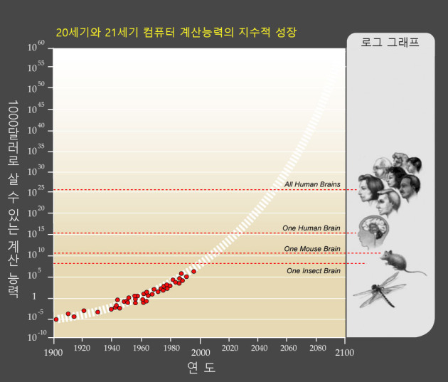

# 엘론 머스크, 스티븐 호킹 등 많은 유명인들이 인공지능을 경계하라고 호소하는가?

**이 글은 Tim Urban 의 The AI Revolution를 번역하신 coolspeed님의 글을 요약한 글입니다.**

저자: Tim Urban

원문링크:
* Part I: [The AI Revolution: The Road to Superintelligence](https://waitbutwhy.com/2015/01/artificial-intelligence-revolution-1.html)
* Part II: [The AI Revolution: Our Immortality or Extinction](https://waitbutwhy.com/2015/01/artificial-intelligence-revolution-2.html)

번역: [coolspeed](https://coolspeed.wordpress.com/2016/01/03/the_ai_revolution_1_korean/)

 

## 약인공지능에서 강인공지능으로 통하는 길
#### 왜 이 길이 그토록 험난한가

오직 인간 수준의 지능을 가진 컴퓨터를 만드는게 얼마나 어려운가를 이해해야 우리 인간의 지능이 얼마나 불가사의한지를 느낄 수 있을 것이다. 하늘을 찌르는 빌딩을 짓고 인간을 우주에 보내고 우주 빅뱅의 디테일을 이해하는 것 — 이 모든 것은 인간의 뇌를 이해하고 유사한 것을 만드는 것보다 훨씬 쉽다. 현재까지 인간의 뇌는 우리가 알고있는 **우주안에서 가장 복잡한 사물이다.**

그리고 인공지능을 만드는 어려움은 당신이 직감적으로 생각할 수 있는 그런 것들이 아니다.

* 순간에 열자리 수를 곱할 수 있는 컴퓨터를 만들기 — 매우 쉽다.
* 한 동물이 고양이인지 개인지 식별할 수 있는 컴퓨터를 만들기 — 극도로 어렵다.
* 세계 체스 챔피언을 이길 수 있는 컴퓨터를 만들기 — 성공한지 오래다.
* 6살 아이가 읽는 그림책속의 문자를 읽을 수 있고 그 뜻을 이해할 수 있는 컴퓨터를 만들기 — 구글이 수십억달러를 퍼부어서 연구하고있지만 아직 성공하지 못했다.
* 일부 우리가 어렵게 여기는 일들 — 미적분, 금융시장 책략, 번역 등등은 컴퓨터한테는 매우 쉽다.
* 일부 우리가 쉽다고 느끼는 일들 — 시각, 움직임, 직감 — 컴퓨터한테는 개어렵다.

#### 컴퓨터 과학자 Donald Knuth 의 말로
>“인공지능은 이미 모든 생각이 필요한 영역에서 인간을 초월했다. 하지만 인간이나 기타 동물이 생각을 하지 않아도 완성할 수 있는 일들에서는 아직 멀었다.”

 

## 강인공지능으로 통하는 첫걸음

#### 컴퓨터의 처리 속도를 높여야 한다.
강인공지능에 도달하기 위해 꼭 만족해야 할 조건은 컴퓨터 하드웨어의 계산능력이다. 인공지능이 인간의 뇌와 겨룰 만큼 총명하려면 최소한 인간의 뇌만큼의 처리능력을 갖추어야 한다.

처리 능력을 다루는 단위는 cps (calculations per second, 초당 계산수) 이다. 인간 두뇌의 cps 를 구하려면 그 속의 모든 구조물의 최고 cps 를 구하고 그것들을 모두 더하면 된다.

레이 커즈와일 (Ray Kurzweil) 은 하나의 구조물에 대한 최대 cps 를 구하고 그것이 전체 뇌에서 차지하는 무게의 비중으로 나누어 인간 두뇌의 총 cps 를 구했다. 뭔가 부족한 것처럼 들리지만 그는 몇번이나 서로 다른 영역을 다양한 전문측정법을 통해 같은 방식으로 계산을 했는데 그 결과들이 항상 아주 근접한 수치에 도달하였다 — 대략 10의 16승 cps, 즉 매초당 1경번의 계산이다.

현재 세계에서 제일 빠른 컴퓨터인 중국의 [텐허 2호](http://www.reuters.com/article/us-china-supercomputer-idUSKCN0J11VV20141117) (2015년 기준) 는 사실 이미 이만큼의 처리능력을 가졌는데 그 처리능력이 3.4경 cps 이다. 물론 톈허 2호는 720 제곱미터 면적을 차지하고 2400 만 와트의 전력을 소비하며 3.9억 달러의 돈을 들여 만든 것이다. 광범위한 응용은 막론하고 대부분의 상업적이나 공업적 사용도 굉장히 비싸다.

커즈와일은 컴퓨터 발전정도의 지표는 1000달러로 얼마만큼의 cps 를 살 수 있는가라고 생각한다. 1000 달러로 인간 두뇌급인 1경 cps의 계산능력을 살 수 있을 때에야 강인공지능이 우리 삶의 일부가 될 수 있다고 한다.

무어의 법칙이 제시한바로는 전 세계의 컴퓨터 계산 능력은 2년마다 배로 늘어난다. 이 법칙은 역사 자료가 뒷받침해주고 있는데 왜 컴퓨터의 하드웨어가 인류발전과 마찬가지로 기하급수적으로 발전하는가를 제시하고 있다. 우리는 이 법칙을 통해 언제쯤 1000 달러로 1경 cps 를 살 수 있을 지를 계산해보자. 지금 1000달러로 약 10조 cps 를 살 수 있는데 지금까지의 추세는 무어의 법칙 그래프의 예측에 부합한다.

그 뜻은 지금 1000 달러 살 수 있는 컴퓨터는 이미 쥐의 뇌보다 강하며 이미 인간의 뇌의 1000분의 1의 수준에 해당된다는 뜻이다. 아직도 너무 약해보인다. 하지만 생각해봐라 1985 년에 같은 돈으로 인간 두뇌의 1조분의 1만큼의 cps 밖에 살 수 없었고 1995 년에는 10억분의 1, 2005년에는 백만분의 1, 2015 년에는 이미 천분의 1이나 된다. 이런 추세로 발전한다면 우리는 2025 년에는 1000달러로 인간의 뇌에 해당되는 계산처리속도의 컴퓨터를 살 수 있을 것이다.

적어도 하드웨어상에서 우리는 강인공지능의 문턱에 들어섰으며 (중국의 톈허 2호) 10년이내 우리는 저렴한 가격으로 강인공지능 지원 가능한 컴퓨터 하드웨어를 살 수 있을 것이다.