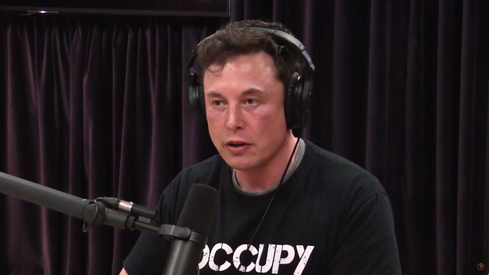

## 인공지능은 축복인가 재앙인가.

팀 어번의 글과 번역된 글에는 정말 흥미로운 부분들이 많다. 다만 분량이 길어
한번에 읽기 어렵고 처음 내가 글을 읽읅 당시에도 2시간 정도 읽었음에도 절반도 못읽었던 것으로 기억한다.
시간이 허락된다면 한번쯤 읽어보길 바란다. [원본번역글](https://coolspeed.wordpress.com/2016/01/03/the_ai_revolution_1_korean/)
  
 
 
 

벤자민 프랭클린은 "죽음과 세금은 피할 수 없다." 라는 말을 남겼다.
하지만 내가 개인적으로 가장 좋아하는 과학자 리처드 파인만은 이런이야기를 했다.
>모든 생명과학 영역에서 죽음이 불가피하다는 증거는 그 어디에도 없다. 만약 당신이 영구기관을 만들려고 한다면 우리 인류의 물리학에 대한 연구는 이미 그것이 불가능하다는 충분한 이유들을 말해주고 있다. 하지만 생물학적 영역에서 우리는 죽음이 불가피하다는 그 어떤 증거도 발견하지 못했다. 즉 사망이 무조건 불가피한게 아닐 수도 있다는 것이다. 생물학자들은 언젠가는 사망의 진정한 요인을 밝혀낼 것이고 ‘죽음’이라는 이 몹쓸 “질병”은 드디어 고쳐질 것이며 인간의 신체도 더 이상은 임시적인 그릇이 아닐 것이다.
 
인공지능은 축복일지도 재앙일지도 모른다. 나는 개인적으로 재앙이 될 가능성이 높다고 생각한다.
과학이 발전할 수록 범죄자들도 과학을 사용한다는 점이다.  

이미지를 클릭하면 영상으로 이동합니다.

 

엘론머스크도 인공지능의 발전에 대해 상당히 부정적인듯 보인다, 라디오에 출연해 거의 현타를 느끼는듯한 엘론머스크의 모습이
나에겐 너무나 인상적이였다. 인공지능이 인류의 축복이 될지 인류의 종말이 될지 모르겠지만 AI라고 하는 주제에 대해 다른 시각으로 접해볼 수 있는 기회가 되었길 바란다. 
