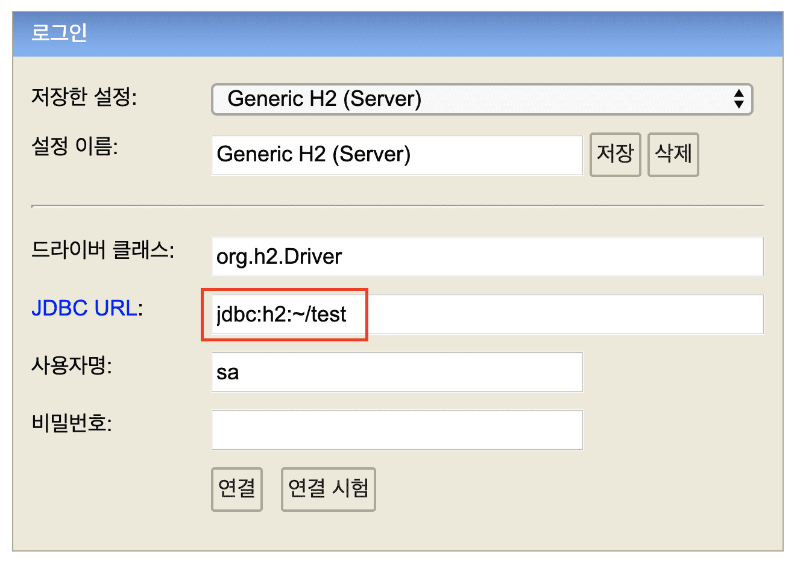
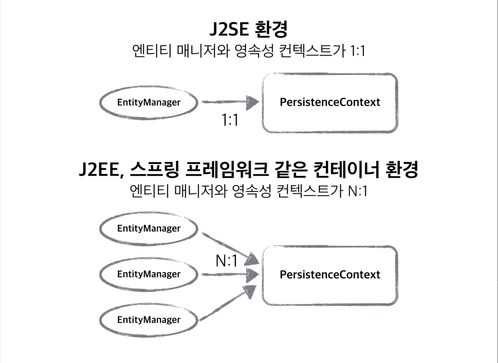

## 로맨틱한 JPA

```
해당 내용은 대부분이 김영한님의 '자바 ORM 표준 JPA 프로그래밍 - 기본편' 강의 내용을
필자가 다시 리마인드하며 편하게 공부하기 위해 정리한 것에 불과하다.

김영한 님의 '자바 ORM 표준 JPA 프로그래밍' 도서와 '자바 ORM 표준 JPA 프로그래밍 - 기본편' 인프런 강으에
훨씬 자세하고 디테일한 설명들이 들어있다, 돈이 아깝지 않은 강의 이므로 보길 추천한다.
```

<br>
<br>

## JPA 란 무엇인가?
__JPA(Java Persistent API)__

JPA는 여러 ORM 전문가가 참여한 EJB 3.0 스펙 작업에서 기존 EJB ORM이던 Entity Bean을 JPA라고 바꾸고 JavaSE, JavaEE를 위한 영속성(persistence) 관리와 ORM을 위한 표준 기술이다. JPA는 ORM 표준 기술로 Hibernate, OpenJPA, EclipseLink, TopLink Essentials과 같은 구현체가 있고 이에 표준 인터페이스가 바로 JPA이다.

ORM(Object Relational Mapping)이란 RDB 테이블을 객체지향적으로 사용하기 위한 기술이다. RDB 테이블은 객체지향적 특징(상속, 다형성, 레퍼런스, 오브젝트 등)이 없고 자바와 같은 언어로 접근하기 쉽지 않다. 때문에 ORM을 사용해 오브젝트와 RDB 사이에 존재하는 개념과 접근을 객체지향적으로 다루기 위한 기술이다.


| 버전 | 연도 | 설명 |
|---|:---:|---:|
| `JPA 1.0(JSR 220)` | 2006년 | 초기 버전, 복합 키와 연관관계 기능 부족 |
| `JPA 2.0(JSR 317)` | 2009년 | 대부분의 ORM 기능 포함, JPA Criteria가 추가 |
| `JPA 2.1(JSR 338)` | 2013년 | 스토어드 프로시저 접근, 컨버터, 엔티티 그래프 기능 추가 |

<br>

## JPA를 써야하는 이유

#### 생산성
* JPA를 자바 컬렉션에 객체를 저장하듯 JPA에게 저장할 객체를 전달.
* INSERT SQL을 작성하고 JDBC API 사용하는 지루하고 반복적인 일을 JPA가 대신 처리해준다.
* CREATE TABLE같은 DDL문 자동 생성
* 데이터베이스 설계 중심의 패러다임을 객체 설계 중심으로 역전

<br>

#### 유지보수
엔티티에 필드 추가시 등록, 수정, 조회 관련 코드 모두 변경
JPA를 사용하면 이런 과정을 JPA가 대신 처리
개발자가 작성해야 할 SQL과 JDBC API 코드를 JPA가 대신 처리해줌으로 유지보수해야 하는 코드 수가 줄어든다.

#### 패러다임 불일치 해결
* 상속, 연관관계, 객체 그래프 탐색, 비교하기 같은 패러다임 불일치 해결

#### 성능
* 중간 계층이 있는 경우 아래의 방법으로 성능을 개선할 수 있는 기능이 존재한다.
    * 모아서 한번에 요청을 처리하는 버퍼링 기능 
    * 읽을 때 쓰는 캐시기능
* JPA도 JDBC API와 DB 사이에 존재하기 때문에 위의 두 기능이 존재한다.


#### 데이터 접근 추상화와 벤더 독립성
SQL이 각 DBMS(MySQL, Oracle)에 따라 만들어져서 독립적이다, 방언으로 인한 격차를 해소한다고 이해하고 있다.

<br>

## JPA는 DB에 종속적이지 않다.

#### hibernate.dialect 속성 지정하기

바로 위 `JPA를 써야하는 이유` 부분에서 "데이터 접근 추상화와 벤더 독립성"를 언급했다, JPA를 사용하기위해선 `src/main/resources` 디렉토리 안에 `META-INF/persistence.xml` 파일을 생성해야 하고
그 안에 JPA 관련 설정을 적어주어야 한다.

persistence.xml 파일안에 `<property name="hibernate.dialect" value="org.hibernate.dialect.H2Dialect"/>` 라는 속성이 있다.
중요한 속성이고 내가 사용하는 DB의 종류에 따라 value가 달라진다. 예로 적은 코드에서는 H2를 사용하는 경우이다.

JPA는 DB에 종속적이지 않다, 극단적으로 db를 mysql에서 oracle로 변경해도 큰 어려움없이 교체 가능하다.
DB마다의 특성이나 조금씩 다른 sql 쿼리를 가지는데 (예를들어 mysql에선 limit, oracle에선 rownum) 이런 개념을 JPA에서는 방언(dialect) 이라 표현했다.

하이버네이트는 40가지 이상의 데이터베이스 방언을 지원한다.

```
h2         : org.hibernate.dialect.H2Dialect
Oracle 10g : org.hibernamte.dialect.Oracle10gDialect
MySQL      : org.hibernate.dialect.MySQL5InnoDBDialect
```

## persistence.xml 살펴보기

```
<?xml version="1.0" encoding="UTF-8"?>
<persistence version="2.2"
             xmlns="http://xmlns.jcp.org/xml/ns/persistence" xmlns:xsi="http://www.w3.org/2001/XMLSchema-instance"
             xsi:schemaLocation="http://xmlns.jcp.org/xml/ns/persistence http://xmlns.jcp.org/xml/ns/persistence/persistence_2_2.xsd">
    <persistence-unit name="hello">
        <properties>
            <!-- 필수 속성 -->
            <property name="javax.persistence.jdbc.driver" value="org.h2.Driver"/> <!-- 무슨DB를 쓰는지 -->
            <property name="javax.persistence.jdbc.user" value="sa"/> <!-- 유저이름 -->
            <property name="javax.persistence.jdbc.password" value=""/> <!-- 비밀번호 -->
            <property name="javax.persistence.jdbc.url" value="jdbc:h2:tcp://localhost/~/test"/> <!-- 접근URL 경로 -->
            <property name="hibernate.dialect" value="org.hibernate.dialect.H2Dialect"/> <!-- 하이버네이트 방언 지정-->

            <!-- 옵션 -->
            <property name="hibernate.show_sql" value="true"/> <!-- 실제 구동하는 SQL 쿼리를 보여줌 -->
            <property name="hibernate.format_sql" value="true"/> <!-- 읽기 조금더 편하게, 코드를 이쁘게 포맷팅해줌 -->
            <property name="hibernate.use_sql_comments" value="true"/> <!-- 실행된 SQL 쿼리가 어느객체에서 실행되는지 보여줌 -->
            <!--<property name="hibernate.hbm2ddl.auto" value="create" />-->
        </properties>
    </persistence-unit>
</persistence>

        <!--
            hibernate.dialect 속성 지정하기
            h2         : org.hibernate.dialect.H2Dialect
            Oracle 10g : org.hibernamte.dialect.Oracle10gDialect
            MySQL      : org.hibernate.dialect.MySQL5InnoDBDialect
            JPA는 DB에 종속적이지 않다, 극단적으로 db를 mysql에서 oracle로 변경해도 큰 어려움없이 교체 가능하다.
            DB마다의 특성이나 조금씩 다른 sql 쿼리를 가지는데 (예를들어 mysql에선 limit, oracle에선 rownum) 이런 개념을 JPA에서는 방언(dialect) 이라 표현했다.
            하이버네이트는 40가지 이상의 데이터베이스 방언을 지원한다.
        -->
```
persistence 설정 파일을 yml로 변경하는 것도 가능하다.

<br>

## H2 DB로 실습 및 주의사항

H2 DB는 인메모리에서 실행되는 데이터베이스로 주로 간단한 실습 및 테스트환경에서 많이 사용된다고 한다.
[H2 사이트](https://www.h2database.com/html/main.html)로 이동해서 OS환경에 맞게 설치해주고 console을 통해 접속하면된다. (맥의 경우 bind/h2.sh 파일)

<br>

#### H2 접속이 안될때

처음 H2 데이터베이스를 실행했을 때
`Database "~/test" not found, and IFEXISTS=true, so we cant auto-create it [90146-199]`
이런 오류가 발생하는 경우가 있다, 데이터베이스 파일이 없는 상황인데



위 이미지 처럼 JDBC URL에

`jdbc:h2:~/test` 라고 입력후 연결버튼을 눌러주면 데이터베이스 파일이 생성되면서 연결된다.

이후에는 `jdbc:h2:tcp://localhost/~/test` 로 접속하면된다.
(이미지 처럼 파일에 직접 접근하는 방식은 파일에 락이 걸려서 여러곳에서 접속을 못하는 문제가 있다고 함)

만약 이렇게해도 안되는경우 본인의 PC를 재시작하면 해결된다. (필자 해당)

#### 결론
1. h2접속 에러인경우 DB가 생성돼지 않아서이다.
2. `jdbc:h2:~/test` 를 통해 DB를 생성한다.
3. DB가 만들어졌으니 `jdbc:h2:tcp://localhost/~/test`로 접속한다.
4. 그래도 안돼는경우 h2 콘솔을 종료하고 (웹 브라우저 말고 H2엔진) 다시 접속해 본다.
5. `jdbc:h2:~/test` 로 생성 `jdbc:h2:tcp://localhost/~/test`로 접속
6. h2콘솔로 접속할 때 `jsessionid`라는 key가 붙는데 이게 새로적용이 안되서 접속이 안되는것일 수 있으니 다시 실행후 접속하면 해결된다.

<br>

## 영속성 컨텍스트

JPA를 공부하며 가장 중요한 부분 2가지가
* 객체를 어떻게 설계하고 관계형데이터베이스를 어떻게 설계하고 이 두가지를 어떻게 매핑할것인가.
* JPA가 내부적으로 어떻게 동작하는가? (영속성 컨텍스트)

JPA에서는 사용자가 요청을 보내면 `EntityManager Factory`가 `EntityManager`를 생성하고  `EntityManager`가 커넥션을 통해 SQL문을 생성해 DB와 통신하게 된다.
`EntityManager.persist(entity);` 코드를 실행하면 DB에 entity라는 값을 저장한다고 생각하겠지만 entity를 영속성 컨텍스트 라는곳에 저장한다는 점이다.

<br>



* 영속성 컨텍스트
    * 영속성 컨텍스트는 논리적인 개념이다.
    * 눈에 보이지 않는다.
    * 엔티티 매니저를 통해서 영속성 컨텍스트에 접근한다.
    


 #### 엔티티의 생명주기
 
 * 비영속 (new/transient)
    * 영속성 컨텍스트와 전혀 관계가 없는 새로운 상태
    
   ```
   Member member = new Member();
   member.setId("member1");
   member.setUsername("회원1");
   ``` 
    
* 영속 (managed)
    * 영속성 컨텍스트에 관리되는 상태
    
    ```
    EntityManager em = emf.createEntityManager();
    em.getTransaction.begin();
  
    // 객체를 저장한 상태(영속)
    em.persist(member);
    ```
    
* 준영속(detached)
    * 영속성 컨텍스트에 저장되었다가 분리된 상태

* 삭제 (removed)
    * 삭제된 상태
    
    
JPA에서 DB와 통신을 통해 값을 저장하거나 변경을 일으킬 때 `em.persist(member);` 라고 코드를 작성해도 DB에 쿼리가 날라가지 않는다.
`commit()` 될 때 실제 쿼리가 생성되어 DB에 날라간다, 즉 애플리케이션과 DB 사이에 중간계층이 존재하고 그것이 __영속성 컨텍스트__ 이다.
이런 메커니즘으로 만들어진 이유는 여러 이점이 생긴다.

* 영속성 컨텍스트의 이점
    * 1차 캐시: (조회할때 DB에서 조회하지 않고 1차 캐시에서 조회하게 된다.)
    * 동일성(Identity) 보장: 자바컬렉션에서 같은 값을 가져와 비교하면 true가 나오듯 `==` 비교로 true값을 얻을 수 있다. (SQL 쿼리인 경우 같은 레퍼런스 인대도 false가 나옴)
    * 트랜잭션을 지원하는 쓰기 지연 (transactional write-behind): JPA는 모두 트랜잭션 이므로 여러 insert를 하는경우 insert문이 여러번 실행되는것이 아닌 commit하는 순간 DB에 insert SQL을 보낸다. 버퍼링을 사용하지않고 매번 query를 날리면 최적화를 할 수 있는 여지조차 없게된다.
    * 변경 감지 (Dirty checking): JPA의 목적이 자바 컬렉션을 다루듯 사용하는 것이다, JPA에서는 값만 바꾸어도 update 쿼리가 실행된다. 이런동작이 가능한 이유가 Dirty checking 기능이다. 영속성 컨텍스트를 통해 `commit()`을 할때 entity와의 스냅샷을 비교한다. 마치 SPA의 리액트가 가상DOM을 통해 변경된 부분만 render하는 것 처럼 말이다.    
    * 지연 로딩(Lazy Loading): 
    
<br>

## 준영속상태

그런데 준영속상태란, 영속상태에 있다가 분리되는 것이다. 처음부터 비영속상태인 것과는 다르다.
영속상태에 있다가 분리가 되었으니 영속성 컨텍스트가 제공하는 기능을 사용하지 못하게 된다. (더티체킹, 업데이트 등등)

영속상태가 되는 경우는 2가지 이다.
* `em.persist(member)`를 통해 값을 넣는경우 (영속성 컨텍스트에서 관리하는 경우)
* `em.find(member.class, "helloA")`와 같이 find로 값을 찾는데 1차 캐시에 없는경우 DB에서 조회해서 가져온 뒤, 1차캐시에 삽입하면서 영속 상태가 된다.


준영속 상태로 만드는 방법
1. `em.detach(member);` 
    * detach, 말 그대로 떼어낸다는 의미이다. 비영속 상태가 되므로 `tx.commit()` 즉, 트랜잭션에서 커밋을 해도 영향을 받지않는다, 준영속상태기 떄문이다.
    * 특정 엔티티만 준영속 상태로 전환하고 싶은경우 사용한다.
2. `em.clear()` 
    * 영속성 컨텍스트를 완전히 초기화한다.
    * 만약 em.clear로 초기화 한 뒤, 1차 캐시에 없는 값을 `em.find(member.class, "helloA")`로 조회해서 하면 다시 영속성 컨텍스트에 올라가게된다.
    * 초기화 이후 조회했으니까 
3. `em.close()`
    * 영속성 컨텍스트 자체를 종료시킨다.


<br>

## 플러시
* 수정된 엔티티를 쓰기지연 SQL 저장소에 등록한다.
* commit()을 할 때 자동으로 플러시가 발생한다고 생각하면 된다.
* 영속성 컨텍스트의 변경내용(쿼리내용)을 데이터베이스에 반영(동기화)하는 것이다.
* 이름 때문에 오해가 많지만, 플러시는 영속성 컨텍스트를 비우는 것이 아니다. 그냥 "쓰기 지연 SQL"에 있는 쿼리들이 DB에 반영이 되는 것이다. 1차캐시가 그대로 남아있는다.
* 트랜잭션이라는 작업단위, 커밋 직전에만 동기화 하면된다.
* JPQL을 사용할 때는 미리 한번 실행한다, JPQL로 만약 select를 하는데 이전값을 저장을 안하고 영속상태로만(persist) 만들고 조회를 한다면 값이 없을 것이다. 그럼 문제가 발생할 수도있다. 이런경우를 방지하기 위해 JPQL이 실행 하기 전 무조건 플러시를 한번 하고난 이후 쿼리가 실행된다.

#### 직접 영속성 컨텍스트를 플러시 하는법
```
em.flush() // 직접 호출
ts.commit() // 트랜잭션에 커밋을 할 때 호출
JPQL 쿼리실행 // JPQL이 실행될 때 자동으로 플러시를 한번 호출하고 쿼리가 실행된다.
```
값을 테스트하기 위함이 아니라면 개발자가 직접 플러시를 할 일이 별로 없다.

```
em.setFlushMode(FlushMode.AUTO) // 기본값, 커밋이나 쿼리를 실행할 때 플러시 한다.
em.setFlushMode(FlushModeType.COMMIT) // 커밋할 때만 플러시 한다.
```

기본 값이 FlushMode.AUTO인데 그냥 이상태로 쓰는경우가 대부분이라고 한다. 굳이 바꿀필요가 없다.

<br>

## 데이터 베이스 스키마 자동생성

JPA에는 DDL 이라는 데이터베이스를 자동으로 생성해주는 기능이 있다.
* DDL을 애플리케이션 실행시점에 자동 생성
* 테이블 중심 -> 객체 중심
* 데이터베이스 방언을 활용해서 데이터베이스에 맞는 적절한 DDL 생성
* 개발용 으로만 사용해야 한다. production에서 사용시 table을 drop 후 생성하기 때문에 위험.

개발할 때 테이블을 먼저 만들어놓고 개발을 하는 경우가 많지만 자동으로 DB 스키마를 만들어 주기 때문에 편리하다.
개발시 DB 스키마가 변경될 가능성이 높은데 DB를 다시만들거나 `ALTER` 문을 통해 스키마를 변경할 필요가 없어진다.


#### 옵션
| 옵션 | 설명 |
|---|:---|
| `create` | 기존테이블 삭제 후 다시 생성 (DROP + CREATE) |
| `create-drop` | create와 같으나 종료시점에 테이블 DROP, 테스트케이스 이후 깔끔하게 값을 초기화 하고 싶을 때 유용 |
| `update` | 변경된 부분만 반영, 애플리케이션이 구동중인 상태에서 변동사항이 생기면 변동사항만 추가시켜준다, 삭제는 적용안됨. |
| `validate` | 엔티티와 테이블이 정상 매핑 되었는지만 확인 |
| `none` | 사용하지 않음, 사실 없는 옵션이지만 DDL을 사용하지 않는경우 관례상 none으로 표기한다. (주석처리와 같음) |


```
<?xml version="1.0" encoding="UTF-8"?>
<persistence version="2.2"
             xmlns="http://xmlns.jcp.org/xml/ns/persistence" xmlns:xsi="http://www.w3.org/2001/XMLSchema-instance"
             xsi:schemaLocation="http://xmlns.jcp.org/xml/ns/persistence http://xmlns.jcp.org/xml/ns/persistence/persistence_2_2.xsd">
    <persistence-unit name="hello">
        <properties>
            <!-- 필수 속성 -->
            <property name="javax.persistence.jdbc.driver" value="org.h2.Driver"/> <!-- 무슨DB를 쓰는지 -->
            <property name="javax.persistence.jdbc.user" value="sa"/> <!-- 유저이름 -->
            <property name="javax.persistence.jdbc.password" value=""/> <!-- 비밀번호 -->
            <property name="javax.persistence.jdbc.url" value="jdbc:h2:tcp://localhost/~/test"/> <!-- 접근URL 경로 -->
            <property name="hibernate.dialect" value="org.hibernate.dialect.H2Dialect"/> <!-- 하이버네이트 방언 지정-->

            <!-- 옵션 -->
            <property name="hibernate.show_sql" value="true"/> <!-- 실제 구동하는 SQL 쿼리를 보여줌 -->
            <property name="hibernate.format_sql" value="true"/> <!-- 읽기 조금더 편하게, 코드를 이쁘게 포맷팅해줌 -->
            <property name="hibernate.use_sql_comments" value="true"/> <!-- 실행된 SQL 쿼리가 어느객체에서 실행되는지 보여줌 -->
            <property name="hibernate.hbm2ddl.auto" value="create" />  <!-- DDL 옵션 -->
        </properties>
    </persistence-unit>
</persistence>
```

처음 우리가 살펴보았던 `persistence.xml`이다. 'DDL 옵션' 이라고 주석을 달아놓은 `<property name="hibernate.hbm2ddl.auto" value="create" />` 이부분이 DDL 사용을
결정하는 옵션 부분이다.

절대 절대 운영 서버에서 데이터베이스 스키마 자동생성을 사용하면 안된다.
* 개발초기단계에서는 create 또는 update
* 테스트 서버에서는 update 또는 validate
* 스테이징과 운영 서버는 validate 또는 none을 사용할 수 있겠으나 그냥 쓰지마라

테스트 서버에도 사용하지 않는 것이 낫다. 혹시나 실수로 스키마가 update되어 alter가 되어버리면 이것역시 상당히 문제가 될 수 있다.
의도치 않게 alter 쿼리가 실행되고 데이터베이스에 락이 걸리면 서비스가 몇분동안 중지되게 된다.
운영서버에 create나 create-drop, update를 사용하면 DB가 날라가기 때문에 절대 사용하면 안된다, 사용하면 대참사

<br>

## 필드와 컬럼 매핑
| 어노테이션 | 설명 |
|---|:---|
| `@Column` | 컬럼과 매핑한다, name을주면 DB의 컬럼명과 객체에서의 필드이름을 다르게 줄 수 있다. |
| `@Temporal` | 날짜 타입 매핑 (예를들어 회원가입 타임스탬프, 회원탈퇴 타임스탬프를 기록해야 할 컬럼과 매핑.) |
| `@Enumerated` | enum 타입과 매핑 |
| `@Lob` | Lob에는 BLOB과 CLOB가 있다. 즉, C롭 B롭이 있다, @Lob으로 표기하고 문자타입이면 C롭으로 매핑된다. |
| `@Transient` | 특정 컬럼과 매핑하고 싶지않을때, 예를들어 DB의 컬럼과 매핑하지않고 그냥 메모리상에서만 계산하거나 DB와 어떤 상호작용을 하고싶지 않은경우 @Transient 어노테이션을 쓰면 DB쿼리는 생성돼지않고 그냥 메모리상으로만 사용하게 된다. |

<br>

#### @Column 더 알아보기

사실상 컬럼 어노테이션이 가장 중요하다. 가장 많이사용하기도 @Column의 속성만 잘 알아도 일반적인 매핑은 어려움없이 할 수 있다.

| 어노테이션 | 설명 |
|---|:---|
| `insertable, updateable` | `insertable`는 컬럼이 수정되었을 때 반영할 것 이냐이고, `updateable`는 업데이트가 되었을 때 반영할 것인지를 결정한다. 기본값을 true이다. |
| `nullable (DDL)` | null값의 허용 여부를 설정한다. 기본이 true인데 false로 바꾸면 notNull 제약조건이 붙게 된다. 즉 nullable=false 이면 null일 수 없게된다. |
| `unique (DDL)` | unique=true를 해주면 유니크 제약조건을 걸 수 있는데 잘안쓴다. 이름이 랜덤처럼 알아보기 어렵게 붙어서 디버깅할때 확인이 어렵다. 대신 @Table(uniqueConstraints = example) 를 많이 쓴다. |
| `length (DDL)` | 말 그대로 length를 지정한다, String 타입에만 사용 가능하다.|
| `columnDefinition` | 데이터베이스 컬럼 정보를 직접 줄 수 있다. `예) @Column(columnDefinition = "varchar(100) default 'EMPTY'")` 이런 식으로 직접 컬럼 정보를 지정할 수 있다. |
| `precision, scale (DDL)` | BigDecimal 타입인 경우에 사용한다 (BigInteger도 가능) precision은 소수점 관련해서 내가원하는 대로 조절하는 옵션인데 아주 큰 숫자나 정밀한 소수를 다루어야 할 때 사용한다. |

위 의 표는 @Column() 의 내부에 들어갈 수 있는 옵션들이다.

<br>

#### enum 타입을 쓸 때의 주의사항 - ORDINAL을 쓰면 안된다.
위 내용을 보며 우린 enum 타입의 컬럼을 매핑하려면 `@Enumerated`를 사용한다고 배웠다.
그런데 `@Enumerated` 어노테이션은 기본설정이 ORDINAL(오디널) 이다. 이렇게 ORDINAL로 만들면 무슨문제가 생기냐면
숫자로 만들어주기 때문에 0,1,2 등등으로 구분을 한다. 예를들어 member 객체에 회원의 등급을 구분하는 role이라는 컬럼에 `@Enumerated`를 사용하면
유저의 등급을 guest, member, admin 이런식으로 구분하는게 아니라 0,1,2 와 같은 숫자로 구분하게 된다.
문제는 나중에 수정사항이 생겨 맨앞에 또다른 등급이 추가되게되면 이미 기존에 저장되었던 role 컬럼에 숫자는 변하지 않기 때문에 버그를 만들게 된다.
그러므로 `@Enumerated`를 사용할 때는 `@Enumerated(EnumType.STRING)`으로 사용해야 한다.

<br>

## 기본 키 매핑
기본키를 매핑하는데에는 크게 2가지가 있다.
* @Id - 내가 직접 id를 할당하는 경우 (DB에 값을 넣을 때 id를 넣어주어야함.)
* @GeneratedValue - 자동생성, auto_increment 같은것이 해당된다.

id는 별것 없다 그냥 `@Id`라고만 사용하면 데이터를 삽입할 때 id도 내가 직접 넣어주어야 한다.
`@GeneratedValue`를 거의 사용하게 되는데 사용할 수 있는 옵션들이 있다.

| 어노테이션 | 설명 |
|---|:---|
| `IDENTITY` | 데이터베이스에 위임, MySQL |
| `SEQUENCE` | 데이터베이스 시퀀스 오브젝트 사용, Oracle |
| `TABLE` | 키 생성 전용 테이블 사용 @TableGenerator 어노테이션이 필요하다, 모든 DB에서 사용가능하지만 다만 성능이 떨어지고 최적화가 안되어있다. 코드는 시퀀스를 적용할 때와 비슷하다 |
| `AUTO` | 방언에 따라 자동 지정, 기본값|

기본값은 `AUTO` 이다. 오토를 선택하면 데이터베이스에 따라 자동으로 `IDENTITY`, `SEQUENCE`, `TABLE`중 하나로 알아서 선택하는 것이다.
즉 결국엔 3가지 옵션이고 오토를 선택하면 DB에 따라 셋중 한개를 JPA에서 자동으로 결정하는 것이다.


```
@ENtity
@SequenceGenerator(
    name = "MEMBER_SEQ_GENERATOR",
    sequenceName = "MEMBER_SEQ", // 매핑할 데이터베이스 시퀀스 이름
    initialValue= 1,
    allocationSize = 1)
public class Member{
    @Id
    @GeneratedValue(strategy = GenerationType.SEQUENCE, generator = "MEMBER_SEQ_GENERATOR")
    private Long id;
}
```
시퀀스를 사용할 때 시퀀스이름을 정하지 않으면 하이버네이트에서 만드는 시퀀스를 사용하게되는데
직접 정해주고 싶다면 entity 클래스에 @SequenceGenerator로 시퀀스를 만들고 generator의 속성에 값을 전달하면 된다.

<br>

#### 코드 예제
```
@Id
@GeneratedValue(strategy = GenerationType.AUTO)
private Long id;
```

위와 같은 형태로 strategy(전략)의 값으로 타입을 넣어주면된다.

#### id의 타입 지정하기
* id를 지정할 때 int는 애매하다. 0의 삽입이 가능하고 담을 수 있는 값이 작기 때문이다.
* Integer도 애매하다. 10억이 넘으면 값을 담을 수 없고 나중에 타입을 변경하는 것이 문제가 되기 때문이다.
* Long을 사용하길 권장한다. Long과 Integer타입이 공간이 2배가 차이가 나겠지만 전체 애플리케이션으로 볼 때는 거의 영향을 주지 않는다.


#### GenerationType.IDENTITY 전략의 특징 (AUTO)
* 원래 어떤값을 삽입해도 즉, `em.persist()` 를 해도 즉시 insert문이 생성되는게 아니라 tx.commit() 시점에 insert 쿼리가 생성된다고 했다. 하지만 예외적으로 IDENTITY 전략을 사용할떄는  persist()를 할 때 바로 insert 쿼리가 생성되게 된다. 왜냐면 영속성 컨텍스트에서 관리를 하려면 키가 있어야 하는데 정작 key가 뭔지 알려면 insert를 통해 생성을 해야 key를 알 수 있기 때문이다.
* DB에 `em.persist()` 하는 시점에 insert가 실행되고 영속성 컨텍스트에서는 id를 가지고 관리하게 되는데 정작 select문이 실행되지 않는 이유는 JDBC 내부적으로 이런상황에 대한 return값이 이미 설계되어 있기 때문에 select를 하지않았음에도 `member.getId()`를 하면 id값을 가져오게 된다.
* 위와 같은 이유로 `GenerationType.IDENTITY`전략 에서는 쓰기를 모아서 실행하는 것이 안된다. 하지만 실제 개발을 할 때 버퍼링으로 모아서 write 하는것이 크게 메리트가 있는건 아니라고 한다.

<br>

## 단방향 매핑

```
Team team = new Team;
team.setName("TeamA");
em.persist(team);

Member member = new Member();
member.setUsername("member1");
member.setTeamId(team.getId()); // team을 set하는게 아닌 id를 set하고있다.
em.persist(member);

Member findMember = em.find(Member.class, member.getId());  
Long findTeamId = findMember.getTeamId(); // team의 id를 찾아야한다.
Team findTeam = em.find(Team.class, findTeamId); teamId를 가지고 다시 team을 찾는등 계속 쿼리를 날리는 등의 작업이 생긴다.
```

위 코드를 보자 객체지향 스럽지않다. member를 찾거나 team 찾을때 member는 team을 team이라는 객체로 가지고있는 것이 아니라 마칭 DB처럼 외래키로 가지고 있다.
그렇기 떄문에 값을 찾거나 가져오려 할때 레퍼런스로 참조하지 못하고 id를 가져와서 id를 가지고 다시  팀을 찾고있다.

이 부분을 단방향 매핑을 통해 해결한다면

```
public class Member{
    @Id
    @GeneratedValue
    private Long id;

    @Column(name = "USERNAME")
    private String username;

    @ManyToOne // Member가 n이고 Team이 1 이다. 그러므로 ManyToOne이 된다.
    @JoinColumn(name = "TEAM_ID") // TEAM_ID가 프라이머리키 이기 떄문에 name의 값으로 TEAM_ID를 넣어준 것이다.
    private Team team;    
}
```

Member 객체에 Team 필드부분을 관계가 무엇인지, 조인하는 컬럼이 무엇인지 써주면 된다.

<br>

```
Team team = new Team;
team.setName("TeamA");
em.persist(team);

Member member = new Member();
member.setUsername("member1");
member.setTeam(team); // 아까와 달리 생성한 team을 그냥 set으로 넣어준다.
em.persist(member);

Member findMember = em.find(Member.class, member.getId());  
Team findTeam = findMember.getTeam(); // 아까와 달리 teamId를 받을 필요도없고 그냥 찾은 member에서 get으로 가져오면 된다.
```
위 처럼 단방향을 지정했으므로 그냥 get이나 set으로 마치 자바 컬렉션을 통해 값을 넣거나 가져오는 것처럼 사용할 수 있게되었다.

<br>

## 양방향 객체 연관관계

위에 내용, 단방향 매핑을 보면 member에서 team을 가져오는 것은 됐지만 team에서 member를 가져오는 것은 안된다.
하지만 따지고 보면 둘다 가능해야 맞다. team을 통해 소속된 member들을 가져올 수 있어야 맞는것 아니겠나
이런것을 위해 필요한게 양방향 매핑(양방향 연관관계)이다.

* 객체지향 관점으로 보면 레퍼런스가 한쪽으로 참조를하지 양쪽에서 참조를 하지않는다.
* 하지만 DB입장에서는 방향이라는 개념자체가 없다 그냥 외래키(FK)를 가지고 내가원하는 방향에서 아무렇게나 join으로 확인해 볼 수 있기때문이다. 이 예제에서는 member가 foreign key를 통해 team을 가져오거나 team이 foreign key을 통해 member를 가져오는게 원래 가능하다는 뜻이다. 테이블에서는 방향이란 개념자체가 없고 외래키 만으로 양방향이 이미 다 할수있는 상태다.
* 이런 패러다임의 차이를 극복하기위해 객체입장에서는 member와 team의 둘다 foreign key를 넣어주어야 하는 상황인거다.

```
public class Team{
    @Id
    @GeneratedValue
    @Column(name = "TEAM_ID")
    private Long id;
    private String name;

    @OneToMany(mappedBy = "team") // team이 1이고 member가 n이니까 OneToMany 이다, mappedBy는 내가 team으로 매핑되어있다. 나의 반대편 사이트에는 team이라는 필드가 있다는 의미로 보면 된다.(반대편인 member 객체는 나를 team이라는 필드에 저장한다는 의미) 
    private List<Member> members = new ArrayList<>(); // 관례인데 new ArrayList()로 초기화를 하는것이다. add할때 null포인트가 안뜨게 하려고 하는 관례이다.
}
```
양방향 관계를 위해 Member객체에 관계를 설정했드시 Team객체에 관계를 설정한다. 

<br>

```
Team team = new Team;
team.setName("TeamA");
em.persist(team);

Member member = new Member();
member.setUsername("member1");
member.setTeam(team); // 아까와 달리 생성한 team을 그냥 set으로 넣어준다.
em.persist(member);

Member findMember = em.find(Member.class, member.getId());  
List<Member> members = findMember.getTeam().getMembers(); // getTeam으로 멤버의 팀을 가져왔는데 다시 getMember()를 한다. 근데 이게 가능하다 왔다갔다 하는행위가, 양방향 관계 이기 때문이다.
```
위 처럼 양방향 관계를 매핑했기 때문에 member에서 team을 가져오고 team에서 member를 가져오는게 가능하다.
양쪽에서 모두 객체 그래프 탐색이 가능해졌다.

* 객체는 가급적 단방향이 좋다. 양방향으로 하면 신경써야할게 많다.
* 사실상 객체에서 양방향 연관관계는, 그냥 단방향 연관관계가 두개가 있는것이다.
* 객체입장에서는 단방향이 2개, DB(테이블) 입장에서는 양방향이 1개 있는 것이다. (원래 테이블은 양방향이니까) 
* 두개의 연관관계중 왜래키를 소유하는 table이 Owner가 되고 FK를 제공한 테이블은 mappedBy(가짜 매핑)가 된다.
* FK를 소유하는 테이블을 오너로 하는이유는 여러가지이지만 무엇보다 객체에 어떤변화가 생겼을때 엉뚱한 곳에서 쿼리가 날라가면 디버깅할때 너무 헷갈리고 성능이슈도 존재한다고 한다.
* 외래키를 가지고 있는 쪽이 주인이 되는게 좋은이유가 FK를 소유하는 테이블이 무조건 N이 되고 FK를 제공한 쪽이 1이 되기때문에 많은 고민거리들이 해결된다.


<br>

## 연관관계의 주인(Owner)

#### 양방향 매핑 규칙
* 객체의 두 관계중 하나를 연관관계의 주인으로 지정
* 연관관계의 주인만이 외래키를 관리(등록, 수정)
* 주인이 아닌쪽은 읽기만 가능
* 주인은 mappedBy 속성 사용 X
* 주인이 아니면 mappedBy 속성으로 주인 지정

#### 양방향 연관관계 주의점!
1. 주인이 아닌 

```
Team team = new Team();
team.setName("TeamA");
em.persist(team);

Member member = new Member();
member.setName("member1");

team.getMembers().add(member);

em.persist(member);
```

위 코드가 양방향 매핑시 가장 많이 하는 실수이다.
얼핏보면 양방향 관계니까 정상적인 코드처럼 보이지만, 잘못된 코드다.
위 코드에서 주인(Owner)은 member 이다. 그리고 team객체에 있는 members는 `mappedBy`이다. 즉 가짜매핑, 읽기전용이다.
그런데 읽기전용인 members 에서 getMembers를 통해 가져와서 add를 하려고 하니까 값이 저장이 안된것이다.

양방향 매핑에서 FK를 가지고 있는 테이블인 member는 Owner이고 team은 mappedBy(가짜매핑)이므로 읽기전용이라 저장이 안된것이다.

결국 오너에서 값을 넣어야한다. 라는점인데 양방향인경우 양쪽에 다 값을 넣어주는 것이 더 맞는방법이다.
왜냐하면 team만들어 persist()하고 member를 만들어 persist()한 상태에서 `em.find(Team.class, team.getId())`를 했다면 이코드는
DB에서 조회하는게 아니라 영속성 컨텍스트의 1차캐시에서 가지고오게 되어버린다. 실제로는 DB에서 조회를 해와야 되는데
1차캐시에 team의 값이 있다보니 쿼리가 안나가고 그냥 1차캐시에서 가지고있던 값을 가지고오게 되는것이다. 

이런문제 때문에도 양방향에서 값을 넣어주는 상황이 발생하면 member와 team에 둘다 값을 넣어주는것이 맞다.
나중에 테스트 케이스를 작성할 때도 JPA와 상관없이 순수 자바상태로 작성해야 하는데 이런 상황에서도 문제가 생긴다.

결론은 양방향 연관관계에서 값을 세팅할때에는 양쪽 둘다 값을 넣어주어야 한다.

<br>

#### 극복하는 방법 - 연관관계 편의 메소드를 생성하자.
위에 내용처럼 양방향에서 값을 넣을때 Owner와 mapped(가짜매핑)에 둘다 값을 넣자고 했다.
그런데 사람이 하는일이기 때문에 실수를 할 가능성이 충분히 있다. 그렇기 때문에 연관관계 편의 메소드를 만들어 실수를 줄이는 방법이 권장된다. (연관관계 편의메소드라는 표현은 김영한 님이 그냥 정한 표현)

```
public class Member{
    @Id
    @GeneratedValue
    private Long id;

    @Column(name = "USERNAME")
    private String username;

    @ManyToOne // Member가 n이고 Team이 1 이다. 그러므로 ManyToOne이 된다.
    @JoinColumn(name = "TEAM_ID") // TEAM_ID가 프라이머리키 이기 떄문에 name의 값으로 TEAM_ID를 넣어준 것이다.
    private Team team;

    public Long getId() {return id;}

    public void setId(Long id) {this.id = id;}

    public String getUsername() {return username;}

    public void setUsername(String username) {this.username = username;}

    public Team getTeam() {return team;}

    // 편의 메소드
    public void setTeam(){
        this.team = team;
        team.getMembers().add(this);
    }
}
```

member Entity에 `setTeam()`을 하면 원래는 그냥 `this.team = team;` 부분만 존재했지만
`team.getMembers().add(this);`를 추가해주는 것이다. 즉 member에 team을 세팅할때 내가인수로 받은 team에 getMembers().add()를 내가직접 해주는 것이다. 애초에 실행되게끔 member의 set에 team의 set까지 미리 정해놓는 것이다.

참고로 JPA 마이스터 김영한님의 경우 이런 편의메소드를 만들때 이름을 그냥 관례적으로 set으로 쓰지않고 change와 같은 prefix를 넣어서 이게단순히 관례적인 getter, setter가 아니라
중요한 역할을 하는것을 개발자가 눈치채기 쉽게 만든다고 한다. 내생각에도 이게 나은것같다. 메소드가 굉장히 많아질텐데 이름을 다르게하지않으면 나중에 의미를 파악하기 너무 어려울것 같다.
이런 편의메소드를 1:N 관계에서 둘중 하나에만 넣어주어야 한다. 만약 둘다넣으면 무한루프에 걸리거나 버그가 발생할 수 있다. 상황마다 어디에 넣을것인가는 달라질 수 있어서 꼭 1에 넣어가 N에 넣어야 하는것은 아니다.

#### 정리
1. 단방향 매핑만으로도 이미 연관관계 매핑이 끝나게끔 노력해야한다.
2. 양방향 매핑은 반대방향으로 조회, 객체 그래프 탐색이 가능해지는 추가되는 것 뿐이다.
3. JPQL에서 역방향으로 탐색할 일이 많다. (실무에서는 생각보다 역방향으로 조회해야 할 일이 많기 때문에)
4. 단방향 매핑을 잘 하고 양방향은 필요할 때 추가해도 된다. (테이블에 영향을 주지 않음)
5. 객체지향으로 설계하는 입장에서 양방향 관계가 별로 좋을게없다, 고민거리만 많아지므로 단방향으로 최대한 만들고 정말 필요하면 나중에 양방향으로 구현한다.

<br>

#### 연관 관계별 특징 정리
* N : 1 관계 -> 가장 실무에서 흔히 쓰이는 방식이다. FK를 가진 테이블과 매핑하고있는 Entity클래스가 Owner가 되고 반대방향인 1은 mappedBy가 되어 가짜매핑이 된다.
* 1 : N 관계 -> 1이 Owner가 된다. 위 예제로 치자면 team이 Owner가 되고 member가 mappedBy가 되는것이다. team을 중심으로 객체관리가 이루어지겠다는 설계이다 JPA에서 1:n으로 매핑하는것을 지원하지만 권장하지않고 꼭 1:n으로 만드는것 역시 그렇게 해야할 경우가 잘 없다고 한다, 객체지향적으로 보면 1:n이 나을 수 있으나  DB를 입장을 생각해보면 외래키(FK)가 무조건 n쪽으로 들어가야되게된다. 그렇게되면 team의 members가 업데이트되었을 때 member에 값들도 관리를 해주어야한다. 이런문제 때문에 객체와 DB를 모두 고려해야하므로 n:1 방식 + 단방향으로 설계하는것이 개발하고 관리하고 디버깅하는 면에서 유리하게된다. 내 Entity가 아닌 다른곳에 FK를 가지고 있기 떄문에 내 정보가 변경되면 다른 엔티티에 update쿼리가 나가야 하기 때문에 1:n으로 만들어야 하는경우 n:1로 만들고 양방향 매핑으로 관리하면 1:n으로 만들지않아도 서비스가 가능해진다. 결론은 n:1 단방향으로 만들되 반대로 참조해야 하는경우 양방향으로 만들고 편의메소드로 관리하자, 실무에서의 설계라는게 테이블이 수십개씩 돌아갈텐데 최대한 매핑과 설계가 단순해야 누구나 사용할 수 있다 
* 1 : 1 관계 -> 대칭적인 관계이기 떄문에 주테이블과 대상테이블중 아무나 외래키를 넣는 선택이 가능하다. 외래키에 데이터베이스 유니크 제약조건이 추가되어야 한다. 없어도 가능은 한데 그럼 어플리케이션에서 관리를 잘 해주어야한다. 1:1관계인데 값이 중복되면 안되니까, 예를들어 Member와 Locker(사물함) 테이블이 있다고 할때 외래키가 member에 들어갈수도 있고 locker에서 관리할 수도 있다. Owner가 @JoinColumn을 가지고 반대에서 참조를 해야하는경우 그냥 `@OneByOne(mappedBy = "반대편 필드이름")` 으로 사용하면 된다. 이론적으로 주테이블(member, 주로 액세스를 하는 테이블)에 외래키가 있으면 주테이블조회 만으로 대상테이블에 데이터가있는지 확인이 가능해지고 객체지향적 관점에서도 적절해진다. 다만 DBA의 입장에서는 외래키를 대상테이블(locker)이 가지고가는게 미래에 테이블의 관계가 1:n으로 변경되거나 하는 점에서 유리해진다. 이런부분은 트레이드 오프라고 보고 전반적인 어플리케이션의 상황에 맞게 고민 해봐야 하는데 주테이블에 외래키를 넣는게 개인적으로 나은것 같다.
* N : M 관계 -> 실무에서 쓰면 안된다, 관계형 데이터베이스에서는 정규화된 테이블 2개로 다대다 관계를 표현할수없다, 그래서 중간 테이블이 만들어져야된다. 객체는 다대다 관계를 객체2개로 표현하는게 가능해진다. List 컬렉션으로 필드를 만들면되는데 DB는 테이블2개만으로 표현이안되서 중간테이블이 생겨야된다는 차이가 발생한다. 실무에서는 주문시간, 수량 같은 데이터가 들어가야하는데 중간테이블에 값을 넣는게 안된다. 이런걸 극복하기위해 어노테이션을 `@ManyToMany` 대신 `@OneToMany` 혹은 `@ManyToOne` 으로 바꾸고 중간테이블을 만들어서 `@Entity`로 관리해주는 것이다. 

<br>

#### 실무에서 TIP
1. Entity를 만들 때 setter를 무조건 만들기 보다는 생성자에서 값을 집어넣는게 유지보수에 좋다, new 생성자로 값넣기
2. Entity객체에 DB관련 속성이나 length, name같은 필요사항을 가급적이면 엔티티객체에 적는것이 좋다. 개발자가 DB를 까보지 않아도 엔티티만으로 파악할 수 있게 하기위함.
3. em.find()는 프라이머리 키로만 조회할 수 있다. name같은걸로 조회하려면 `JPQL`, 더 나아가 `Query DSL`을 사용하면 된다.
4. n:1이 많이사용되고 1:n이 혹 사용될 수 있겠으나, n:m 관게는 실무에서 사실상 쓰이면 안된다.

<br>

## 상속관계 매핑

* 관계형 데이터베이스는 상속 관계가 없다.
* 슈퍼타입 서브타입 관계라는 모델링 기법이 객체 상속과 그나마 유사하다
* 상속관계 매핑 : 객체의 상속,구조와 DB의 슈퍼타입 서브타입 관계를 매핑한다.

논리모델을 3가지의 물리모델로 구현해낼 수 있다.
1. 조인전략 : 부모테이블과 자식테이블을 만들어 PK와 FK로 `JOIN`을 통해 값을 가지고 오는 형태이다.
2. 단일테이블 전략 : 1개의 테이블에 값을 모두 때려박고 `DTYPE` 같은 컬럼을 통해 데이터를 구분한다, 성능때문에 이런 심플한 방식의 구현을 선호하는 경우도 있다고 한다. DB는 1개인데 실제 객체는 상속관계로 구현되어 있을수도 있다.
3. 구현 클래스마다 테이블 전략 : 구현하는 `class`마다 1:1 매핑하듯 `table`을 만들어 주는 것이다. 부모에서 부터 공통된 값을 상속받는게 아니라 그냥 각 table마다 필요한 값을 다 가지고 있는것이다. 다소 중복이 발생하지만 가장 직관적인 방식이다. 다만 값을 넣고 쓰는정도만 사용하면 상관이없는데 id만 알고 어느 테이블인지 모르는 경우라면 부모타입으로 조회할때 union을 통해 DB를 전부 뒤져야하기 때문에 find할때 비효율적일 수 있다. 이 전략은 ORM과 DB전문가가 둘다 비추천하는 전략이고 결과적으로 실무에서 쓰면 안되는 전략이다.

위 3가지 방식중 무엇을 사용하든 JPA는 다 매핑을 하도록 지원을 한다.
JPA 에서 기본으로 제공하는 전략은 `single table` 전략으로 한테이블에 다 때려박는 전략을 기본으로 채택하고 있다.

```
@Entity
@Inheritance(strategy = InheritanceType.JOINED) // 상속관계 매핑 전략을 JOINED로 설정한다 (join을 통한 구현)
public class Item {
    @Id
    @GeneratedValue
    private Long id;

    private String name;
    private Long price;
}

```
위 코드처럼 부모 Entity 객체(부모DB)에 `@Inheritance`어노테이션에 전략을 JOINED로 변경하고
```
@Entity
public class Book extends Item {
    private String author;

    private String isbn;
}

```
자식 Entity 객체가 부모 Entity 객체를 extends로 상속하면 JPA가 알아서 부모엔티티에 있는 값을 자식에도 넣어준다.

```
Book book = new book();

book.setName("자유론") // 부모 테이블
book.setPrice("10000"); // 부모 테이블
book.setAuthor("존 스튜어트 밀"); // 자식 테이블

em.persist(book);
```

이런식으로 값을 저장하면 부모 item에서부터 상속받는 name 과 price는 부모에 들어가고
author는 자식에 들어가는데 대신 컬럼에 PK와FK를 가지고 있게된다 PK와FK가 같은 값이된다.

나중에 find로 값을 가져올때에도 알아서 JPA가 INNER JOIN을 통해 값을 가져온다. 매핑을 잘하면 이렇게 편하게 사용할 수 있게 된다.

부모 엔티티에 `@DiscriminatorColumn`라는 어노테이션을 넣어주면 값을 넣을 때, 어느 객체가 나를 extends 해서 insert를 했는지 구분자를 넣어준다.
운영을 할때는 insert 쿼리만보고 어느 객체에서 insert가 실행된건지 알수 없지만 DTYPE을 넣어주는 `@DiscriminatorColumn` 어노테이션을 붙이면
훨씬 관리가 쉬워지므로 안넣어도 상관없지만 넣는것을 추천한다.

#### 주요 어노테이션

* `@Inheritance(strategy = InheritanceType.XXX)`
    * JOINED : 조인 전략
    * SINGLE_TABLE : 단일 테이블 전략
    * TABLE_PER_CLASS : 구현 클래스마다 테이블 전략
* `@DiscriminatorColumn(name = "DTYPE")` 부모Entity 객체에, 데이터 구분자의 이름을 지정할 수 있다.
* `@DiscriminatorValue("XXX")` 자식Entity 객체에, 각 지식테이블 별 이름을 지정할 수 있다. (기본값은 엔티티객체의 이름)

<br>

#### Mapped Superclass - 매핑 정보 상속
예를들어 모든 db에 생성일, 수정일이 기록되어야 한다면 우리는 모든 Entity 클래스에 `private LocalDateTime createData;` 과 같은 속성을 넣어
생성시간을 입력해주어야 할것이다. 이걸 모든 테이블에 다 넣어주려면 관리의 문제나 추후 변경될 가능성에 대해 신경쓰일 것이다.
이럴때 특정 값을 상속받아 사용하기 위한것이 `Mapped Superclass`어노테이션이다.

```
@MappedSuperclass
public abstract class BaseEntity {
    private String createBy;
    private LocalDateTime createDate;
    private String lastModifiedBy;
    private LocalDateTime lastModifiedDate;

    ... getter and setter
}
```

위 처럼 BaseEntity라는 중복되는 속성을 관리하는 부모엔티티를 만들고 `@MappedSuperclass`어노테이션을 붙여서 이 엔티티는 상속해주기 위한 엔티티라는 것을 명시한다.

```
@Entity
public class member extends BaseEntity{
    @Id
    @GeneratedValue
    private Long id

    private String username;

    ....
}
```

위 처럼 Member라는 엔티티가 BaseEntity 라는 엔티티를 extends 하게 하면 부모엔티티에 있는 등록한사람, 등록시간, 수정한사람, 수정시간 같은 정보를
상속받아 가지고있을 수 있게 된다.

누가 등록/수정을 했는지 필요하기 때문에 넣는것을 추천한다 MappedSuperclass는 상속매핑이나 엔티티가 아니라
그냥 부모객체에 값을 자식엔티티에서 상속해서 관리하기 위한것이기 때문에 부모속성으로 조회할 수 없다.
즉, `em.find(BaseEntity.class, member.getId())` 이런 식으로 부모클래스를 가지고 조회하는것이 불가능하다는 뜻이다.

또한 직접 생성해서 사용할 일이 없으므로 추상클래스(abstract)로 만들기를 권장한다. 어차피 직접사용하지않고
자식클래스가 상속을 받아 사용되기 때문이다.

#### MappedSuperclass 정리

* 테이블과 관계가 없고, 단순히 엔티티가 공통으로 사용하는 매핑정보를 모으는 역할이다
* 주로 등록일, 수정일, 등록자, 수정자 같은 전체 엔티티에서 공통으로 사용하는 정보를 모을 때 사용된다
* `@Entity`클래스는 엔티티나 `@MappedSuperclass`로 지정한 클래스만 상속가능하다. 즉, 부모객체에 `@MappedSuperclass` 또는 `@Entity` 어노테이션이 있어야만 자식객체가 extends를 해서 부모객체에 정보를 상속할 수 있다는 뜻이다.

<br>

## 프록시 와 연관관계 객체

* 프록시
* 즉시 로딩과 지연 로딩
* 지연로딩 활용
* 영속석 전이 (CASCADE)
* 고아 객체
* 영속성 전이 + 고아 객체, 생명주기
* 연관관계 관리

#### 프록시

```
Member member = em.find(Member.class, 1L);
printMember(member); // 멤버 정보를 출력하는 메서드

printMemberAndTeam(member); // 멤버와 팀을 함께 출력하는 메서드
```

예를들어 위 경우처럼 프로젝트에서 멤버만 출력하는 경우 혹은 멤버와 팀을 같이 출력해야하는 경우가 있을때
멤버와 팀을 함께 출력하는 로직에서는 `Member member = em.find(Member.class, 1L);`를 통해 멤버를 가져왔을 때 멤버와 팀정보를
함께 가지고 있는게 상관이없다. 오히려 좋다 하지만 멤버정보만 출력하는 경우에도 팀정보까지 가지고 온다면 이것은 낭비인 셈이다.
JPA에서는 한번에 필요없는 정보까지 가져오는것을 지연로딩과 프록시를 통해 해결한다.

JPA에서는 `em.find()`도 있지만 `em.getReference()`도 있다. find는 실제 DB에서 쿼리로 조회를 해오는 것이고 getReference는 DB조회를 미루는 가짜(프록시) 엔티티 객체를조회한다. 결론적으로 DB에 쿼리가 안나갔는데 객체가 조회가 된다. 

```
Member member = new Member();
member.setUsername("hello");
em.persist(member);

em.flush(); // SQL저장소 비움, DB와 동기화 1차캐시는 존재함
em.clear(); // 영속성 컨텍스트를 모두 비운다. 초기화

Member findMember = em.find(Member.class, member.getId());
System.out.println("findMember.id = " + findMember.getId());
System.out.println("findMember.username = " + findMember.getUsername());
```

위 코드에서는 DB를 조회해서 값을 가져온다. 그런데

```
Member member = new Member();
member.setUsername("hello");
em.persist(member);

em.flush(); // SQL저장소 비움, DB와 동기화 1차캐시는 존재함
em.clear(); // 영속성 컨텍스트를 모두 비운다. 초기화

Member findMember = em.getReference(Member.class, member.getId()); // 프록시
System.out.println("findMember.id = " + findMember.getId());
System.out.println("findMember.username = " + findMember.getUsername()); // 여기서 쿼리가 날아감, getUsername이 없어서
```

위 코드는 DB조회가 아닌 프록시를 통해 객체를 가져왔다. 다만 `em.getReference()`를 할때는 쿼리가 나가지않고
`System.out.println`를 통해 값을 실제로 사용할 때는 쿼리가 나가게 된다.

`em.getReference();`를 하면 하이버네이트가 자신 내부의 라이브러리를 사용해서 프록시(가짜 객체)를 준다.
내부에는 `Entity 타입의 target 변수`가 있는데 target이 실제 엔티티의 참조를 보관한다. 프록시는 실제 엔티티를 상속받아서 프록시객체를 만든다.
프록시객체에 getName을 한다고 치면 Entity의 name을 조회하게 되는것이다

<br>


개발자가 프록시객체에 getName()을 호출하면 프록시 객체의 target값이 처음엔 null이게 된다, 이때 프록시객체가 영속성컨텍스트에 요청을 하게되고
영속성 컨텍스트는 DB를 조회해서 실제 Entity를 생성한다. 그리고 실제 생성된 Entity객체의 참조를 프록시객체에 target에 연결시킨다.
그리고 실제 생성된 실제 엔티티의 getName()의 결과를 가져오게 되는것이다.

즉, 프록시 객체에 없는값을 사용하게되면 영속성 컨텍스트에 초기화 요청을해서 DB조회후 Entity생성하고 참조값을 프록시객체의 target에 연결한다.
이 매커니즘은 JPA의 표준에는 없기때문에 하이버네이트가 구현하는 것이고 구현체가 무엇이냐에 따라 변할 수 있으나 큰 맥락은 비슷할 것이다.

#### 프록시의 특징
1. 프록시 객체는 처음 사용할 때 한번만 초기화
2. 프록시 객체를 초기화 할 때, 프록시 객체가 실제 엔티티로 바뀌는 것은 아님, 초기화되면 프록시 객체를 통해서 실제 엔티티에 접근가능 (target이 채워질 뿐이다.)
3. 프록시 객체는 원본 엔티티를 상속받음, 따라서 타입 체크시 주의해야함 (== 비교 실패, 대신 instance of 사용)
4. 영속셍 컨텍스트에 찾는 엔티티가 이미 있으면 em.getReference()를 호출해도 실제 엔티티를 반환 
5. 영속성 컨텍스트의 도움을 받을 수 없는 준영속 상태일 때 프록시를 초기화하면 문제가 발생한다.

#### 3번특성 프록시의 == 비교 예제
```
Member member1 = new Member();
Member member2 = new Member();

Member m1 = em.find(Member.class, member1.getId());
Member m2 = em.find(Member.class, member2.getId());

System.out("result : " + m1.getClass() == m2.getClass()) // true
```
위 프록시특징에 대해 적혀있듯 프록시객체는 실제엔티티를 상속받은 것이기 때문에 == 비교를 통해 타입을 비교하면 안된다.
위에 코드는 true값이 나오겠지만 만약 m2가 find가 아닌 getReference()로 가져오면 false가 나온다.
그냥 보면 알지않냐 라고 생각할 수 있으나 실제 실무코드에서는 비교를 위한 로직을 통해 비교할텐데 프록시객체가 올지 실제 Entity 객체가올지 알수없기에 instans of로 비교해야한다.

```
Member member1 = new Member();
Member member2 = new Member();

Member m1 = em.find(Member.class, member1.getId());
Member m2 = em.find(Member.class, member2.getId());

System.out("m1 instanceof = " + (m1 instanceof Member));
System.out("m2 instanceof = " + (m2 instanceof Member));
```

이런식으로 `instanceof`를 사용해야 한다.

<br>

#### 4번특성 이미있는 영속성 컨텍스트 예제

```
Member member1 = new Member();
em.persist(member1);

em.flush();
em.clear();

Member m1 = em.find(Member.class, member1.getId());
System.out.println("m1 = " + m1.getClass()); // 실제 Entity 객체가 나온다.

Member reference = em.getReference(Member.class, member1.getId());
System.out.println("reference = " + reference.getClass()); // 프록시가 아닌 실제 Entity 객체가 나온다. 이미 영속성 컨텍스트에 있기때문에
```

위 코드를 보면 처음 em.find()로 DB에서 값을 조회해서 영속성컨텍스트에 이미 값이 올라와 있기 때문에 reference 변수는 `em.getReference()`를 통해 프록시객체를
가져왔음에도 실제 Entity객체가 들어가있게 된다. JPA에서는 같은 트랜잭션 레벨안에서 혹은 같은 영속성 컨텍스트 안에서 ==비교를 할 때 true라는 값이 나오야 한다. 그렇기에
영속성 컨텍스트에 1차캐시에 올라가 있기 때문에 원본을 반환하고 자바컬렉션에서 값을 가져오면 항상 true를 반환하듯 같은 트랜잭션단위에서 find로 가져오든 getReference로 프록시에서 가져오더라도 동일성을 보장하기위해 실제 엔티티를 가져온다.
그런데 특이한 점은 처음 조회할때 find로 조회하면 같은트랜잭션인 상황에서 레퍼런스로 조회해도 실제엔티티로 조회한다. 반대로 처음 프록시로 조회하면 나중에 find로 조회해도 프록시로 반환한다. 동일성을 보장하기 위함이다.

즉, find()로 먼저 조회하면 getReference()로 조회해도 Entity객체가 반환되고
getReference()로 먼저 조회하면 find()로 조회해도 프록시로 반환하게 된다.

#### 5번 준영속 상태에서 초기화하면 오류발생
```
Member member1 = new Member();
member1.setUsername("member1");
em.persist(member1);

em.flush();
em.clear();

Member refMember = em.getReference(Member.class, member.getId()); // 프록시 객체 가져옴

em.detach(refMember); // 준영속 상태로 바꿈 (영속성 컨텍스트에서 레퍼런스멤버를 탈락시킴)

refMember.getUsername(); // 없던값 조회로 DB쿼리 날려야 하는데 초기화를 못함

```

위 코드를 살펴보자 member를 생성하고 clear()로 영속성컨텍스트가 비워진 상태에서 프록시객체를 만들었다.
그런데 문제는 getUsername()을 통해 1차 캐시에 없던 값을 가져오려고 했기 때문에 프록시객체는 영속성 컨텍스트의 도움을 받아
DB를 조회하고 실제 Entity를 만들고 target에 참조값을 저장해야 하는데 준영속 상태로 만들어버려서 초기화를 진행하지 못하는 에러가 발생하는 것이다.
em.close()를 통해 엔티티 매니저를 닫아버려도 똑같은 문제가 발생하게 된다.

`em.detach()`는 특정 객체를 JPA 영속성 컨텍스트에서 관리하지 않게 탈락시키는 것이고 `em.clear()`는 영속성 컨텍스트의 내용을 완전히 비우는 행위이다. `em.close()`는 엔티티 매니저를 종료하는 것이므로
3가지 상황에서 모두 영속성 컨텍스트가 없어지게 되는점이다.

<br>

## 즉시 로딩과 지연 로딩

프록시 에서 살펴보았듯 Member 객체를 조회할때 Team 객체까지 관계가 걸려있다고해서 무조건 가져온다면
member만 사용하는 상황에서는 join하지 않아도 되는 테이블값이 전달되니 손해다. 이런문제를 해결하기 위해
지연로딩을 사용한다.

```
@Entity
public class Member{
    @Id
    @GeneratedValue
    private long id; 

    @Column(name = "USERNAME")
    private String name;

    @ManyToOne(fetch = FetchType.LAZY) // fetc속성으로 지연로딩 설정
    @JoinColumn(name = "TEAM_ID")
    private Team team;
}
```
member 객체에 fetch속성을 통해 지연로딩을 설정했다.

```
Team team = new Team();
team1.setName("team1");
em.persist(team);

Member member1 = new Member;
member1.setUsername("member1");
member1.setTeam(team);
em.persist(member1);

em.flush();
em.clear();

Member m = em.find(Member.class, member1.getId());
System.out.println("m = " + m.getTeam().getClass()); // 프록시를 가지고 있음

System.out.println("==================");
m.getTeam().getName(); // 실제 값을 가져온다. 
System.out.println("==================");
```

위 코드에서 `System.out.println`으로 find에서 가져온 멤버의 팀을 찍어보면 프록시가 들어오게된다.
멤버를 파인드한 m 객체는 엔티티객체 이지만 m객체의 team은 프록시로 가지고 있는것이다.

그리고 실제 team의 값을 가져오는 행위를 할 때, 프록시의 target을 가지고 실제Entity의 값을 가져오는 것이다. (프록시객체가 엔티티객체로 바뀌는것은 아니다 그냥 값을 가져올 뿐)

<br>

```
@Entity
public class Member{

    @ManyToOne(fetch = FetchType.EAGER)
    @JoinColumn(name = "TEAM_ID");

}
```

그런데 대부분의 상황에서 멤버와 팀을 함께사용하는 형태라면 계속 네트워크를 2번씩 타서 쿼리를 날릴것이다.
오히려 성능에 악영향을 미친다, 이런경우 즉시로딩을 하게 만들 수 있다.
`@ManyToOne(fetch = FetchType.EAGER)` 타입을 EAGER 라는 값으로 변경하면 된다.
 
#### 프록시와 즉시로딩 주의

실무에서는 즉시로딩을 쓰면안된다고 한다. 해외프랙티스 가이드나 자료를 찾아보면 가급적 지연로딩만 사용할 것을 추천한다고 한다.

* 가급적 지연 로딩만 사용(특히 실무에서)
* 즉시 로딩을 적용하면 예상하지 못한 SQL이 발생
* 즉시 로딩은 JPQL에서 N+1 문제를 일으킨다.
* `@ManyToOne`, `@OneToOne`은 기본이 즉시로딩 이므로 LAZY로 바꿔줘야 한다.
* `@OneToMany`, `@ManyToMany`는 기본이 지연 로딩

<br>

#### 예상하지 못한 SQL이 발생
만약 member가 team 1개뿐만 아니라 10개의 테이블과 관계가 맺어져 있다면
즉시로딩으로 인해 10개의 테이블에 쿼리를 날리게 된다. 그럼 find할때 무조건 join이 다 날라가게 된다.
작은 프로젝트는 성능이라는 것을 고민할 자체가 적다. 하지만 어플리케이션이 거대해지면 전혀 다른 차원에 문제가 된다.

#### JPQL에서 N+1 문제를 일으킨다.
```
List<Member> members = em.createQuery("select m from Member m", Member.class).getResultList();
```
위에 JPQL을 실행해보면 쿼리가 2번나가게 된다.(EAGER로 설정된 경우만)
em.find를 할때는 PK를 가지고 가져오기떄문에 JPA에서 최적화가 가능해진다. 그런데 JPQL이라는 것은 문자그대로 SQL 쿼리를 날리게 된다.
member를 가지고 올때 team이 즉시로딩이 걸려있으면 가져올때 값이 모두 담겨있어야 하는것이다. 그래서 쿼리가 2번 나가게 된다. 문제는 멤버마다 각각 다른 팀을 가지고 있으면 다른 팀 갯수만큼 조인이 추가로 나간다.
 
이것은 해결하기위해
1. LAZY로 변경
2. JPQL 쿼리문에 `join fetch`을 통해 멤버와 팀을 같이 사용해야 되는 경우 한번에 가져오게 한다.
3. 메소드에 `@EntityGraph` 어노테이션을 달아주기

등등이 있다.

<br>

## 영속성 전이(CASCADE)와 고아 객체
영속성 전이는 부모객체가 영속성에 추가될때 자식객체도 자동으로 영속성에 추가되게끔 하는 것이다.
프록시나 즉시로딩,지연로딩과는 전혀 관계가 없는 별개의 주제인데 오해하는 경우가 많다.

<br>

__중요한 코드만 작성하고 그외 필드나 getter,setter같은 코드는 생략하였다.__
```
@Entity
public class Parent{
    @Id
    @GeneratedValue
    private Long id;

    @OneToMany(mappedBy = "parent")
    private List<Child> childList = new Array<>();

    public void addChild(Child child){ // 편의 메서드
        childList.add(child);
        child.setParent(this);
    }
}
```

부모 엔티티가 List로 childList를 가지고 있다.

```
@Entity
public class Child{
    @Id
    @GeneratedValue
    private Long id;

    @ManyToOne
    @JoinColumn(name = "parent_id")
    private Parent parent;

    public void addChild
}
```

자식이 Owner이고 자식도 부모객체를 가지고 있다.

```
Child child1 = new Child();
Child child2 = new Child();

Parent parent = new Parent();
parent.addChild(child1);
parent.addChild(child2);

em.persist(parent);
em.persist(child1);
em.persist(child2);
```

원래는 이런식으로 persist가 3번 호출되어야 할것이다. 부모와 자식을 다 생성해주어야 하니까
그런데 영속성전이를 사용해 부모엔티티가 persist되면 자식도 persist가 되게 할 수 있다는 것이다.

```
@Entity
public class Parent{
    @Id
    @GeneratedValue
    private Long id;

    @OneToMany(mappedBy = "parent", cascade = CascadeType.ALL) // 영속성전이 추가
    private List<Child> childList = new Array<>();

    public void addChild(Child child){ // 편의 메서드
        childList.add(child);
        child.setParent(this);
    }
}
```

`cascade = CascadeType.ALL`를 연관관계를 적는 어노테이션에 cascade를 추가했다.
이렇게 변경하면 `em.persist(parent);`로 부모를 추가하면 자식도 자동으로 추가된다.

#### CASCADE의 종류
* ALL : 모두 적용
* PERSIST : 영속
* REMOVE : 삭제
* MERGE : 병합
* REFRESH : REFRESH
* DETACH : DETACH

실제로는 all, persist 정보만 사용한다. 영속성 전이는 연관관계를 매핑하는것과는 아무 고나련이 없다
엔티티를 영속화할 때 연관된 엔티티도 함께 영속화하는 편리함을 제공하는 것이 전부다.
하나의 부모에서 자식을 관리하는 경우에 유용하다. 게시판 같은 경우가 유용하다.

<br>

#### 고아객체

부모 엔티티와 연관관계가 끊어진 자식 엔티티를 자동으로 삭제하는 것이다.

``````
@Entity
public class Parent{
   @Id
   @GeneratedValue
   private Long id;

   @OneToMany(mappedBy = "parent", cascade = CascadeType.ALL, orphanRemoval = true) // 고아객체를 삭제하는 속성 추가
   private List<Child> childList = new Array<>();

   public void addChild(Child child){ // 편의 메서드
       childList.add(child);
       child.setParent(this);
   }
}
``````

`orphanRemoval = true`를 추가하면 부모엔티티의 컬렉션에 삭제되면 DB의 값도 삭제되게 된다.

```
Parent findParent = em.find(Parent.class, parent.getId());
findParent.getChildList().remove(0); // orphanRemoval 동작
```
부모 엔티티에서 자식컬렉션중 0번째를 삭제하면 컬렉션에서만 지워지는게 아니라 실제 delete 쿼리가
날라가면서 DB에서 삭제되게 된다.

참조가 제거된 엔티티는 다른 곳에서 참조하지 않는 고아 객체로 판단하고 삭제하는 기능이다.
영속성 전이와 고아객체를 관리하는 옵션을 모두 사용하게되면 결과적으로 도메인 주도 설계의 Aggregate Root 개념을 구현할 때 유용하다
즉, 부모엔티티를 가지고 자식엔티티의 샐명주기를 관리하는것이 가능해지는 것이다.

<br>

## 값 타입

#### JPA의 데이터 타입 분류

* 엔티티 타입
    * @Entity로 정의하는 객체
    * 데이터가 변해도 식별자로 지속해서 추적 가능하다.
    * 예) 회원 티티의 키나 나이 값을 변경해도 식별자로 인식이 가능하다.
    
* 값 타입
    *  int, Integer, String 처럼 단순히 값으로 사용하는 자바 기본 타입이나 객체
    * 식별자가 없고 값만 있으므로 변경시 추적이 불가능하다.
    * 예) 숫자 100을 200으로 변경하면 완전히 다른 값으로 대체 되버린다.
    
JPA에는 최상위에 엔티티 타입과 값 타입이 있다.
그리고 값타입 안에는 기본값 타입, 임베디드 타입, 컬렉션 값 타입으로 나뉘어진다.

<br>

#### 임베디드 타입(복합값 타입)

* 새로운 값 타입을 직접 정의할 수 있음
* JPA는 임베디드 타입(embedded type) 이라 부른다.
* 주로 기본 값 타입을 모아서 만들어서 복합 값 타입이라고도 부름
* int, String과 같은 값 타입이다. 엔티티 타입이 아니라서 변경하면 그냥 끝이다.

예를들어 member객체에 집주소, 우편주소, 번지수, 시작일, 종료일 같은 내용이 담겨있다고 할때
[집주소,우편주소,번지수] 를 homeAddress 라는 하나의 객체로 묶고 [시작일,종료일]을 workPeriod라는 객체로 묶어준다.
그럼 좀더 의미적으로 객체지향적인 관리가 이루어지게 될것이다. 그리고 따로 빼준 객체에 `@Embeddable`을 넣어주고
함축어되어 있는 객체 필드에 `@Embedded` 어노테이션을 붙여주면 된다.

<br>

Member 객체
```
@Entity
public class Member{
    @Id
    @GeneratedValue
    @Column(name = "MEMBER_ID")

    @Column(name = "USERNAME")
    private String username;

    //기간 Period
    @Enbedded
    private Period workPeriod;

    //주소
    @Enbedded
    private Address homeAddress;
}
```

Period 객체
```
@Embeddable
public class Period{
    private LocalDateTime startDate;
    private LocalDateTime endDate;
}
```

Address 객체
```
@Embeddable
public class Address{
    private String city;
    private String street;
    private String zipcode;
}
```

위 내용처럼 엔티티의 내용중 응집력을 가져야할 내용들을 따로 빼내서 객체로 만들어주고
따로 빼낸 객체에 `@Embeddable` 빼놓은 객체를 가져다쓸 엔티티에  `@Enbedded` 어노테이션을 붙여주면 된다.

<br>

#### 값 타입과 불변 객체

값 타입은 복잡한 객체 세상을 조금이라도 단순화 하려고 만든 개념이다. 따라서 값 타입은 단순하고 안전하게 다룰 수 있어야 한다.

```
Address address = new Address(city, street, 1000);

Member member = new Member();
member.setUsername("member1");
member.setHomeAddress(address);
em.persist(member);

Member member2 = new Member();
member2.setUsername("member2");
member2.setHomeAddress(address);
em.persist(member2);

member.getHomeAddress().setCity("newCity"); // 첫번째 멤버만 바꾸려 했는데 참조관계로 모두 바뀜
```

위 코드처럼 멤버1과 멤버2를 만든다. 그런데 맨밑에 첫번째 멤버의 homeAddress의 city를 변경하려고할때
의도치 않게 모두 변경되는 문제가 발생한다. 이런식의 사이드 이펙트에서 발생하는 버그현상은 잡아내기 굉장히 어렵다.
member를 만드는행위는 계층에서 이루어지고 비즈니스 로직도중에 member의 값을 바꾸는 행위를 했는데 의도치않게 다른 모든 멤버의 값이 변경되는 오류가 발생할 수 있다.

임베디드 타입 같은 값 타입을 여러 엔티티에서 공유하면 위험하다.


```
Address address = new Address(city, street, 1000);

Member member = new Member();
member.setUsername("member1");
member.setHomeAddress(address); // 여기에선 그냥 address를 삽입
em.persist(member);

Address copyAddress = new Address(address.getCity(), address.getStreet(), address.getZipcode());

Member member2 = new Member();
member2.setUsername("member2");
member2.setHomeAddress(copyAddress); // 복사한 copyAddress를 삽입
em.persist(member2);
```

이런 식으로 address를 그냥 넣는게 아니라 복사를 해서 값을 사용해야 한다.

#### 객체 타입의 한계 및 불변객체 
* 항상 값을 복사해서 사용하면 공유 참조로 인해 발생하는 부작용을 피할 수 있다. (하지만 누군가 실수로 복사를 안하고 그냥 값을 넣는다면 막을 방법이 없다.)
* 문제는 임베디드 타입처럼 직접 정의한 값 타입은 자바의 기본 타입이 아니라 객체 타입이다. (원시데이터가 아닌 객체는 = 으로 대입하면 무조건 참조관계가 되는데 이걸 == 비교하면 true가 나올 수가 없다.)
* 결과적으로 객체는 = 으로 넣으면 다 대입이 가능해서 공유참조를 피할 수 없다. (기본타입을 primitive type 이라고 부름, 자바스크립트의 원시 데이터)
* 애초에 불변객체, 즉 변경이 불가능한 객체로 만들어버린다. 생성 시점 이후에 값을 변경하는게 불가능한 객체로 만들어버려야 한다.
* 애초에 값을 생성자로만 삽입하고 setter를 만들지 않으면 된다.
* Integer, String은 자바가 제공하는 대표적인 불변 객체 이다.

#### 값 타입의 비교

값타입의 비교에서는 인스턴스가 달라도 그안에 값이 같으면 같은 것으로 봐야한다.
```
int a = 10;
int b = 10;

System.out.println("boolean = " + a==b); // true
```
기본값은 비교하면 트루가 나오지만

```
Address a = new Address("서울");
Address b = new Address("서울");

System.out.println("boolean = " + a==b); // false
```
주소같은 경우에는 값이 같지만 객체비교는 인스턴스가 달라서 참조값이 다르기 때문에 false로 나온다.

<br>

이런 부분때문에 동일성 비교와 동등선 비교를 구분해야 한다.

* 동일성 (identity )비교 : 인스턴스의 참조 값을 비교, == 사용
* 동등성 (equivalence) 비교 : 인스턴스의 값을 비교, equals() 사용
* 값 타입은 `a.equanls(b)`를 사용해 동등성을 비교해야 한다.
* 값 타입의 equals() 메소드를 적절하게 재정의 해야한다. (주로 모든 필드 사용)

equals 메소드가 기본비교가 == 비교이므로 `@Override`를 해서 사용해야한다. 오버라이드할때 IDE에서 기본으로 만들어주는 equals를 사용하면 된다.
euqlas를 오버라이드로 구현할 때는 hashCode 메서드로 만들어 주어야한다. 그래야 hash를 사용하는 hashMap이나 자바 컬렉션에서 효율적으로 사용할 수 있다.

#### 값 타입 컬렉션

값 타입을 List, Set, Map 과 같이 컬렉션으로 사용하는 것을 값 타입 컬렉션이라고 한다.

```
@Entity
public class Mameber{
    @Id
    @GeneratedValue
    @Column(name = "MEMBER_ID")

    @Column(name = "USERNAME")

    @Embedded
    private Address homeAddress;

    @EmementCollection // 값타입 컬렉션인 경우 적어야 하는 어노테이션
    @CollectionTable(name = "FAVORITE_FOODS", joinColumns = @JoinColumn(name = "MEMBER_ID")) // FAVORITE_FOODS라는 테이블과 매핑해서 컬렉션으로 저장한다, join이 필요한경우 @JoinColumn 사용
    private Set<String> favoriteFoods = new HashSet<>();

    @EmementCollection
    @CollectionTable(name = "ADDRESS", joinColumns = @JoinColumn(name = "MEMBER_ID"))
    private List<Address> addressHistory = new ArrayList<>();
}
```

위와 같이 값타입 컬렉션을 사용하면 된다. `@Embedded`의 경우 필드를 연관된 것 끼리 묶어주기 위해 사용했다.
`@EmementCollection`과 `@CollectionTable` 같은 경우는 컬렉션으로 들어가는 값을 별도의 DB 테이블로 만들어 관리하는 것이고 그렇게 분리된
테이블의 값을 값 타입 컬렉션으로 매핑하는 것이다.

* 값 타입을 하나 이상 저장할 때 사용한다.
* `@ElementCollection`과 `@CollectionTable`를 사용해 설정하면 돤다.
* 데이터베이스는 컬렉션을 같은 테이블에 저장할 수 없다. (엔티티의 일반 필드와 컬렉션 값 타입을 같이 담을 수 없다는 뜻이다, 별도의 테입르이 필요하므로 join 키가 필요하게 된다.)
* 컬렉션을 저장하기 위한 별도의 테이블이 필요하다.

```
Member member = new Member();
member.setUsername("member1"); // 일반 필드 값 채우기
member.setHomeAddress(new Address("homeCity, "street, "1000")); // Embedded 필드 값 채우기, 참조를 막기위해 new로 생성

member.getFavoriteFoods().add("치킨"); // get으로 가져와 컬렉션 다루듯이 add로 삽입한다. 
member.getFavoriteFoods().add("족발");
member.getFavoriteFoods().add("피자");

member.getAddressHistory().add(new Address("old1", "street", "500")) // 참조관계를 막기위해 new로 생성해서 넣었다.
member.getAddressHistory().add(new Address("old2", "street", "500"))

em.persist(member);
```

`em.persist(member);`를 할때 `addressHistory`와 `favoriteFoods`는 컬렉션 값 타입 이여서 별도의 DB 테이블로 관리한다고 했다.
그런데 member만 persist()했을 뿐인데 값이 자동으로 `FAVORITE_FOODS`와 `ADDRESS`테이블 에도 저장이 되게 된다. 라이프사이클이 하나의 엔티티로 관리가 된다.

엔티티 안에 들어있는 값 타입 컬렉션은 모두 지연로딩(LAZY)으로 동작한다. 실제 값을 조회하거나 변경하거나
사용할 때 쿼리를 통해 값을 가지고 온다.

<br>

#### 값 타입 컬렉션의 값 수정

```
// homeCity 였던 값을 newCity로 바꾸고 싶은 상황

Member findMember = em.find(Member.class, member.getId()) // 위에 생성된 객체가 있다고 치고
findMember.getHomeAddress().setCity("newCity") // set으로 변경 시도
```

이렇게 하면 변경되지 않을까 생각할 수 있으나 이렇게 set으로 바꾸면 안된다, 값 타입은 immutable 해야되기 때문이다.

```
Member findMember = em.find(Member.class, member.getId())
Address a = findMember.getHomeAddress(); // city만 바꾸고 나머지는 원래 기존값을 쓰고싶어서
findMember.setHomeAddress(new Address("newCity", a.getStreet(), a.getZipcode())) // 새 인스턴스로 갈아끼움
```
setCity가 아닌 setHomeAddress를 통해 어드레스 객체를 새로 넣어주어야 한다, Address 객체의 인스턴스를 아예 새로 갈아끼워야 한다.

```
// 치킨을 한식으로 바꾸고 싶은 상황
findMember.getFavoriteFoods().remove("치킨");
findMember.getFavoriteFoods().add("한식");
```

set의 경우 아예 값을 지우고 넣어주어야 한다, 업데이트가 불가능한 상황이기도 하지만 업데이트를 하면 안되고 아예 값을 지우고 다시 넣어주어야 한다.

그런데 문제는 값 타입 컬렉션은 변경사항이 발생하면 주인 엔티티와 관련된 모든 데이터를 삭제하고
값 타입 컬렉션에 있는 현재 값을 모두 다시 저장한다.

결과적으로 값 타입 컬렉션은 쓰면안된다, 극복할 수는 있으나 너무 복잡해진다 이렇게 어플리케이션이 복잡해지는 상황을
피하기 위해서라도 다른방향으로 해결책을 풀어나가야 한다.

#### 값 타입 컬렉션 대안
* 실무에서는 상황에 따라 값 타입 컬렉션 대신에 일대다 관계를 만들길 고려한다. (값 타입 컬렉션으로 만들어서 `@ElementCollection`과 `@CollectionTable` 어노테이션으로 만들고 join을 하는등의 노력대신 그냥 Entity 클래스로 만들라는 뜻이다.)
* 일대다 관계를 위한 엔티티를 만들고, 여기에서 값 타입을 사용 (1:N 관계 + 단방향으로 만들어서 관리)
* 영속성 전이 + 고아 객체 제거를 사용해서 값 타입 컬렉션 처럼 사용

<br>

## 객체지향 쿼리 언어

실무에서는 여러가지 복잡한 쿼리들이 필요하게되고 JPA에서는 다양한 쿼리 방법을 지원한다.

* JPQL
* JPA Criteria
* QueryDSL
* 네이티브 SQL
* JDBC API 직접사용, MyBatis, SpringJdbcTemplate 사용

<br>

JPQL 이란?
* JPA를 사용하면 엔티티 객체를 중심으로 개발하게 된다.
* 문제는 검색 쿼리, 예) member중 나이가 18세 이상인 모든 회원을 가져오고 싶은경우
* 검색을 할 때도 테이블이 아닌 엔티티 객체를 대상으로 검색을 실행해야 한다.
* 모든 DB데이터를 객체로 변환해서 검색하는 것은 불가능
* 애플리케이션이 필요한 데이터만 DB에서 불러오려면 결국 검색 조건이 포함된 SQL이 필요

이러한 문제를 해결하기위해

* JPA는 SQL을 추상화한 JPQL이라는 객체 지향 쿼리 언어를 제공한다.
* SQL과 문법 유사, SELECT, FROM, WHERE, GROUP BY, HAVING, JOIN 등등 ANSI표준 SQL에서 지원하는것은 모두 지원한다.
* JPQL은 엔티티 객체를 대상으로 쿼리를 한다.
* SQL은 데이터베이스를 대상으로 쿼리를 한다.

결국 JPQL을 SQL로 번역해서 실행하게 되는 것이다.

```
List<Member> result = em.createQuery(
    "select m from Member m where m.username like '%kim%'",
    member.class
).getResultList();
```

이런 식으로 쿼리를 짤수있는데 위 코드에서의 Member는 테이블 member가 아니라 엔티티객체 member를 의미하게 된다.
그런데 이런 JPQL은 사실상 스트링, 문자열로 쿼리를 만드는 것이기 때문에 동적쿼리를 만드는게 어려움이있다. (문자와 문자를 합치기 때문에 노가다가 있다.)
동적 쿼리를 해결하기 위한 방안으로 JPA Criteria 혹은 QueryDSL이 있다.

JPA표준으로써 JPA Criteria가 있긴 하지만, 복잡한 쿼리에경우 너무 복잡하고 운영하기 어려움이 많아 실무에서 잘 안쓰인다고 한다.

#### QueryDSL
* 문자가 아닌 자바코드로 JPQL을 작성할 수 있다.
* JPQL 빌더 역할을 한다.
* 컴파일 시점에 문법 오류를 찾을 수 있다.
* 동적쿼리 작성이 편리하다.
* 단순하고 쉽다.
* 실무에서 사용하길 권장한다.

<br>

## JPQL 공부하기

#### JPQL 문법
* 엔티티와 속성은 대소문자를 구분한다. (Member, age) 엔티티는 앞글자가 대문자여야 한다.
* JPQL 키워드는 대소문자를 구분하지 않는다. (SELECT, FROM, where)
* 엔티티의 이름을 사용한다. 테이블의 이름이 아니다. (@Entity의 name값을 의미한다. 기본값은 table이름과 엔티티 객체이름이 동일함)
* 별칭을 사용할땐 별칭을 적어주어야 하고 as는 생략할 수 있다. (어찌보면 당연한 얘기)

#### 집합과 정렬
```
select
    count(m), // 회원수
    sum(m.age), // 나이 합
    avg(m.age), // 평균 나이
    max(m.age), // 최대 나이
    min(m.age), // 최소 나이
from Member m
```
기본적으로 ANSI표준 SQL에서 지원하는것들을 다 그대로 사용할 수 있다.

#### TypeQuery, Query

TypeQuery는 반환타입이 명확할 때 사용한다.
Query는 타입 반환이 명확하지 않을 때 사용한다.

```
// 반환되는 타입이 Member라는게 명확한 상황
TypedQuery<Member> query1 = em.createQuery("select m from Member m", Member.class);

// 반환되는 타입이 username은 스트링이고 age는 인트인 상황
Query query = em.createQuery("select m.username, m.age from Member m")
```

반환되는 결과물이 컬렉션이라면 `getResultList()`를 사용하면되고 컬렉션이 아니라면 `getSingleResult`를 사용하면 된다.
다만, `getResultList()`는 만약 DB에서 조회한 결과물이 없으면 빈 컬렉션이 반환되기 때문에 크게 문제가없는데
`getSingleResult`를 사용해서 하나의 결과물만 반환해야하는데 결과가 없으면 `javax.persistence.NoResultException`예외 처리에 걸린다.
결과가 2개이상이면 `javax.persistence.NonUniqueResultException`예외가 발생한다. 딱 하나의 결과물만 반환하지 않으면 예외처리가 실행되는 것이다.

값이 없다고 해서 예외처리가 되는것때문에 try, catch를 해야하는부분 때문에 논란이 있다고 한다. 그래서 `Spring Data JPA`를 사용하면 거기에선 아예 try,catch 처리가 되어있다고 한다.
표준스펙에서는 1개가 아닌 상황에서는 예외처리가 되고 Spring Data JPA에서는 자동으로 null을 반환하게 처리되어있다.

<br>

#### 파라미터 넘겨주기

```
Member result = em.createQuery("select m from Member m where m.username = :username", Member.class)
    .setParameter("username", "member1") // :username 이라고 파라미터로 받기로한 값을 set으로 설정해주었다.
    .getSingleResult();

System.out.println("singleResult = " + singleResult);
```

:username 으로 파라미터를 표기하고 setParameter를 통해 값을 전달한다.
위치기반의 파라미터도 지원한다. 마치 Mybaties에서 param1, param2으로 사용하듯이 지원을 하긴하는데 비추한다.
파라미터가 추가되면 순서가 다 밀리니까

#### 프로젝션
프로젝션이란 select절에서 조회할 대상을 지정하는 것을 의미한다.

* 프로젝션 대상 : 엔티티, 임베디드 타입, 스칼라 타입(숫자, 문자등 기본 데이터 타입)
* SELECT m FROM Member m -> 엔티티 프로젝션
* SELECT m.team FROM Member m -> 엔티티 프로젝션 (멤버와 관련된 팀객체가 엔티티)
* SELECT m.address FROM Member m -> 임베디드 타입 프로젝션 (이전 코드에서 Address라는 임베디드 값 타입을 만들고 `@Embedded`로 값을 넣었었으니까 임베디드 타입 프로젝션이 된다.)
* SELECT m.username, m.age FROM Member m -> 스칼라 타입 프로젝션
* DISTINCT로 중복 제거

<br>

#### 페이징 API

JPA에서의 페이징을 위한 API는 매우 쉽고 간결하며 아트의 경지다.

* JPA는 페이징을 다음 두 API로 추상화
* `setFirstResult`(int startPosition) 조회를 시작할 위치, 0부터 시작한다.
* `setMaxResults`(int maxResult) 조회할 데이터 수

이렇게 2가지 API로 페이징을 추상화 하였다.

```
List<Member> result = em.createQuery("select m from Member m order by m.age desc", Member.class)
    .setFirstResult(0)
    .setMaxResults(10)
    .getResultList();

System.out.println("result.size = " + result.size());
for(Member member1 : result){
    System.out.println("member1 = " + member1);
}
```

위 코드처럼 어디서를 기준으로 몇개의 값을 가져올 것인지만 지정해주면 된다. 심플하고 명확하다.
인간의 머리로 추상적인 작업만 채워주면 실질적인 쿼리의 구현체는 라이브러리가 알아서 해주는 것이다.

<br>

#### 조인(JOIN)
* inner조인 : SELECT m FROM Member m JOIN m.team t
* outer조인 : SELECT m FROM Member m LEFT JOIN m.team t 
* 세타 조인 : SELECT count(m) from Member m, Team t where m.username = t.name


세타조인의 경우 연관관계가 없는 것을 그냥 join 하게 된다.

#### 조인 - ON 절
* ON절을 활용한 조인 (JPA 2.1부터 지원한다, 과거버전이므로 대부분 JPA 2.1 이상이다.)
    * 조인 대상은 on으로 필터링할 수 있다.
    * 연관관계가 없는 엔티티를 외부조인 할 수 있다. (하이버네이트 5.1 부터, 마찬가지로 대부분 5.1 이상)

예)
```
JPQL:
SELECT m, t FROM Member m LEFT JOIN m.team t on t.name = 'A' // 팀이름이 a인 경우에서만 멤버와 팀을 join한다.

SQL:
SELECT m.*, t.* FROM Member m LEFT JOIN Team t on m.TEAM_ID=t.id and t.name='A' 
```

위 처럼 on을 통해 join할 대상을 필터링 하고나서 join을 할 수 있다.

<br>

#### 서브쿼리
JPA에서 일반 SQL 쿼리처럼 서브쿼리를 작성할 수 있다.

```
// 나이가 평균보다 많은 회원
select m from Member m where m.age > (select avg(m2.age) from Member m2)

// 한 건이라도 주문한 고객
select m from Member m where (select count(o) from Order o where m = o.member) > 0
```

#### 서브쿼리 지원함수
* [NOT] EXISTS (subquery) : 서브쿼리에 결과가 존재하면 참
    * {ALL | ANY | SOME} (subquery)
    * ALL 모두 만족하면 참
    * ANY, SOME : 같은 의미, 조건을 하나라도 만족하면 참
* [NOT] IN (subquery) : 서브쿼리의 결과 중 하나라도 같은 것이 있으면 참

#### JPA 서브쿼리의 한계
* JPA는 WHERE, HAVING 절에서만 서브 쿼리를 사용할 수 있다.
* 하이버네이트를 사용하면 SELECT절에서 서브쿼리를 사용하는게 가능하게 된다. 예) `select (select avg(m1.age) from Member m1) as avgAge from Member m join Team t on m.username = t.name`
* FROM 절에서 서브쿼리는 현재 JPQL에서 사용할 수 없다.
    * 이런경우 join을 통해 대부분 해결이 가능하지만, 불가능한 경우도 있다.
    * from절에 서브쿼리가 정말 필요한 경우 네이티브 SQL로 작성하거나, 쿼리를 분해해서 2번 날리거나, 그냥 쿼리를 가져와서 애플리케이션에서 조립하는 형태로 사용하는 방법이 있겠다. (join을 통해 해결하는것이 더 좋다.)

#### 조건식 - CASE 식

<br>

기본 CASE 식
```
select
    case when m.age <=10 then '학생요금'
         when m.age >=60 then '경로요금'
         else '일반요금'
    end
from Member m
```

단순 CASE 식
```
select
    case t.name
        when '팀A' then '인센티브110%'
        when '팀B' then '인센티브120%'
        else '인센티브105%'
    end
from Team t
```

COALESCE : 하나씩 조회해서 null이 아니면 반환
NULLIF : 두 값이 같으면 null 반환, 다르면 첫번째 값 반환

<br>

#### JPQL의 기본 함수

JPQL에서는 DB와 상관없이 제공해주는 표준 함수들이 있다. 예를들어 문자를 더하는 concat함수, 문자를 자르는 substring함수, 공백을 제거하는 trim함수 등이 있다.
표준으로 제공하는 기본함수 이외에 필요한 부분은 사용자 정의 함수를 통해 사용할 수 있다. 

* CONCAT : 문자를 더한다. `select concat('a','b') from Member m`
* SUBSTRING : 특정 위치부터 갯수만큼 문자를 자른다 `select concat(m.username, 1, 3) from Member m`
* TRIMG : 문자의 공백 제거 `select trim(m.username) from Member m`
* LOWER, UPPER : 소문자, 대문자로 변경 `select LOWER(m.username) from Member m`
* LENGTH : 문자의 길이 `select LENGTH(m.username) from Member m`
* LOCATE : 두번째 인자를 상대로 첫번째 인자의 문자를 검사해 index를 반환한다. `select locate('de', 'abcdefg') from Member m`, 4를 반환한다 (문자가 아닌 숫자로 반환한다.)
* ABS, SQRT, MOD : 수학 관련 펑션이다, SQL과 동일
* SIZE : 컬렉션의 크기를 돌려준다. `select size(t.members) From Team t`
* INDEX : 값 타입에 `@OrderColumn` 어노테이션을 주고 값의 자릿값을 구할때 사용한다고 하는데 별로 추천하지 않는다.

<br>

#### 경로 표현식

* .(점)을 찍어 객체 그래프를 탐색하는것이 경로 표현식인데 경로표현식에 3가지 경우가 있다.

```
select m.username -> 상태 필드
    from Member m
        join m.team t -> 단일 값 연관 필드
        join m.orders o -> 컬렉션 값 연관 필드
where t.name = '팀A'
```

위 예시처럼 상태필드, 단일 값 연관 필드, 컬렉션 값 연관 필드 총 3가지로 구분된다.

3가지 경우를 구분해야 하는 이유가, 내부가 동작하는 방식이 다르고 결과가 달라진다.

* 상태필드(state field) : 단순히 값을 저장하기 위한 필드다. `m.username`
* 연관 필드(association field) : 연관관계를 위한 필드
    * 단일 값 연관 필드: `@ManyToOne`, `@OneToOne`, 대상이 엔티티 (`m.team`)
    * 컬렉션 값 연관 필드: `@OneToMany`, `@ManyToMany`, 대상이 컬렉션 (`m.orders`)

<br>

#### 경로 표현식 특징
* 상태필드: 경로 탐색의 끝, 더이상 탐색할 부분이 없다.
* 단일 값 연관 경로: 묵시적 내부 조인(inner join)발생, 탐색 O
* 컬렉션 값 연관 경로: 묵시적 내부 조인 발생, 탐색 X
    * FROM 절에서 명시적 조인을 통해 별칭을 얻으면 별칭을 통해 탐색이 가능하다.
    
위 내용과 같은 특징이 있는데 결론은 묵시적 join은 사용하면 안된다. 어플리케이션이 커지고 쿼리가 수백개씩 발생하는데 묵시적 join이 발생하면 나중에 큰 문제를 겪게되고, 묵시적 조인은 조인이 발생하는 상황을 한눈에 파악하기 어렵다는 것 자체가 문제고 SQL 성능 튜닝에도 큰 영향을 주므로 쓰지않아야 한다.
항상 묵시적 join이 아닌 명시적 join을 사용해 값을 가져와 탐색을 해야한다.


## fetch join

페치조인은 실무에서 매우 중요하다.

* SQL 조인의 종유가 아니다 X
* JPQL에서 성능 최적화를 위해 제공하는 기능
* 연관된 엔티티나 컬렉션을 SQL 한번에 함께 조회하는 기능
* join fetch 명령어 사용
* 페치 조인 ::= [LEFT [OUTER] | INNER] JOIN FETCH 조인경로

<br>

#### 엔티티 페치 조인
* 회원을 조회하면서 연관된 팀도 함께 조회(SQL 한번에)
* SQL을 보면 회원 뿐만 아니라 팀(T.*)도 함께 SELECT
* JPQL 에서 `select m from Member m join fetch m.team`을 실행하면
* SQL에서 실제로 날라가는 쿼리는 `SELECT M.*, T.* FROM MEMBER M INNER JOIN TEAM T ON M.TEAM_ID=T.ID` 으로 변환된다.

만약 리스트를 뿌려야하는 상황이여서 반복문을 돌리며 멤버의 이름과 멤버가 속한 팀의이름을 가져와 뿌리는 상황이라면
프록시로 team정보를 가지고 있다가 team.getName()을 할 때 프록시가 실제 값에 접근하게 된다.
그럼 지연로딩으로 인해(모든 엔티티를 LAZY로 설정해야함) 반복문에서 getName을 할 때 DB에 쿼리를 날려서 영속성 컨텍스트에 값을 올려서
결과를 반환하게 된다. 즉 쿼리가 여러방이 나가게 된다는 것이다 만약 회원이 100명인데 회원마다 속한 team이 전부 다르면 쿼리가 100번이상
발생한다는 의미이다.

#### 1 : N 상황일 때 페치조인
1:N 인 상황에서 페치조인을 하면 데이터가 뻥튀기 된다. join을 하면 팀A에 몇명의 회원이 있는지 알 수 없고 속해있는 회원수 만큼 컬럼이 늘어나기 때문이다.
그럼 반복문을 돌릴 때 중복된 결과가 나오게되는데 이걸 제거하기위해 `DISTINCT`를 사용하게 된다.

#### fetch join과 DISTINCT
* SQL의 `DISTINCT`는 중복된 결과를 제거하는 명령
* JPQL의 `DISTINCT` 역할은 SQL처럼 하나의 `DISTINCT`로 처리가 불가능하기 떄문에 2가지 기능이 제공된다.
    * SQL에 `DISTINCT`를 추가
    * 애플리케이션에서 엔티티 중복 제거
    
SQL에 `DISTINCT`를 추가해서 쿼리가 실행될 때 중복을 제거한 이후 엔티티가 중복되는 경우가 있는지를 확인해
 엔티티의 중복도 제거해주는 것이다.
 
`select distinct t From Team t join fetch t.members`를 사용해 DB에서의 중복과 식별자가 같은 엔티티 중복을 제거를 한다.
 
<br>

#### fetch join 의 한계

* 페치 조인 대상에는 별칭을 줄 수 없다. (하이버네이트는 가능 하지만 가급적 사용하지 말 것)
*둘 이상의 컬렉션은 페치 조인 할 수 없다.
* 컬렉션을 페치 조인하면 페이징 API를 사용할 수 없다. (setFirstResult, setMaxResults)
    * 일대일, 다대일 같은 단일 값 연관 필드들은 페치 조인해도 페이징이 가능
    * 하이버네이트는 경고 로그를 남기고 메모리에서 페이징 (매우 위험)
    
fetch join을 할 때 페이징API를 쓸 수 없는것을 해결하기위한 글로벌 옵션으로
persistence.xml에(JPA 설정 파일)에 옵션을 넣는부분에

<br>

```
<property name="hibernate.default_batch_fetch_size" value="100"/>
```

`default_batch_fetch_size`옵션의 value는 1,000 이하로 설정하는 것이 좋다.
JPA에서의 성능문제는 대부분 N+1 문제, 즉 쿼리가 예상했던것 이상으로 발생하는 문제인 경우가 많고 해결방법으로
fetch join을 이용해 해결이 가능하다.

<br>

#### fetch join - 정리

* 모든 것을 페치 조인으로 해결할 수 는 없다.
* 페치 조인은 객체 그래프를 유지할 때 사용하면 효과적 이다.
* 여러 테이블을 조인해서 엔티티가 가진 모양이 아닌 전혀 다른 결과를 내야 하면, 페치조인 보다는 일반 조인을 사용하고 필요한 데이터들만 조회해서 DTO로 반환하는 것이 효과적 이다.


## JPQL 엔티티 직접사용

* JPQL에서 엔티티를 직접 사용하면 SQL에서 해당 엔티티의 기본 키 값을 사용

* JPQL에서 엔티티를 직접사용하는 경우
    * `select count(m.id) from Member m` // 엔티티의 아이디를 사용
    * `select count(m) from Member m` // 엔티티를 직접 사용
    
* 위에 두가지 select문이 SQL로 변형될 때 `select count(m.id) as cnt from Member m` 이렇게 실행된다.

jpql에서 엔티티아이디를 사용하거나 엔티티를 count로 찍어도 둘다 같은 쿼리가 실행되어 count(m.id)로 실행되게 된다.
즉, 엔티티를 파라미터로 전달할 수 있고 식별자(id)를 전달할 수도 있다. 하지만 실행되는 쿼리는 똑같이 식별자로 쿼리를 실행시킨다는 것이다.

<br>

## Named 쿼리 - 어노테이션

`@NamedQuery` 어노테이션을 사용해 쿼리를 함수로 빼놓는것 처럼 정해놓고 name값으로 불러올 수 있다.

```
@Entity
@NamedQuery(
    name = "Member.findByUsername",
    query = "select m from Member m where m.username = :username")
public class Member {
    ...
}

List<Member> resultList =
    em.createNamedQuery("Member.findByUsername", Member.class)
        .setParameter("username", "회원1")
        .getResultList();
```
위와 같이 entity를 지정할 때 `@NamedQuery`어노테이션으로 네임드쿼리를 정의하고 name값으로 이름을 정해준다.
나중에 쿼리를 사용할 때 name값을 이용해 호출하면 재사용이 가능해진다.

* 미리 정의해서 이름을 부여해두고 사용하는 JPQL
* 동적 쿼리는 안되고 정적쿼리만 가능해진다.
* 어노테이션, XML에 정의하는것이 가능해진다.
* 애플리케이션 로딩 시점에 초기화 후 재사용한다 (이부분이 큰 장점, 정적쿼리니까 변하지 않을 것이고 어플리케이션 로딩시점에 하이버네이트나 JPA같은 것들이 네임드쿼리를 파싱해서 캐싱하게 된다.)
* 애플리케이션 로딩 시점에 쿼리를 검증한다. (이부분 역시 큰 장점이다. 애플리케이션을 실행할 때 미리 에러를 체크해줄 수 있다. 문법오류 등등 파악가능)

컴파일을 할 때 에러가 나는것이 가장 좋고, 어플리케이션이 실행되는 런타임 시점에 오류가 나는것도 그나마 낫지만 사용자가 버튼을 누를 때 에러가 발생하는 에러가 가장 최악의 에러이다.
실무에서는 spring data JPA를 사용하게될텐데 그떈 Repository 인터페이스에 `@Query`어노테이션으로 적어주면 알아서 네임드쿼리로 작성해준다.
엔티티 안에 네임드쿼리로 적어주게되면 엔티티가 너무 지저분해지는데 이런부분을 해소해준다.

<br>

## 벌크연산
pk를 찍어서 업데이트를 하는 상황을 제외한 모든 update, delete 문이라고 생각하면 된다. 즉 글로벌하게 적용되어야 하는 update, delete를 실행해주는게 벌크연산이라고 생각하면 된다.

예를들어 재고가 10개 미만인 모든 상품가격을 10% 상승시키려면, 너무많은 SQL실행이 이루어져야 한다.
1. 재고가 10개 미만인 상품을 리스트로 조회해야되고
2. 상품 엔티티의 가격을 10% 증가시키고
3. 트랜잭션 커밋 시점에 변경감지가 동작한다.

변경한 데이터가 100건이면 100번의 update SQL이 실행되어야되고 100만건이면 100만번 실행되어야 한다.
이런걸 해결하기 위한게 벌크연산이다.

```
em.createQuery("update Member m set m.age = 20")
    .excuteUpdate(); // integer를 반환하는데 영향을 받은 row의 숫자를 의미한다.
```

위 처럼 모든 멤버나이를 20살로 변경하는 예제이다. 하이버네이트를 사용하면 insert를 벌크연산 하는것도 가능하다.

#### 벌크 연산 주의
* 벌크 연산은 영속성 컨텍스트를 무시하고 데이터베이스를 직접 쿼리한다.
    * 벌크연산을 먼저 실행하고
    * 벌크 연산 수행 후 영속성 컨텍스트를 초기화 한다. 
    * 플러시는 자동으로 벌크연산 이전에 실행해준다.
    
즉, 영속성 컨텍스트를 건드릴 만한 행위를 하기전에 벌크연산을 먼저 하거나, 벌크연산을 수행한 이후 DB의 내용과 영속성 컨텍스트의 내용이 다른상황을 막기위해 영속성컨텍스트를 초기화해주면 된다.( em.clear() )

<br>
<br>

## 변경 감지와 병합 (merge)

JPA를 사용할 때 변경 감지와 머지의 차이를 이하하는게 매우 중요하다

```
public class ItemUpdate{

    @Autowired
    EntityManager em;

    public void updateTest(){
        Book book = em.find(Book.class, 1L);

        book.setName("example"); // 변경감지 == dirty checking 
    }

}
```

위 코드를 보면 em.find로 엔티티의 값을 찾으면 영속성컨텍스트에 값이 캐시가 되어서
값이 변경되면 알아서 커밋할때(플러시 될 때) 변경감지(더티체킹)를 통해 값이 변경된다, 내가 원하는 값으로 업데이트가 된다
그런데 준영속 상태 즉, 더이상 영속성 컨텍스트가 관리해주지 않는 상태이다.

준영속성 상태가 되기위해서는 `em.detach()` `em.clear()` 혹은 `em.close()`와 같은 메서드를 통해 영속성 컨텍스트를 비우는 경우도
해당되지만 DB에 저장되어 있는 값을 호출해와서 객체에 담는 행위도 준영속 상태로 볼 수 있는 것이다.

<br>

book 아이템을 수정하는 컨트롤러 코드
```
@PostMapping("/items/{itemId}/edit")
public String updateItem(@PathVariable String itemId, @ModelAttribute("form") BookForm form){
    Book book = new Book();
    book.setId(form.getId());
    book.setName(form.getName());
    book.setPrice(form.getPrice());
    book.setStockQuantity(form.getStockQuantity());
    book.setAuthor(form.getAuthor());
    book.setIsbn(form.getIsbn());

    itemService.saveItem(book);
    return "redirect:/items";
}
```

위 상태가 준영속 상태에 해당되는 상황이다. `Book book = new Book();` 으로 새로운 객체를 만들고
`book.setId()`를 통해 새로만든 객체긴 하지만 식별이 가능한 id를 할당해 주었다. 새로 만든 객체긴 하지만
식별이 가능하므로 준영속 상태가 되는것이다. 마치 `em.persist()`로 값을 저장한뒤 영속성컨텍스트가 비워진 것처럼 말이다.

<br>

이렇게 준영속 상태인 경우에는 영속성 컨텍스트가 관리를 안해주니까 단순히 set을 통해 값을 바꿔도 변경이 감지가 안된다
그래서 변경하기위해 2가지 방법을 사용할 수 있다.

1. 변경 감지 기능을 사용
    * DB에서 id를 가지고 `find()`로 실제 엔티티를 조회해서 변경하고싶은 내용을 변경한다(변경하고 싶은값은 파라미터로 받음)
    `@Transactional` 어노테이션 안에서 set을 통해 값을 변경하면 알아서 커밋되는 시점에 영속성 컨텍스트가 값의 변경을 추적해 업데이트 시켜주게된다.
2. 병합(merge) 사용
    * 병합은 준영속 상태의 엔티티를 영속 상태로 변경할 때 사용하는 기능이다.
    * 머지를 사용하면 id로 엔티티 객체를 찾아 전달받은 값의 변경사항을 알아서 갈아끼워 주는 것인데 직접 변경 감지로 set을 통해 값을
    바꾸는 것과는 동작에 차이가 있다.
    * 변경감지와 병합이 매우 비슷해 보이는데 실무에서 주의해야 하는 부분은 모든값을 다 바꾼다는점, 병합시 값이 없으면 null로 업데이트할 위험이 있다는 점이다.
    (병합은 모든 필드를 교체한다.) 실무에서는 이것이 서비스 장애를 만들 가능성이 있다.
    

실무에서는 변경감지 기능을 통해 수정을 하는것이 더 나은 방법이고, 머지는 별로 사용되지 않는다.
실무에서는 항상 요구사항과 기획이 변경될 가능성, 기타 등등의 이유로 훨씬 복잡하다
머지를 아예 사용한다고 변경감지로 업데이트 되어야하는 값만 정확하게 변경시켜주는것이 더 좋은 선택이다.

<br>

* 가장 좋은 해결 방법
    * 병합을 사용하지 말고 변경감지를 이용한다
    * 컨트롤러에서 어설프게 엔티티를 생성하지 말자
    * 트랜잭션이 있는 서비스 계층에 식별자(id)와 변경할 데이터를 전달하자 (파라미터 혹은 너무 파라미터가 많으면 Dto를 별도로 생성하자)
    * 트랜잭션이 있는 서비스 계층에서 영속상태의 엔티티를 조회하고(id를 통해find()로 DB에서 찾아옴) 엔티티의 데이터를 직접 변경해주자
    * 트랜잭션 커밋 시점에서 알아서 변경감지(더티체킹)를 통해 값을 플러시 해주며 변경된다.
