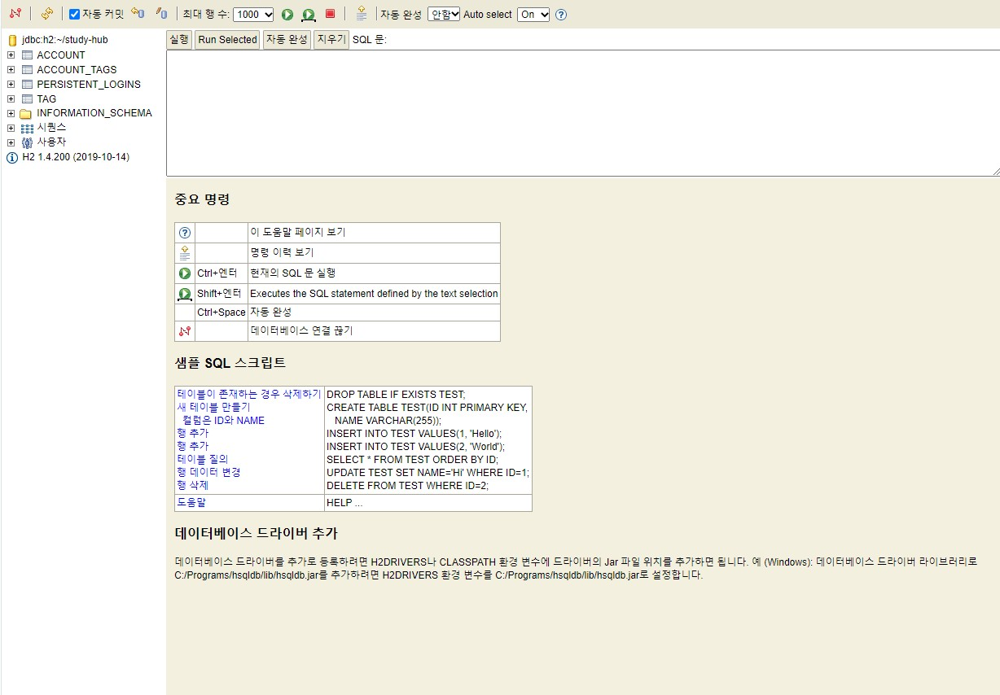

# H2 Database 

## H2 데이터베이스란?

H2 데이터 베이스는 인메모리형 DB이다, RDBMS 데이터베이스이고 브라우저 기반의 콘솔모드로 별도의 설치과정 없이 2MB 이하의 매우 저용량에 DB이다.
주로 개발단계에서 사용되거나 실습용으로 많이 사용되며 개발단계에서 사용하기에 매우 편리하다. 인프런이나 유튜브 강의에서도 H2 DB를 사용하는 경우를
봤을 것이다. SQL문법은 표준SQL의 대부분이 지원된다. H2DB는 자바 기반의 DBMS이므로 자바가 설치되어 있어야 한다.

[여기](http://www.h2database.com/html/main.html)에서 다운로드가 가능하다.

<br>

## H2DB 사용 주의사항.

#### 안정화 버전을 사용할 것
현재 안정된 버전은 1.4.200 버전으로 2019.10.14일 공개되었다.
그런데 Spring boot + JPA를 사용하는 환경에서 H2DB를 가지고 실습을 하다보면 DB커넥션이 제대로
이루어 지지않는 경우가 발생한다,
1.4.200 버전에서 localhost로 접속을 하면
```
Connection is broken: "java.net.ConnectException: Connection refused (Connection refused): localhost"
```
위와 같은 오류가 발생하는 경우가 있는데, 본인의 경우는 H2삭제후 1.4.199 버전으로 재설치를 통해 진행했다.


#### 서버 구동 확인하기
H2서버가 구동중인지 확인해 주어야할 필요가 있다.
윈도우 사용자의 경우 그냥 작업표시줄 검색에 작업 표시줄에 H2라고 검색하면 `H2 console` 이라는 앱이 나오기 때문에 실행하면 자동으로
H2 Database Engine 이라는 H2 엔진이 구동된다.

맥의 경우 bind/h2.sh 파일을 실행시켜 주어야 한다.
H2 DB 엔진이 실행되지 않은 상태에서는 당연한 이야기지만 연결이 안되는 에러가 발생한다.
DB 커넥션 오류가 발생할 때 경험이 적은 사용자들은 DB를 따로 실행해 주어야 한다는 사실을 익숙치 않아하는 경우가 많다.


<br>

#### H2 접속이 안되는 경우

처음 H2 데이터베이스를 실행했을 때 Database "~/test" not found, and IFEXISTS=true, so we cant auto-create it [90146-199] 이런 오류가 발생하는 경우가 있다, 데이터베이스 파일이 없는 상황인데
<br>


위 이미지 처럼 JDBC URL에

`jdbc:h2:~/test` 라고 입력후 연결버튼을 눌러주면 데이터베이스 파일이 생성되면서 연결된다.

이후에는 `jdbc:h2:tcp://localhost/~/test` 로 접속하면된다.
(이미지 처럼 파일에 직접 접근하는 방식은 파일에 락이 걸려서 여러곳에서 접속을 못하는 문제가 있다고 함)

만약 이렇게해도 안되는경우 본인의 PC를 재시작하면 해결된다. (필자 해당)

#### 결론
1. h2접속 에러인경우 DB가 생성돼지 않아서이다.
2. `jdbc:h2:~/test` 를 통해 DB를 생성한다.
3. DB가 만들어졌으니 `jdbc:h2:tcp://localhost/~/test`로 접속한다.
4. 그래도 안돼는경우 h2 콘솔을 종료하고 (웹 브라우저 말고 H2엔진) 다시 접속해 본다.
5. `jdbc:h2:~/test` 로 생성 `jdbc:h2:tcp://localhost/~/test`로 접속
6. h2콘솔로 접속할 때 `jsessionid`라는 key가 붙는데 이게 새로적용이 안되서 접속이 안되는것일 수 있으니 다시 실행후 접속하면 해결된다.

<br>



위 이미지 처럼 접속에 성공했다면 왼쪽 패널에 보이는 table과 질의를 위한 가운데의 콘솔을 이용해 사용하면 된다.

한글로 나오기 때문에 누구나 직관적으로 사용할 수 있을 것이다.

<br>

## Spring boot에서 사용하기

스프링부트 자체가 기본적으로 스프링보다 많은 부분을 프로젝트 시작시점부터 자동으로 설정해 주기 때문에
어렵지 않다.

```
<?xml version="1.0" encoding="UTF-8"?>
<persistence version="2.2"
             xmlns="http://xmlns.jcp.org/xml/ns/persistence" xmlns:xsi="http://www.w3.org/2001/XMLSchema-instance"
             xsi:schemaLocation="http://xmlns.jcp.org/xml/ns/persistence http://xmlns.jcp.org/xml/ns/persistence/persistence_2_2.xsd">
    <persistence-unit name="hello">
        <properties>
            <!-- 필수 속성 -->
            <property name="javax.persistence.jdbc.driver" value="org.h2.Driver"/> <!-- 무슨DB를 쓰는지 -->
            <property name="javax.persistence.jdbc.user" value="sa"/> <!-- 유저이름 -->
            <property name="javax.persistence.jdbc.password" value=""/> <!-- 비밀번호 -->
            <property name="javax.persistence.jdbc.url" value="jdbc:h2:tcp://localhost/~/test"/> <!-- 접근URL 경로 -->
            <property name="hibernate.dialect" value="org.hibernate.dialect.H2Dialect"/> <!-- 하이버네이트 방언 지정-->

            <!-- 옵션 -->
            <property name="hibernate.show_sql" value="true"/> <!-- 실제 구동하는 SQL 쿼리를 보여줌 -->
            <property name="hibernate.format_sql" value="true"/> <!-- 읽기 조금더 편하게, 코드를 이쁘게 포맷팅해줌 -->
            <property name="hibernate.use_sql_comments" value="true"/> <!-- 실행된 SQL 쿼리가 어느객체에서 실행되는지 보여줌 -->
            <!--<property name="hibernate.hbm2ddl.auto" value="create" />-->
        </properties>
    </persistence-unit>
</persistence>

        <!--
            hibernate.dialect 속성 지정하기
            h2         : org.hibernate.dialect.H2Dialect
            Oracle 10g : org.hibernamte.dialect.Oracle10gDialect
            MySQL      : org.hibernate.dialect.MySQL5InnoDBDialect
            JPA는 DB에 종속적이지 않다, 극단적으로 db를 mysql에서 oracle로 변경해도 큰 어려움없이 교체 가능하다.
            DB마다의 특성이나 조금씩 다른 sql 쿼리를 가지는데 (예를들어 mysql에선 limit, oracle에선 rownum) 이런 개념을 JPA에서는 방언(dialect) 이라 표현했다.
            하이버네이트는 40가지 이상의 데이터베이스 방언을 지원한다.
        -->
```

위 코드는 persistence 설정 파일이다.

한가지 주의할 만한 내용은 맨처음 언급했듯 H2DB는 인메모리 설정이라는 점이다.
DB를 종료후 실행된 인스턴스가 생성되게 되면 데이터는 휘발성으로 사라지게 된다.