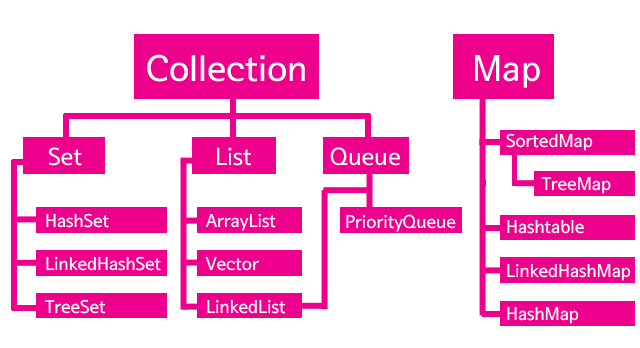

# 자바스크립트 개발자가 배워본 자바의 특징


<br />

## Collections Framework
자바스크립테 에서는 배열을 사용할때 그냥 `const arr = []` 이런형태로 배열을 만들고 필요할때마다 push를통해 값을 넣어주면된다.
그런데 자바에서는 배열을 사용할때 최초의 크기를 지정해주어야 하고 이 크기가 변경될 수 없다.
이러한 불편함을 극복하기위해 프리엠워크를 사용하는것이고, Collections Framework중 하나로 ArrayLst가 있는것이다.

Collections Framework라는 것은 다른 말로는 컨테이너라고도 부른다. 즉 값을 담는 그릇이라는 의미이다. 그런데 그 값의 성격에 따라서 컨테이너의 성격이 조금씩 달라진다. 자바에서는 다양한 상황에서 사용할 수 있는 다양한 컨테이너를 제공하는데 이것을 컬렉션즈 프래임워크라고 부른다.


## ArrayLst


ArrayList는 Collection-List에 속해있다. ArrayList는 LIst라는 성격으로 분류되고 있는 것이다. List는 인터페이스이다. 그리고 List 하위의 클래스들은 모두 List 인터페이스를 구현하기 때문에 모두 같은 API를 가지고 있다. 클래스의 취지에 따라서 구현방법과 동작방법은 다르지만 공통의 조작방법을 가지고 있는 것이다.
익숙한 ArrayList를 바탕으로 나머지 컬렉션들의 성격을 파악해보자.

<br>

```
public class ArrayListDemo {
 
    public static void main(String[] args) {
        String[] arrayObj = new String[2];
        arrayObj[0] = "one";
        arrayObj[1] = "two";
        // arrayObj[2] = "three"; 오류가 발생한다.
        for(int i=0; i<arrayObj.length; i++){
            System.out.println(arrayObj[i]);
        }
         
        ArrayList al = new ArrayList();
        al.add("one");
        al.add("two");
        al.add("three");
        for(int i=0; i<al.size(); i++){
            System.out.println(al.get(i));
        }
    }
 
}
```

위에 코드는 세번째 값을 넣으려 할때 에러가 발생한다. arrayObj를 인스턴스할때 2개의 크기를 가지도록 만들었기 때문이다.
자바스크립트라면 배열을 만들고 나서 배열에 10개를 넣든, 100개를 넣든 상관이 없다.

```
ArrayList al = new ArrayList();
al.add("one");
al.add("two");
al.add("three");
```
하지만 위에 코드처럼 ArrayList를 사용하면 크기를 지정하지 않기때문에 필요한 갯수만큼 배열의 크기도 늘어난다.

**기억해야할 부분은 ArrayList는 프레임워크이기 때문에 java에서의 순수 배열을 사용할때와 사용법이 조금 다르다는 점이다.**

## List, Map, Set 의 차이점
- List는 중복을 허용한다. 배열과 거의 유사하다고 생각하면된다.
- Set은 중복을 허용하지않는다. 이미 컬렉션에 1이라는 값이 있는데 다시1을 넣으려고 한다면 에러가 발생하지는 않지만 값은 들어가지않게된다.
- Map 컬렉션은 key와 value의 쌍으로 값을 저장하는 컬렉션이다 객체형태로 저장된다고 보면 되겠다. `put(key: value)`형태로 값을추가하고 `getKey` 혹은 `getValue`로 가져온다.

 
 
## List의 사용법

#### 생성하기
```
ArrayList<Integer> numbers = new ArrayList<>();
```

#### 추가하기
```
numbers.add(10);
numbers.add(20);
numbers.add(30);
numbers.add(40);
```

#### 삭제하기
```
numbers.remove(2);
```

#### 가져오기
```
numbers.get(2);
```

#### 반복하기
```
Iterator it<Integer> = numbers.iterator();
```
ArrayList를 탐색할 때는 Iterator를 사용한다. Iterator는 객체지향 프로그래밍에서 주로 사용하는 반복 기법입니다. Iterator를 쓰려면 우선 Iterator 객체를 만들어야 한다.

```
while(it.hasNext()){
    int value = it.next();
    if(value == 30){
        it.remove();
    }                       
}
```
`it.next()` 메소드는 호출될 때마다 엘리먼트를 순서대로 리턴한다. 만약 더 이상 순회할 엘리먼트가 없다면 it.hasNext() 는 false를 리턴해 while문은 종료된다, Iterator는 엘리먼트를 삭제/추가할 때도 사용 가능하다
it.remove()는 it.next()를 통해서 반환된 엘리먼트를 삭제한다.

```
for(int value : numbers){
    System.out.println(value);
}
```
위 코드처럼 그냥 mumbers객체의 값을 value로 가져와 사용할 수 있다. 자바스크립트의 for in문처럼 말이다.
개인적으로 이방법이 더욱 보기에도 쉽고 편한것 같다.

<br>
<br>

## 전체코드
```
package list.arraylist.api;

import java.util.ArrayList;
import java.util.Iterator;

public class Main {

    public static void main(String[] args) {

        ArrayList<Integer> numbers = new ArrayList<>();

        numbers.add(10);
        numbers.add(20);
        numbers.add(30);
        numbers.add(40);
        System.out.println("add(값)");
        System.out.println(numbers);

        numbers.add(1, 50);
        System.out.println("\nadd(인덱스, 값)");
        System.out.println(numbers);

        numbers.remove(2);
        System.out.println("\nremove(인덱스)");
        System.out.println(numbers);

        System.out.println("\nget(인덱스)");
        System.out.println(numbers.get(2));

        System.out.println("\nsize()");
        System.out.println(numbers.size());

        System.out.println("\nindexOf()");
        System.out.println(numbers.indexOf(30));

        Iterator it = numbers.iterator();
        System.out.println("\niterator");
        while (it.hasNext()) {
            int value = (int) it.next();
            if (value == 30) {
                it.remove();
            }
            System.out.println(value);
        }
        System.out.println(numbers);

        System.out.println("\nfor each");
        for (int value : numbers) {
            System.out.println(value);
        }
        System.out.println("\nfor");
        for (int i = 0; i < numbers.size(); i++) {
            System.out.println(numbers.get(i));
        }

    }

}
```


참고: [생활코딩](https://opentutorials.org/module/516/6446)