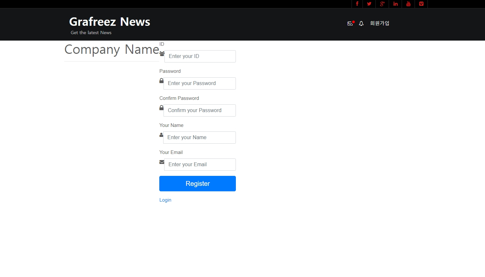

-# SpringBoot - Mybatis 사용하기

## Mybatis란?

마이바티스는 개발자가 지정한 SQL, 저장프로시저 그리고 몇가지 고급 매핑을 지원하는 퍼시스턴스 프레임워크이다. 마이바티스는 JDBC로 처리하는 상당부분의 코드와 파라미터 설정및 결과 매핑을 대신해준다. 마이바티스는 데이터베이스 레코드에 원시타입과 Map 인터페이스 그리고 자바 POJO 를 설정해서 매핑하기 위해 XML과 애노테이션을 사용할 수 있다.

<br>

## Mybatis 적용해 보기

#### application.properties에 mybatis 등록

```
#mybatis - mybatis/mapper 하위에 있는 모든 디렉토리에 모든 xml파일을 사용한다는 의미, 대신 @Mapper와 namespace가 자기이름과 같은것을 매핑한다.
mybatis.mapper-locations=classpath:mybatis/mapper/**/**.xml
```

위와 같이 properties에 등록한다.

<br>



* 개인사이트를 만들기 위해 bootstrap으로 대충 만들던중 mybatis관련 포스트를 작성하기 위해 예제로 사용해 UI가 심각.
* 회원가입 페이지에서 정보를 입력하고 Register 버튼을 누르면 POST `/register`로 요청을 보내게 된다.


```
@Controller
public class ViewController {
    @Autowired
    private RegisterDao registerDao;
    @Autowired
    WebSecurityConfig webSecurityConfig;

    @GetMapping("/")
    public String getMain(){
        return "index";
    }

    @GetMapping("/register")
    public String getRegister(){
        return "guest/register";
    }

    @PostMapping("/register")
    public String postRegister(
            @RequestParam("userId") String userId,
            @RequestParam("password") String password,
            @RequestParam("name") String name,
            @RequestParam("email") String email
            ){
        System.out.println("userId = " + userId);
        System.out.println("password = " + password);
        System.out.println("name = " + name);
        System.out.println("email = " + email);

        Map<String, String> map = new HashMap<String, String>();
        map.put("userId", userId);
        map.put("password", webSecurityConfig.passwordEncoder().encode(password));
        map.put("name", name);
        map.put("email", email);

        registerDao.register(map);

        return "redirect:/";
    }
}
```

위 코드는 회원가입을 보여주는 GET `/register` 요청을 받으면 회원가입 페이지를 보여주고 POST `/register` 요청을 받으면
`map`으로 requestParma을 하나씩 key 와 value 형태로 삽입해 bean으로 주입받은 `registerDao` 객체의 register를 실행하는 모습이다.

 `registerDao.register(map);`이 실행되면 `resources/mybatis/mapper` 디렉토리 안에 있는 Register.xml의 `register`가 실행된다.
 
 
#### resources/mybatis/mapper/register 코드
 
```
<?xml version="1.0" encoding="UTF-8" ?>
<!DOCTYPE mapper
        PUBLIC "-//mybatis.org//DTD Mapper 3.0//EN"
        "http://mybatis.org/dtd/mybatis-3-mapper.dtd">

<mapper namespace="com.exclusiveint.exclusive.dao.RegisterDao">

    <insert id="register">
        INSERT into exclusive (userId, password, name, email)
            VALUES(#{userId}, #{password}, #{name}, #{email})
    </insert>

</mapper>
```

`<mapper namespace="com.exclusiveint.exclusive.dao.RegisterDao">` 부분을 보면 유추할 수 있듯이 namespace부분에 기재된
클래스(Interface)와 mapper가 매핑된다. `com.exclusiveint.exclusive.dao.RegisterDao` 클래스(Interface)에 명시되어 있는 메소드와
<mapper></mapper> 안에 쿼리문으로  쓰여있는 id가 같아야한다.

#### com.exclusiveint.exclusive.dao.RegisterDao 코드
```
package com.exclusiveint.exclusive.dao;

import org.apache.ibatis.annotations.Mapper;
import org.springframework.stereotype.Repository;

import java.util.Map;

@Mapper
@Repository
public interface RegisterDao {
    public int register(Map<String, String> map);
}
```

mapper/register의 id와 dao.RegisterDao의 인터페이스에 명시되어있는 메소드명이 같아야한다, 이렇게 맵핑이 가능한 이유는
프로퍼티스에 mabatis mapper 파일의 경로를 등록했기 때문에 `@Mapper` 어노테이션과 네임스페이스의 이름이 같은것을 맵핑해주고 있기 떄문이다.

<br>

그럼 위에 `mapper/register` 파일의 insert문이 실행되며 전달받은 파라미터의 값들이 db에 저장된다.


```
<select id="viewDao" resultType="com.example.dto.viewDto">
    SELECT * FROM bbs where id = ${param1}
</select>
```

insert문이 아닌 select 쿼리였다면 위 코드처럼 resultType을 통해 Dto 객체에 반환값을 저장하면 된다. 

<br />
 