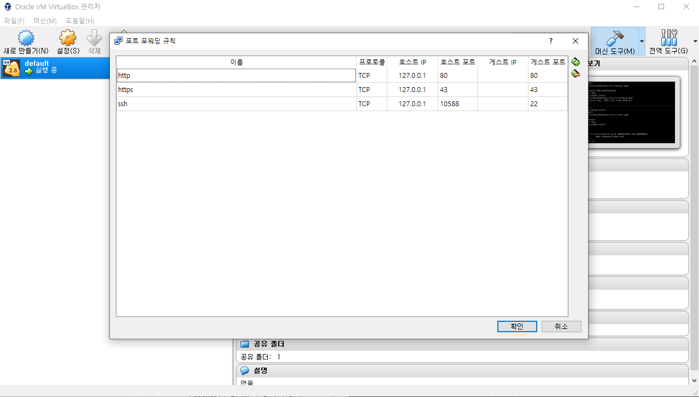
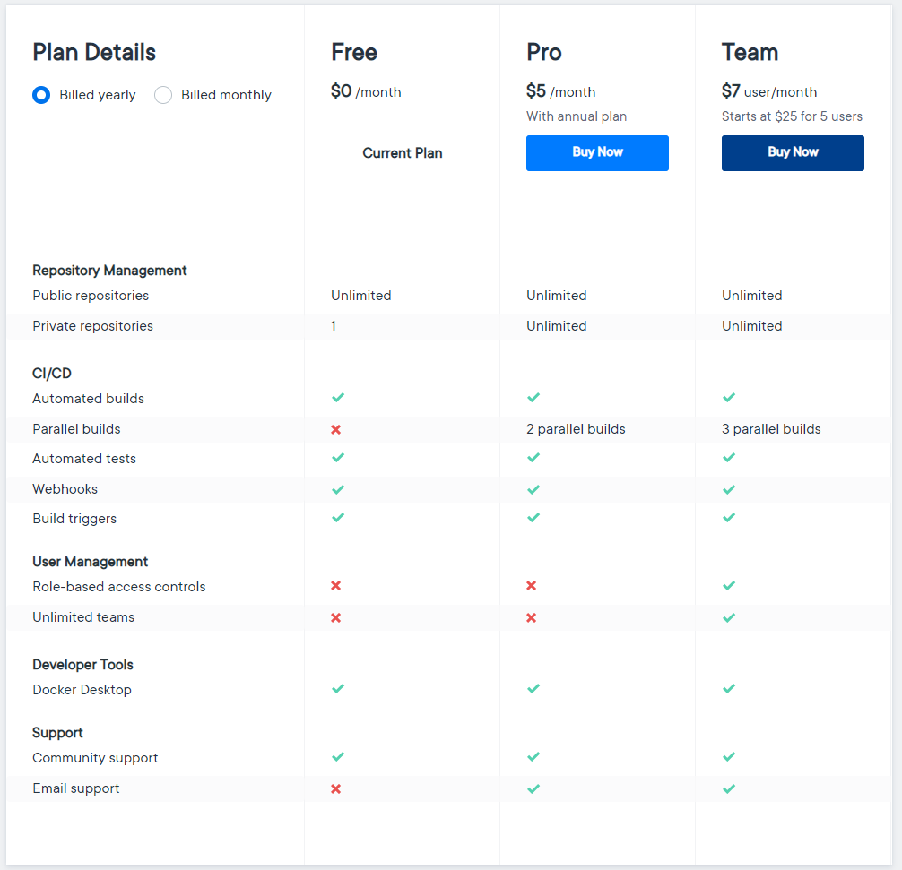

# Docker 공부하기

## 참고 (에러상황)

원래 docker terminal이 잘 실행되었는데 20.07.21 퇴근후 집에서 해보려고 하니 실행이 안되고있다.
`Error getting IP address: Something went wrong running an SSH command` 이런 에러가 발생하는데 왜 IP를 얻지 못하는지 모르겠다.
리니지m 때문에 블루스택 업데이트를 했는데 블루스택 안드로이드 업데이트가 영향을 주었나 의심스럽다.

```
docker-machine rm default
docker-machine create --driver virtualbox default
```
위 코드로 해결 되었다.


<br>

---

<br>

## 도커란 무엇인가?


<br>

도커의 이미지는 고래가 컨테이너를 쌓고있는 모습이다. 기본적인 컨셉이 그러하다 고래가 도커이고 그위에 컨테이너가 있다 컨테이너 안에는 서버에서 사용하는데
필요한 어플리케이션들이 이미지라는 형태로 정의되어 있다.
도커는 논리적인 구분이다. 물리적으로 서버가 쪼개지거나 하는것은 아니다. Host OS위에 도커가 올라가고 도커위에
내가 필요로하는 컨테이너인 프로세스(웹서버, DB, Git 등등)가 떠있는 것이다.

도커는 서버를 세팅하기위해 필요한 여러가지 도구들을 도커 이미지라는 형태로 관리하는 것이다.
다양한 OS에 여러 어플리케이션이 올려지고 이런것을 컨테이너 라고 부른다.
도커는 2013년 3월 산타클라라에서 열린 Pycon Conference에서 처음 발표되었고 리눅스 베이스 이며 go lang으로 만들어져 있다.
64비트 이므로 윈도우에서 사용한다면 윈7  미만에서 사용할 수 없다.

1. 윈도우, 리눅스 상관없이 서버환경을 구축하도록 도커파일을 통해 관리한다.
2. 설정되어 있는대로 필요 프로그램을 쉽게 다운받고 사용할 수 있게 해준다.


## 도커 설치하기

윈도우10
    - 처음 도커를 설치하려고하면 `Docker Desktop requires Windows 10 Pro/Enterprise (15063+) or Windows 10 Home (19018+).` 이런 에러가 발생할 것이다. [여기](https://github.com/docker/toolbox/releases)에서 Docker toolbox를 설치해주자
    - 정상적인 실행을 위해서는, 작업관리자 '성능' 탭에서 '가상화:사용'이라고 표시되면 도커를 사용할 수 있다.
    - 툴박스를 설치했으면 `Docker Quickstart Terminal`이라는 프로그램을 실행해 엔터를 눌러주자 터미널창에서 creating이 시작되며 VirtualBox를 설치할 것 이다.
    - 반응이 없는경우 엔터를 입력하자, 마지막에 고래모양이 나오면서 `Start interactivi shell`이라고 나오면 정상적으로 설치가 완료되었다.
    - 도커 명령어는 `Windows Powershell`이 아닌 `Docker Quickstart Terminal`에서 실행해야 한다. 네임스페이스가 다르다. 
    - 이번엔 Docker Desktop을 설치하다 GUI 환경에서 도커를 사용할 수 있다. [Docker for Windows Only](https://docs.docker.com/docker-for-windows/install/) 주의점이 있다면 윈도우10 Pro 이상이어야 한다 Home버전에서는 Hyper-5를 사용할 수 없어서 도커데스크톱 사용이 안된다. 
    - [참고 블로그](https://steemit.com/kr/@mystarlight/docker)를 확인해보면 좋을 것 이다.
    
맥
    - [Docker for MAC](https://docs.docker.com/docker-for-mac/install/)
    
<br>


도커는 리눅스 환경에서 실행되는데 윈도우는 리눅스가 아니기 때문에 윈도우에서 도커를 설치하면
오라클 버추얼박스 라는것을 추가로 띄워서 그위에 도커를 실행시키게 된다.

## 도커 명령어

| 커맨드 | 기능 |
| ------ | --- |
| `docker pull`  | run은 이미지가 없는경우 다운로드도 하지만 pull의 경우 다운로드만 이루어 진다. |
| `docker create -p 80:80 --name nx nginx`  | nginx라는 이미지를 nx라는 이름의 컨테이너로 생성한다. |
| `docker start`  | 도커 컨테이너를 실행한다, 생성하는것과는 다르다. |
| `docker run example` | 이미지를 찾아 컨테이너로 만들고 실행까지 수행한다. (이미지 없으면 도커허브에서 풀링) |
| `docker stop \`docker ps -q\` ` | docker ps -q를 하면 실행중인 컨테이너의 id를 가져오는데 이걸 stop으로 전달해서 모두 중지시키는 명령어이다. |
| `docker container run <docker-image-name> <command>` | 도커 컨테이너를 실행한다. 위 커맨드와 의미적으로 동일하다.(아마도) [참고](https://okky.kr/article/735452?note=2016019)  |
| `docker commit ` | 현 컨테이너의 이미지를 그대로 저장한다, 예를들어 ubuntu를 설치하고 docker,aws-cli,git 등등을 설치한뒤 필요한 어플리케이션이 설치된 이미지의 상태를 commit해서 다시 저장할 수 있다. |
| `docker ps` | 현재 실행중인 컨테이너 리스트를 확인할 수 있다. |
| `docker ps -a` | 실행중인 도커 컨테이너와 중지된 컨테이너까 정보를 확인할 수 있다. |
| `docker system df` | 컨테이너가 얼만큼의 디스크를 사용하는지 정보를 알려준다. |
| `docker <option> prune` | 사용하지 않는 컨테이너를 삭제하기위한 명령어인데 `<옵션>` 위치에 무엇을 넣느냐에 따라 역할이 달라진다. 대표적인 옵션들은 `system / image / container / volume / network` 이다. 예를들어 `docker container prune` 라고하면 안쓰는 컨테이너를 삭제하고 `docker network prune` 라고 실행하면 iptables 규칙 및 라우팅테이블과 가상네트워크 장치의 잉여 자원을 삭제한다. 터미널에서 삭제할거냐고 물어볼때 yes대신 y라고 쳐야 작동한다. |
| `docker inspect nginx` | nginx 이미지를 볼 수 있다. |
| `docker info` | 설치 디렉토리, 버전, storage가 설치된 디렉토리 등등 정보를 볼 수 있다. |
| `docker exec -it ubuntush cat /etc/hosts` | 이미 실행되고 있는 ubuntush라는 컨테이너에 `cat /etc/hosts`라는 실행을 명령할 수 있다. |
| `docker rename "ubuntush" "ub"` | tbuntush라는 이름의 컨테이너 이름을 ub로 변경 |
| `docker logs tc # stdout, stderr` | 컨테이너 로그 남기기 |
| `docker cp <path> <to container>:<path>` | 로컬 시스템 -> 컨테이너로 파일 이동 |
| `docker cp <from container>:<path> <path>` | 컨테이너 -> 로컬 시스템으로 파일 이동 |
| `docker cp <from container>:<path> <to container>:<path>` | 컨테이너 -> 컨테이너로 파일 이동 |


<br>
<br>

## 도커 명령어 의미 익히기

`Docker Quickstart Terminal`을 실행하고 `docker run hello-world`을 입력해보자 `
`Unable to find image 'hello-world:latest' locally` 라는 문구가 나오더니 다운로드를 할 것이다.
로컬상에서 hello-world라는 이미지를 찾을 수 없어 도커허브에서 pulling 한것이다. 깃에서의 풀은 코드를 받는것이지만 도커에서는 이미지를 받는것이다.
`https://hub.docker.com/` 이곳에서 도커 이미지를 공유할 수 있다. 좀더 알아보고 싶다면 `https://docs.docker.com/get-started/` 이곳을 확인해보라는 메세지가 나온다.
즉 우리는 방금 도커허브에서 헬로월드 예제를 다운받아 실행해본 것이다.

이번에는 `docker ps -a`를 실행해보자


위 이미지 처럼 컨테이너의 상태와 언제만들어졌는지 status에선 언제 실행되었는지가 표기된다. names는 정해준 값이 없기 때문에 임의에 이름이 부여되어 있다.

`docker-machine.exe ls`를 실행해보면 실행되고 있는 버추얼박스와 정보를 확인할 수 있다.


```
 // 두 코드의 의미는 같다, container 생략 가능
 docker run --name webserver -d -p 3000:80 nginx 
 docker container run --name webserver -d -p 3000:80 nginx 
```
위 코드에서의 container는 생략이 가능하다 즉 docker run .... 으로 작성할 수 있다.
run 다음의 --name 은 컨테이너에 webserver라는 이름을 붙이는 것이다. -d는 Detachment를 의미한다. 분리시킨다는 의미다
백그라운드로 실행할 지 포그라운드로 실행할지를 의미한다. -d 옵션으로 백그라운드에서 실행하게 할 수 있다. -p는 포트를 의미하고
-p 3000:80 이니까 nginx의 80번 포트를 내 pc의 3000번 포트에 할당하는 것이다. 기본적으로 1000 이하의 포트는 시스템에서 사용한다. 마지막 nginx는 이미지의 이름이다.
 
위 코드를 실행해고 `docer ps`를 입력하면 지금 nginx 컨테이너가 실행중임을 알 수 있다.
<br>

위 코드를 실행했는데 localhost로 접속해보아도 `Welcome to nginx!` 라는 문구가 보이지 않고 연결할 수 없다는 에러가 나오는가?

<br>


그렇다면 Oracle VM VirtualBox 앱을 실행 -> 설정 -> 네트워크 -> 고급 -> Port Forwarding으로 들어가 위 이미지처럼 설정해주자.

윈도우에서 도커를 쓰는경우 리눅스가 아니므로 오라클 VM 위에서 도커가 동작한다고 했다, 도커 컨테이너가 바로 진입하지 못하기 때문에
Port Forward로 일종의 Bridge(다리)를 놓아주는 것이다.


<br>

```
docker run -it --name "test1" centos /bin/cal
```
-it란 i는 인풋이다 화면상에 입력을 받기위함이고 t는 tty라고해서 standard out 화면상의 표준출력이다.
-it를 입력하면 인터랙티브한 대화형으로 실행할 수 있다. test1이라는 컨테이너이름을 주었다, 이름이 없으면 임의에 이름이 붙게된다.
centos 이미지를 실행하는데 마지막 /bin/cal은 명령이다.
즉, centos기반으로 이미지를 실행시켜서 /bin/cal을 실행하라는 명령이 되는 것이다.
위 코드를 실행하면 캘린더가 실행되게 된다.

<br>

```
docker run -it --name "centossh" centos /bin/bash
```
이번에는 centos의 쉘을 실행해보자 리눅스에서 기본 디렉토리가 /bin이므로 마지막 명령은 bash만 써도 된다.
--name을 지정해줄 때 ""를 쓰지않아도된다. 하지만 띄어쓰기가 들어가는경우 따옴표로 구분해주어야 한다.
위 코드를 실행하면 이번엔 도커 터미널이 다운받은 centos 이미지의 shell을 실행한 모습이 나오게 된다.
centos의 네임스페이스로 들어가게 되는 것이다. 이상태로 `whoami` 혹은 `ls` 명령으로 리눅스 명령을 실행 할 수 있다.

<br>

```
# ubuntush 라는 컨테이너를 만들었다.
docker run -it --name "ubuntush" ubuntu /bin/bash

# 실행은 되지만 우분투 쉘로 들어가지는 않는다.
docker start ubuntush

# 들어가고 싶다면 실행중인 상태에서 attach를 사용해 우분투 쉘로 들어갈 수 있다. 
docker attach ubuntush

# attach로 들어간 상태에서 우분투를 종료하지않고 터미널에서만 빠져 나오고 싶다면 Ctrl+p + Ctrl+Q 를 눌러주면 도니다.
```
Ctrl+p + Ctrl+Q를 누르면 실행되는 컨테이너를 종료하지않고 터미널에서 빠져나올 수 있다. (detach)
attach라는 명령어를 주면 실행되는 ubuntu나 centos에 터미널로 들어갈 수 있다. (ubuntush가 실행중이여야 들어갈 수 있다.)

<br>

```
 # cp를 통해 클라이언트의 파일을 도커컨테이너로 전달할 수 있다, 혹은 반대도 가능하다.
 docker [container] cp <container-name>:<path> <client-path>
 docker [container] cp <client-file> <container-name>:<path>
 ex)
 docker cp mysql5:/backup/dump.sql
 docker cp dump.sql mysql5:/


 # 내 디렉토리에 어떤 파일을(localpath) 컨테이너(container-path) 에게 공유할 수 있다.
 docker run -v <localpath>:<container-path>
```
파일을 공유하거나 공유할 때 사용하는 명령어가 -v 이다.

## Oracle & Mysql 설치해보기

```
# oracle 다운로드
docker pull oracleinanutshell/oracle-xe-11g

# oracle 이라는 컨테이너 만들고 실행
docker run -d -p 8080:8080 -p 1521:1521 --name oracle oracleinanutshell/oracle-xe-11g

# 도커가 oracle을 실행하는 상태로 bash 쉘을 키도록 했다
docker exec -it oracle bash

# 그안에서 cat /etc/issue를 통해 OS를 확인해보자, Ubuntu 18.04.1 LTS \n \l 라고 나올것이다.
cat /etc/issue
```

위 커맨드를 하나씩 실행해보면 결과적으로 도커위에 오라클이라는 컨테이너가 실행되고 그위에 우분투가 설치된 상태로 오라클이 실행되고 있는 모습이다.

```
# mysql 이미지 뒤에 태그로 버전을 지정해줄 수 있다.
docker pull mysql:5.7

# -e는 환경변수를 의미한다, MYSQL_ROOT_PASSWORD = root1! 라는 OS에서 사용할 환경변수를 만든것이다. 태그명이 latest가 아니면 적어주어야 실행된다.
docker run -d -p 3306:3306 -e MYSQL_ROOT_PASSWORD=root1! --name mysql5 mysql:5.7 mysql
```

<br>

## 도커 레지스트리


우리가 사용하고자 하는 애플리케이션, 즉 이미지를 찾고 싶다면 도커 레지스트리라는 개념을 알아야 한다.
Registry 라는 일종의 보관소에서 image를 다운받는 형태로 사용할 수 있다. 누구나 image를 만들어서 push할 수도 있고 다운로드 할 수도 있다. 
이미지는 static한 정지되어있는 상태이므로 container로 만들어서 실행을 해야한다. 컨테이너가 이미지를 띄워준 것이다.
terminal 에서 `docker search <imageName>` 이런 형태로 확인할 수도 있으나 [도커허브](https://hub.docker.com/)를 참고하길 바란다.

OFFICIAL IMAGE 라는 태그가 붙어있는 이미지의 경우 공식적으로 제공하는 이미지 이다.

도커 허브에가서 회원가입을 하면 나만의 Private Repository 를 만들수 있다. 다만 프리플랜의 경우에 1개까지는 이용할 수 있으나
더 많은 프라이빗 레포지토리를 원한다면 결제가 필요하다.

<br>



전에는 프로그레스 바 형태의 디자인이여서 바를 올리면 사용가능한 공간이 얼마나 생기는지
나오는 형태였는데 지금은 이런 정적인 모습으로 변했다. 아쉬운 것 같다.

<br>

## 도커의 라이프 사이클

.png)

상당히 좋은 이미지 인것같다. 도커의 라이프사이클을 이해하기에도 좋고 명령어 들의 이해에도 도움이 되는것 같다. 

<br>

## 도커의 레이어 개념

.png)

도커의 이미지에는 레이어라는 개념이 있다. 위 이미지처럼 이미지안에 레이어가
나뉘어져 있는데 레지스토리에 저장할 때 이미지를 각각 레이어로 쪼개서 겹치는 부분은 일치하는 레이어로 유지를 하고 바뀌는 부분만
새롭게 저장되어 사용하게 된다.

1. 이미지A를 지워도 이미지B에서 사용하는 레이어가 있다면 유지된다.
2. 이미 존재하는 레이어는 새로 다운로드 받지않고 공유되듯 사용된다.

<br>

## MySQL 환경변수를 사용한 서비스 구축
```
docker run --name some-mysql -e MYSQL_ROOT_PASSWORD=my-secret-pw -d mysql:tag
```
위 코드를 살펴보자 일반적으로 사용하던 container를 run 하는 도커 명령어와 비슷하지만 -e 명령어를 주었다.
env 즉 환경변수를 `-e` 라고 적어주는 것이다. MYSQL_ROOT_PASSWORD라는 환경변수를 전달하는 것이다. container 안에 고정된 비밀번호를 박아넣으면
되지않는가 생각할 수 있으나 공유기 해킹문제가 있다. 그래서 위 코드처럼 환경변수를 전달함으로 인해 초기 비밀번호를 세팅해주는 것이다.

<br>
<br>

그럼 한번 실습해 보자
```
# --rm 옵션으로 컨테이너가 종료되면 삭제까지 자동으로 이루어지게 했다.
docker run --name ms -e MYSQL_ROOT_PASSWORD=lua928908 --rm -d mysql

# -it를 통해 bash로 들어갔다.
docker exec -it ms bash

# 현재 bash에서의 환경변수 이름과 값을 볼 수 있다.
printenv

# 특정 환경변수만 확인
printenv env_name
```

위 내용중 `pintenv`를 쳐보면

```
root@0716c06a8ae1:/# printenv
MYSQL_MAJOR=8.0
HOSTNAME=0716c06a8ae1
PWD=/
MYSQL_ROOT_PASSWORD=lua928908
HOME=/root
MYSQL_VERSION=8.0.21-1debian10
GOSU_VERSION=1.12
TERM=xterm
SHLVL=1
PATH=/usr/local/sbin:/usr/local/bin:/usr/sbin:/usr/bin:/sbin:/bin
_=/usr/bin/printenv
```
이렇게 mysql bash에서 존재하는 환경변수 들을 확인할 수 있다.

```
docker exec -it ms mysql -u root -p
```
위 코드를 입력하면 패스워드를 입력하라고 나온다.
조금전 환경변수 `-e MYSQL_ROOT_PASSWORD=lua928908` 라고 전달했던 것처럼
lua928908을 입력하면 root 계정으로 로그인이 된다.


<br>

## 도커 이미지 push하기 (docker hub에 저장하기)

```
sudo docker login
# 아이디/이미지명 으로 이미지 이름을 바꾸어서 등록해야한다. 오피셜이 아니기 때문이다. 
sudo docker tag exampleImage lua928908/exampleImage
sudo docker images
sudo docker push lua928908/exampleImage
```

당연한 이야기지만 먼저 [도커허브](https://hub.docker.com/)에 가입되어 있어야 한다.
`docker login`을 입력하면 아이디와 비밀번호를 입력하라고 나온다, 마치 git에 로그인할 때 처럼, 그런다음 도커의 이미지명을 바꾸어야한다.
`sudo docker tag exampleImage lua928908/exampleImage`를 통해 이미지 이름을 바꾸어 주어야 도커허브에 등록이 가능해진다. 우리가 임의로 만든 이미지
이기 때문이다. (official 이라면 가능) 그런다음 `docker push lua928908/exampleImage`를 입력해 도커허브에 푸쉬해주는 것이다.


<br>

## 도커 완전 삭제 및 재설치하기

필자의 경우 nginx를 중복배포하여 문제가 발생하는 경우가 있었다.
docker로 배포가 안되는 오류를 접했는데 nginx 컨테이너가 자동으로 재실행되는 문제 때문에 EC2를 종료하고
docker를 삭제한 뒤 재설치 후 정상 배포를 하였다.

```
# docker container 중지
docker stop `docker ps -q`

# docker container 삭제
docker rm $(docker ps -a -q)

# local에 저장된 image를 모두 삭제한다.
docker rmi $(docker images -q)

# docker service, containerd service 중지
systemctl stop docker.service
systemctl stop containerd.service

# 디렉토리를 삭제한다.
cd /var/lib/docker
rm -rf *
cd /var/run
rm docker.sock docker.pid (rm: remove 소켓 `docker.sock'? 라고 물어보면 y)
rm -rf docker
```
깔끔하게 이렇게 삭제를 한다.

<br>

```
# docker 설치
apt install docker

# docker 실행
systemctl start docker

# 배포
npm run deploy:production [profileName]
```
위 코드를 통해 docker를 재설치하고 기존방식대로
배포를 진행한다.


#### 참고 및 추천자료
- [시니어코딩IndiFlex - { docker } 도커 #1 - docker의 개념](https://www.youtube.com/watch?v=MHzxhoBmCwA)
- [재즐보프 - 도커와 컨테이너 왜 필요한지 알고 계신가요!! 첫 번째 이야기](https://www.youtube.com/watch?v=ePpiEy_C_jk&list=PLnIaYcDMsSczk-byS2iCDmQCfVU_KHWDk&index=1)
- [도커 컴포즈란?](https://www.44bits.io/ko/post/almost-perfect-development-environment-with-docker-and-docker-compose)
- [docker-compose를 이용하여 개발환경 구축하기(feat. vagrant)](https://youtu.be/MqfGuhHnlxw)

