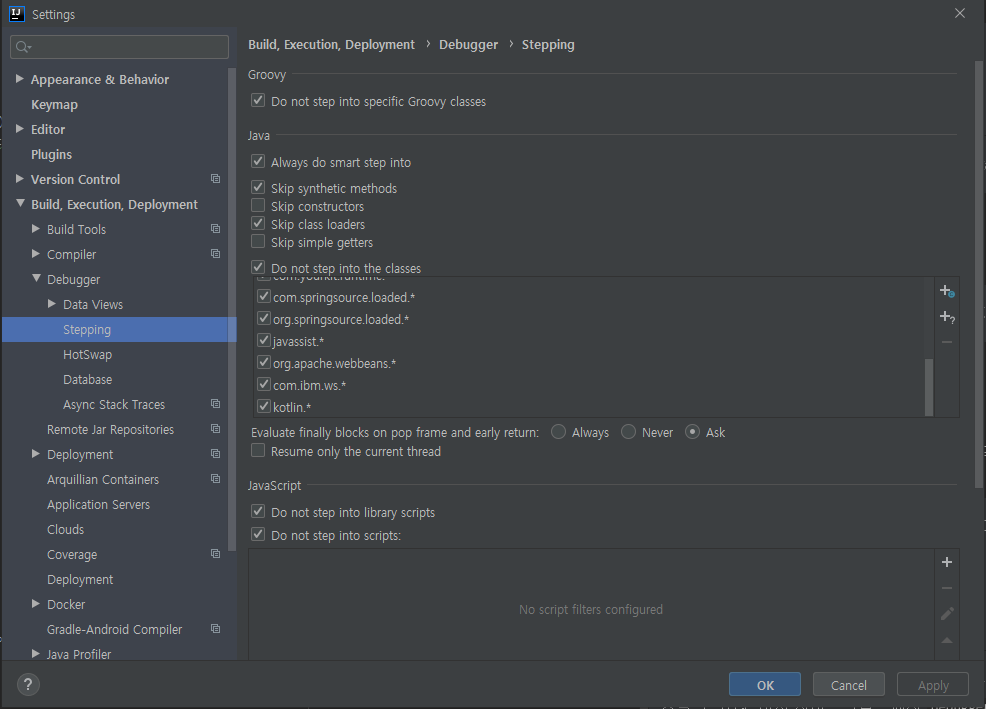
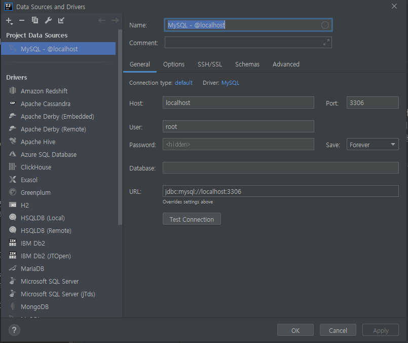

# 인텔리제이 사용법

## 인텔리제이란

인텔리제이 IDEA는 해외에서 많이 알려진 IDE이지만 공식한국어 매뉴얼을 제공하지 않고 주력 제품이 모두 유료라는 이유로 한국에서는 오랫동안 지명도가 낮다.
한국에서는 2017년 정도부터 주목을 받았지만 인텔리제이 IDEA는 2001년에 최초 버전이 출시됐으며 훌륭한 리팩토링 기능과 코드 자동 완성기능으로 유명하다 오랜 역사만큼 고급기능이
많아져 초심자에게 친화적이지는 않다. 커뮤니티에디션을 오픈소스로 공개했고 커뮤니티 에디션과 얼티밋 에디션 버전으로 나누어진다.

모든 파생 IDE의 기반은 얼-티밋 에디션이지만 얼티밋 에디션에 포함되지 않은 기능을 가진IDE도 존재한다.


이미지 출처 :  인텔리제이 IDEA - 야마모토 유스케, 이마이 마사노부


## 인텔리제이 IDEA 설치하기

인텔리제이 설치방법에는 인스톨러 설치와 젯브레인 툴박스를 이용한 설치가 있는데
젯브레인 툴박스를 설치하는것을 추천하고싶다. https://www.jetbrains.com/toolbox-app/ 으로 이동해서
설치를 해주면 된다. 툴박스를 통해 설치를하게되면 젯브레인에서 제공하는 모든 IDEA 제품군이 나오게되는데 내가원하는 것만 설치하면된다.


설치가 완료되면 툴박스를 통해 버전을 관리할 수 있다. 새버전 확인과 업그레이드를 지원하고 다른 젯브레인 제품을 사용하고 싶다면 간편하게 설치할 수 있다.
이외에도 인텔리제이 -> 설정(톱니바퀴) -> Settings를 클릭하면 인텔리제이 세팅을 변경할 수 있다. Maximum Heap Size가 기본 750MB로 설정되어 있는데
인텔리제이를 실행하는데 얼만큼의 메모리를 할당할지 결정하는 값이다. 본인의 개발PC 메모리가 8기가라면 1024 ~ 2048을 16기가라면 2048 ~ 4096을 선택하면
더 쾌적하게 이용할 수 있다.

설치를 하고나면 초기 설정위저드를 통해 UI 테마, 키맵설정, 추천플러그인 설정등에 대해 나오게 된다.
필자는 1~2년 전만해도 여러 에디터를 자주 갈아타고 단축키를 변경하거나 테마를 변경하는등 나에게 적절한 환경을 만들고자 노력했지만
튜닝의 끝은 순정이라 했던가? 최대한 IDEA를 기본설정 그대로 사용하려고 하는 편이다.

<br>

## 자주 사용하는 단축키
--------
| 단축키 | 액션 이름 | 기능 |
| :------ | --- | --- |
| `ctrl + r` | Replace | 바꾸기 |
| `ctrl + shift + r` | Replace in Path | 프로젝트 내 바꾸기 |
| `shift 2회` | Search Everywhere | 무엇이든 검색 가능(파일명,액션,IDE옵션 등) |
| `alt + 1` | Project | 프로젝트 툴로 포커스 이동 |
| `alt + insert` | New... | 파일추가(현재위치 혹은 포커스된 프로젝트툴에서 생성) |
| `ctrl + j` | Insert Live Template | 약어를 통한 코드확장 예) java 에서 sout 으로 println 사용 가능 |
| `ctrl + alt + s` | Settings... | 프로젝트 세팅 옵션 |
| `ctrl + alt + l` | code format action  | 코드 줄맞춤 |
| `shift + f6` | Rename | 리네임 리팩토링 (파일 안에서 변수명을 한번에 변경하는 것도 가능) |
| `ctrl + shift + f8` | View Breakpoints  | Breakpoints 다이얼로그 |
| `f7` | Step Into | 스텝 인투 |
| `f8` | Step Over | 스텝 오버 |
| `f9` | Resume Program  | 재실행 |
| `alt + f8` | Evaluate Expression  | 계산식 평가 |
| `ctrl + tab` | Switcher | 닫은 파일 열기 |
| `ctrl + e` | Recent Files | 최근 사용한 파일 목록 |
| `ctrl + shift + back space` | Last Edit location | 마지막 편집 위치로 커서 이동 |
| `ctrl + f12` | File structure popup | 해당 파일의 구조 확인 예) 메서드 구조 |
| `ctrl + alt + v` | Extract Variable | 코드의 결과를 변수로 추출한다. 예) Member m = repo.find(1L) |
| `ctrl + alt + m` | Extract Method | 코드를 메서드로 추출한다. |
| `Shift + F10` | Run | 프로젝트를 실행한다. |
| `ctrl + alt + Left/Right` | Navigate back / forward | 해당 메서드 코드위치로 이동 및 복귀한다.|
| `ctrl + shift + F10` | Run context configuration from editor | IDE의 현재 문맥상 실행할 수 있는 요소가 있으면 실행한다 예) 테스트 코드, application |
| `psvm + tab` | code extends | main 메서드를 자동으로 만들어준다. |
| `ctrl + F9` | build project | springboot dev tools를 사용하면 build만 해도 자동으로 view와 관련된 코드를 바로 적용해주는 기능 때문에 빌드만 사용하는 경우도 많이 있다. |

<br>

## Postifix Completion

함수 내에서 arg1>arg2.if 라는 수식을 만들고 tab을 누르면
```
if(arg1 > arg2){
    // code
}
```
이런 형태의 수식이 만들어진다. 이런게 있는지 몰랐는데 사용하면 나름 편리할것 같다.

| postfix | 사용방법 |
| ------ | --- |
| `수식.log` | 식을 console.log로 출력 |
| `수식.var` | 식을 변수에 대입 |
| `수식.if` | 식을 조건문으로 한 if 문을 구성 |
| `수식.not` | 식의 조건을 반전 |


이외 다른 Postfix Completion은 Preferences 다이얼로그의 Editor -> General -> Postfix Completion 에서 확인할 수 있다.

<br>

## 브레이크 포인트 사용하기

프로그램의 특정행에서 `Ctrl + F8`을 누르거나 크도의 왼쪽 영역을 클릭하면 빨간색 원이 표시되고 디버깅 실행 시 일시 정지하는 브레이크 포인트를 설정할 수 있다.
마치 자바스크립트에서 `debugger;` 를 통해 특정 코드에서 실행이 멈추게 하는 역할과 비슷하다. 나는 처음엔 이렇게 빨갛게 표시하는 부분이 그냥 눈으로 볼때 코드의 영역을 구분하기 편하라고 만들어져 있는 것인줄 알았다


#### 디버그 실행제어
브레이크 포인트로 정지후에 다음 버튼이나 단축키를 사용해 실행 상태를 제어할 수 있다.

* 재실행: 일시 정지 상태를 해제하고 다음 브레이크 포인트 까지 실행을 계속한다.
* 스텝 오버: 현재 행을 실행한 후 다음 줄을 실행하기 전에 다시 일시 중지한다.
* 스텝 인투: 정지 행에 메소드 호출이 있으면 메소드를 호출한 곳에 들어가 다시 일시 중지한다. 호출 메소드가 Preferences 다이얼로그의 Build, Execution, Deployment -> Debugger -> Stepping으로 지정돼 있다면 들어가지 않고 스텝오버 한다.
기본적으로 표준 라이브러리, 클래스로더, 합성 메소드는 건너뛰도록 설정되어있다. 자세한 동작을 활인할 필요가 없는 경우에는 shift를 두번눌러 액션을 `Search Everywhere`를 실행하고 



#### 브레이크 조건
브레이크 포인트에 마우스 우클릭을 하면 'Condition'이라는 항목에 브레이크 조건을 지정할 숫 있다. 예를들어 반복문 안에서 i=50이라고 적어주면
반복문이 실행될때 i 값이 50인 상황에서 break point가 걸리게 된다. 또한 more를 누르면 Breakpoints 다이얼로그가 나타나며 상세한 동작을 지정할 수 있다.
단축키로는 `ctrl + shift + f8`을 눌러 Breakpoints 다이얼로그를 확인할 수 있다.


## 데이터베이스 접속

젯브레인의 유료 IDE에서는 Database라는 패널을 통해 DB 접속이 가능하다. 인텔리제이는 자바로 만들어져 DB 접속시 JDBC를 사용한다. JDBC는 자바로 데이터베이스에 접속하는
표준사양으로 대부분의 데이터베이스가 JDBC 드라이버를 제공한다. 화면 오른쪽에 Database 툴 윈도우에서 DB에 접속하고 +New에 있는 Data Source에서 접속하고자 하는
데이터베이스 종류를 선택한뒤 Data Source and Drivers 다이얼로그에서 데이터베이스 접속정보를 입력하면 된다.



위 사진처럼 설정정보를 입력하고 Test Connection을 눌러 접속이 되는지 확인해보자. 필자의 경우 서버타임존을 설정하라는 에러가 회사 맥북과 집 window PC 에서도
발생하는데 Advanced 라는 탭을눌러 serverTimeZone 값에 Asia/Seoul을 입력해주면 접속이 가능해진다.

처음에 접속정보를 설정하려할때 밑에부분에 Download missing driver files 라는 메세지가 경고표시와 함께 노출되면 메세지를 클릭해 JDBC 드라이버를 설치해주면 된다.

<br>

#### 아이콘 툴바


참고로 오늘 젯브레인의 또다른 제품, Data Grip을 처음 사용해보았는데 인텔리제이의 Database와 굉장히 흡사하다는 느낌을 받아
신기하다. 둘다 비슷한 기능과 UI를 가지고 있는것 같다.