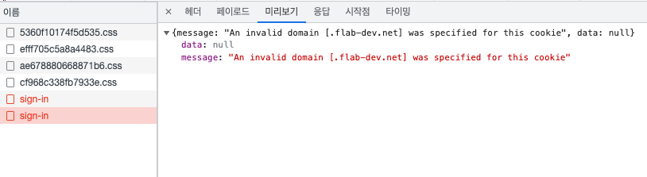
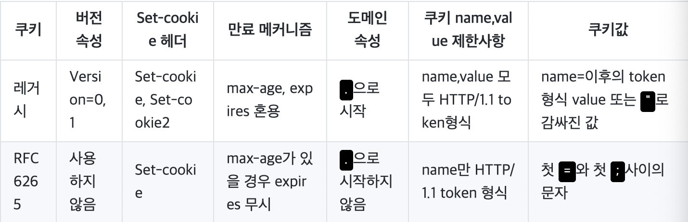

# SpringBoot + Next.js 프로젝트 회고

> 이 글에서는 현재 회사에서 Next.js + SpringBoot +  JPA 로 진행하는 프로젝트를 개발해 가면서 몰랐던 새로 알게되는 전반적인 내용들을 기록하려 한다.
회사에서 진행하는 프로젝트이다 보니 예제코드는 example로 변경해서 기록되어 있기에 정확하지 않을 수 있다.
> 
> 잘못된 설명이나 오타에 대한 pull request 늘 환영 합니다. 


---

# 쿠키 발급이 안되는 문제

## 시나리오
1. 기존에는 accessToken과 refreshToken을 localStorage에 보관했었다.
2. 알고보니 token을 localStorage 같은 곳에 보관하면 확장프로그램이나 기타 XSS공격과 같은 심각한 보안문제가 발생한다고 한다.
3. 결과적으로 refreshToken은 HTTP 세션에 보관하고 accessToken은 redux 같은 메모리에만 보관하기로 했다.
4. Header 컴포넌트 useEffect에서 refreshToken을 가지고 accessToken을 발급받는 로직을 실행시킨다. (refreshToken은 자동으로 붙임)
5. 로컬에서 프론트와 백엔드를 모두 띄우고 로그인을 하면 쿠키가 정상적으로 발급된다.
6. 로컬 프론트에서 서버에 올라가있는 백엔드로 로그인을 하면 로그인은 성공하지만 쿠키발급이 안되는 문제가 있다.


위 이미지처럼 쿠키에 문제가 있다는 오류가 발생.

<br>

## 해결법

나의 상황에서는 쿠키를 정상적으로 발급 하려면  둘중 한가지에는 해당되어야 한다. (로컬에서 서버로 보내는 경우)
- secure가 true 이면서 SamSite 속성이 none인 경우 (SamSite가 none이여도 보인정책에 따라 기본적으로 Lax로 된다.)
- secure가 false 이면서 SamSite 속성이 설정되어 있고 도메인이 같은 경우
  그런데 나의 상황에서는 로컬에서 서버로 보내는 것이기 때문에 https로 보내기 까다롭다 그래서 secure는 무조건 false여야 하기 때문에
  로그인을 요청하는 도메인과 처리하고 쿠키를 발급하는 도메인이 같아야 한다.

결국 로그인 요청 도메인과 인증/쿠키를 발급하는 도메인이 다르기 때문에 발생하는 문제다.
우리는 hosts파일을 변경해 cookie.com이 server.cookie.com에게 로그인 요청을 보내고 쿠키를 발급하게 했다.

```
# /etc/hosts 설정

##
# Host Database
#
# localhost is used to configure the loopback interface
# when the system is booting.  Do not change this entry.
##
127.0.0.1	localhost
255.255.255.255	broadcasthost
::1             localhost
# Added by Docker Desktop
# To allow the same kube context to work on the host and the container:
127.0.0.1 kubernetes.docker.internal
# End of section

127.0.0.1 cookie.com
192.168.0.114 server.cookie.com
```


위 예시처럼 hosts파일을 변경했다. 프론트는 cookie.com:3000으로 접속해 next.js 어플리케이션을 통해 server.cookie.com에게 axios 로그인 요청을 보낸다. 그럼 도메인이 동일하기 때문에 쿠키가 정상 발급 된다.

대부분의 블로그나 stackoverflow에 이런 내용이 안나와 있는 이유는 대부분의 사람들이 localhost에서 프론트와 백엔드를 모두 띄웠을 것이기 때문이다.

.env 파일도 수정해주자 프론트가 server.cookie.com한테 axios 요청을 보내면 hosts 설정에 따라 내부 백엔드 서버가 띄워져있는192.168.0.114(옆자리 개발자분 맥북) 로 요청이 가게 된다.

<br>

### next 프로젝트 .env  설정
```
NEXT_PUBLIC_API_URL=http://server.cookie.com:8888
NEXT_PRODUCTION_URL=https://example.com
```

### 스프링부트 프로젝트 TokenUtil.java 설정
```java
public static void setAuthCookie(String refreshToken, HttpServletResponse httpResponse) {
  Cookie cookie = new Cookie("refreshToken", refreshToken);
  cookie.setHttpOnly(true);
  cookie.setDomain("flab-dev.net");
  cookie.setSecure(true);
  cookie.setPath("/");
  httpResponse.addCookie(cookie);
}
```


위 이미지처럼 정상적으로 쿠키가 발급 되었다.

---

# getServersideProps 요청시 state 초기화

getServersideProps (SSR) 처리시 HYDERATE 액션 타입이 state를 초기화 하는 문제
getServerSideProps를 호출할 때 즉 SSR처리를 하면 서버에 있는 스토어인스턴스가 `HYDRATE` 타입의 액션을 호출한다.

## 시나리오
1. 로그인 화면에서 로그인을 한다
2. redux-saga를 통해 redux 스토어에 firebaseIdToken 이라는 값이 저장한다.
3. 다른 페이지로 이동한다. (예를들어 공지사항)
4. 공지사항 페이지에서(/pages) getServerSideProps를 이용해 SSR로 데이터를 가져온다.
5. `HYDRATE` 타입의 액션이 실행된다.
6. 초기값으로 state가 덮어씌어 지는 오류가 발생한다.

<br>

기존에는
```javascript
case HYDRATE:
    return action.payload
```
이런 식으로 payload를 리턴하게 되었는데 payload안에 initialState가 들어있으므로 초기화가 되어버린다.
firebaseIdToken도 null 값으로 초기화를 하기 때문에 refreshToken이 있는 사용자 인데도 없는 것으로 잘못 처리하게 된다.

```
case HYDRATE:
      action.payload.member.firebaseIdToken = state.member.firebaseIdToken
      const nextState = {
        ...state,
        ...action.payload
      }
      return nextState
```
위 상태처럼 HYDRTE 타입의 액션이 실행될 때 firebaseIdToken을 무조건 클라이언트의 상태에서 사용하게 임시방편 하였음.
결과적으로는 클라이언트의 state와 서버의 state를 합치는 처리가 있어야 할 듯 함.

아래는 123에 나와있는 예제이다.
아래 예제에서도 overwrite되니 주의하라는 주석이 있다.
```
// store.ts

import {createStore, AnyAction, Store} from 'redux';
import {createWrapper, Context, HYDRATE} from 'next-redux-wrapper';

export interface State {
  tick: string;
}

// create your reducer
const reducer = (state: State = {tick: 'init'}, action: AnyAction) => {
  switch (action.type) {
    case HYDRATE:
      // Attention! This will overwrite client state! Real apps should use proper reconciliation.
      return {...state, ...action.payload};
    case 'TICK':
      return {...state, tick: action.payload};
    default:
      return state;
  }
};

// create a makeStore function
const makeStore = (context: Context) => createStore(reducer);

// export an assembled wrapper
export const wrapper = createWrapper<Store<State>>(makeStore, {debug: true});
```

원글: https://github.com/kirill-konshin/next-redux-wrapper#usage

## 해결법
```javascript
const rootReducer = (state: any, action: any) => {
  switch (action.type) {
    case HYDRATE:
      action.payload.member.firebaseIdToken = state.member.firebaseIdToken
      const nextState = {
        ...state,
        ...action.payload
      }
      return nextState
    default: {
      const combineReducer = combineReducers({
        test,
        mypage,
        comment,
        member,
        question,
        news,
        tech
      })
      return combineReducer(state, action)
    }
  }
}
```
위에서 언급하듯 임시방편으로 state에 있는 firebaseIdToken을 payload에 firebaseIdToken에 넣어주었다.
이 방법으로도 되긴 하지만 뭔가 그리 좋은 방법은 아닌 듯 하다. 혹시 나중에 서버측에서 firebaseIdToken을 새로 받아와야 하는 상황이 생길수도 있지 않을까.

<br>

세가지 정도 방법이 있는 것 같다.
1. overwrite 되면 안되는 값만 클라이언트 값으로 사용하기 (위에 예시처럼)
2. state와 action.payload 값을 비교해 있는값이 들어가게 처리하기 (`json-merge` 같은 라이브러리로 적절히 처리하기)
3. redux store에 auth라는 별도의 key를 만들어 auth라는 값은 무조건 클라이언트 값으로 사용하기

3번 방법은 1번 방법과 비슷한데 firebaseIdToken 이라는 하나의 프로퍼티만 지정해서 관리해주기보다 auth라는 객체 자체를 무조건
클라이언트 측 상태를 쓰게 하는 방법이다.

### 2022.10.14 추가
> auth라는 별도의 state를 만들어서 인증과 관련된 부분은 auth에서 관리하였다.

<br>
---
<br>

# CSR/SSR 서로 상태가 호환안되는 문제 (인증 상태 유지하기 해결하기)
## 시나리오

1. 로그인을 한다 (메인페이지로 이동)
2. `axios.defaults.headers.common.firebaseIdToken = 'ABCD...'` 을 추가한다. (refreshToken은 쿠키에 idToken은 메모리상에서만 보관하기로 함, localStorage 안됨)
3. 다른 페이지로 이동
4. 이동한 페이지의 `serverSideProps`에서 dispatch하는 axios는 `firebaseIdToken`이 없다 (로그인 후 설정해주었는 데도 없다)

처음 이 문제를 확인했을 때 axios의 instance가 서로 달라서 그런건가 라고 생각했다. 그래서 아래 코드처럼 `axiosInstance`라는 인스턴스를 만들어 axios요청이 필요한 곳에서 import해 사용했었다.

```javascript
const axiosInstance = axios.create()
axiosInstance.defaults.baseURL = process.env.NEXT_PUBLIC_API_URL
axiosInstance.defaults.headers.common['Content-Type'] = 'application/json'
axiosInstance.defaults.withCredentials = true

// refreshToken 관련 코드
axiosInstance.interceptors.response.use((response) => response, errorHandler)
```
그런데 이렇게 싱글톤으로 인스턴스를 가져와 사용하게 만들어도 문제가 계속되자 구글링을 하다 보니 CSR/SSR 서로 각각 상태공유가 안되는 것으로 보였다.
어떤 글에서는 axios를 사용하지 말고 create-next-app을 하면 생성되는 `/api` 디렉토리에 있는 예제처럼 api를 사용하라고 하는 글도 있었다.

<br>

api처리를 변경하는 것은 무리가 있다고 생각되어서 찾다가 결과적으로 처리한 방식은 _app.tsx에 서버사이드랜더링 부분에 cookie를 커리하는 코드를 넣는 방법 이였다.
```javascript
App.getInitialProps = async (context: any) => {
  const {ctx, Component} = context
  let pageProps: any = {}
  const allCookies = cookies(ctx)

  if (allCookies && allCookies.refreshToken) {
    axiosInstance.defaults.baseURL = process.env.NEXT_PUBLIC_API_URL
    axiosInstance.defaults.headers.common['Content-Type'] = 'application/json'
    axiosInstance.defaults.withCredentials = true
    axiosInstance.defaults.headers.common['Cookie'] = `refreshToken=${allCookies.refreshToken}`
    const {data} = await axiosInstance({
      method: 'post',
      url: '/refresh-token',
      withCredentials: true
    })
    axiosInstance.defaults.headers.common.firebaseIdToken = data.data.firebaseIdToken
    pageProps.firebaseIdToken = data.data.firebaseIdToken
  } else {
    axiosInstance.defaults.baseURL = process.env.NEXT_PUBLIC_API_URL
    axiosInstance.defaults.headers.common['Content-Type'] = 'application/json'
    axiosInstance.defaults.withCredentials = true
    pageProps.firebaseIdToken = null
    delete axiosInstance.defaults.headers.common['Cookie']
    delete axiosInstance.defaults.headers.common.firebaseIdToken
  }

  if (Component.getInitialProps) {
    pageProps = await Component.getInitialProps(ctx)
  }

  return {pageProps}
}
```

* `_app.tsx`에서는 `getServerSideProps`가 동작하지 않는듯 하다
* 다른 페이지에서는 `getServerSideProps`를 할 때 `next-redux-wrapper`를 통해 만든 wrapper를 가져와 사용하지만 최신 next버전 에서는 `next-redux-wrapper`를 사용할 수 없는 것으로 보인다
* 위 내용과 동일한 issue가 등록되어 있으나 8개월째 처리되지 않음... [링크](https://github.com/kirill-konshin/next-redux-wrapper/issues/455)

<br>

Header.tsx에서는 pageProps로 전달받은 값을 사용해 로그인이 되어있는지 체크하게 사용했다. 헤더 컴포넌트에서 useEffect를 사용해 로그인 이후에 새로고침으로 진입하는 경우를 처리하기 위한 코드를 추가 했다.

```javascript
const Header = ({firebaseIdToken}: any) => {

  const {authMemberInfo, firebaseIdToken: authStoreFirebaseIdToken} = useSelector((state: any) => state.auth)

  useEffect(() => {
    // _app.tsx에 getInitialProps에서 내려준 firebaseIdToken이 있다면 axiosInstance에 넣어주기
    if (firebaseIdToken && signOutDone === false)
      axiosInstance.defaults.headers.common.firebaseIdToken = firebaseIdToken

    // 클라이언트에서 로그인/비로그인 여부는 authMemberInfo로 확인하기
    if (firebaseIdToken && authMemberInfo === null && signOutDone === false) {
      dispatch({
        type: GET_AUTH_MEMBER_INFO_REQUEST
      })
    }
  }, [authMemberInfo, firebaseIdToken])


  return (
      <header
        // firebaseIdToken로 로그인/로그아웃 플래그 처리하기
      </header>
  )
}

export default Header
```

자세한 코드 내용은 삭제하고 대략적인 부분만 작성하였다.  
<br>

요약하면 아래와 같다.
* 로그인하면 `_app.tsx`에 `getInitialProps` 부분에서 클라이언트가 node서버(next.js 서버)에 보낸 쿠키를 가지고 dispatch후 토큰만 `axiosInstance` defaults에 저장한다.
* 토큰을 하위 컴포넌트에 props로 전달해주고, `Header.tsx` 컴포넌트는 _app에서 부터 전달된 토큰값을 가지고 로그인/비로그인 여부를 확인한다.
* 로그인 이후 새로고침을 통해 들어오는 경우를 위해 Header컴포넌트에 `useEffect`부분에 추가적인 처리를 해준다. (토큰을 받고 사용자정보를 redux에 저장해 놓는 작업)


### 문제점
위에 방법이 깔끔하지 않지만 우선 위에 방식으로 처리를 했다. `_app.tsx`에 `getInitialProps` 부분에서 `dispatch`를 하고 redux 스토어에 유저정보나 토큰정보를 저장해 놓는다면 보다 처리가 편리하고
`Header.tsx` 컴포넌트에서 로그인/비로그인 여부를 확인하는 작업도 편하겠지만 우리에 프로젝트는 `next.js`에서 `redux-saga`를 사용하기 위해 `next-redux-wrapper`를 사용하고 있다.
문제는 next-redux-wrapper를 사용하면 `serverSideProps`를 적용하는 방식이 조금 다르다는 점이다.

<br>

```javascript
export const getServerSideProps = wrapper.getServerSideProps((store) => async ({req, res, ...etc}: any) => {
  try {
    const {id} = etc.query
    store.dispatch({
      type: LOAD_MAGAZINE_DETAIL_REQUEST,
      data: id
    })

    store.dispatch(END)
    await store?.sagaTask?.toPromise()

    return {
      props: {
        ...(await serverSideTranslations(etc.locale, ['common'], nextI18nextConfig))
      }
    }
  } catch (e) {
    return {props: {}}
  }
})
export default Magazine
```

위 코드처럼 `getServerSideProps` 변수에 담긴 함수가 `context`라는 arguments를 받는경우가 일반적인데 콜백을 전달해 주어야 한다.

```javscript
Page.getInitialProps = wrapper.getInitialPageProps(store => ({pathname, req, res}) => {
  console.log('2. Page.getInitialProps uses the store to dispatch things');
  store.dispatch({
    type: 'TICK',
    payload: 'was set in error page ' + pathname,
  });
});
```
next-redux-wrapper 깃허브 설명에 보면 위 코드처럼 `Page.getInitialProps`를 `wrapper.getInitialPageProps`로 처리하면 된다고 하는데 실제로는 동작하지 않는다.
현재 내가 사용하고 있는 next.js 버전은 12버전이다. 어느 인프런 강의에 질의응답 부분에는 실무에서 redux 버전을 최신으로 사용하지 않는다는 내용을 봤다.  
프론트 개발을 할 때 npm 버전에 관한 이슈는 괴로운 부분인 것 같다.  

내가 깊이가 없기 때문도 있겠지만 나같은 사람에게는 큰 고난인 것 같다.

아무튼 결론은 _app.tsx의 getInitialProps에서 redux-saga를 쓰지 못한다는 것이다. [해당 내용에 대한 git issue](https://github.com/kirill-konshin/next-redux-wrapper/issues/455)

<br>

그래서 나의 경우에는 윗부분에 적었던 코드처럼 기본 `getInitialProps` 부분에 if로 분기를 해서 `axiosInstance`에 코드를 넣거나 props를 하위 컴포넌트에 내려줘서 로그인/비로그인 처리를 해주었던 것이다. 더 좋은 방법이 있으면 가여운 초보개발자에게 pull request 해주었으면 좋겠다.

다음 프로젝트에서 또 내가 next.js를 맡거나 프론트 개발을 많이 담당하게 된다면 redux-saga 와 axios 보다는 다른 방식을 고민할 것 같다.


# Mysql - JSON_ARRAYAGG를 쓸 때 자주 하는 실수

질문, 답변, 태그, 북마크를 모두 가져와 `GROP BY` 를 한 뒤 `JSON_ARRAYAGG` 를 통해 값을 배열로 만들어 주려고 했다.

```mysql
SELECT
    q.question_id as id,
    q.title,
    q.content,
    JSON_ARRAYAGG(qt.tag_name) AS tags
FROM question q
LEFT JOIN question_tag qt ON qt.question_id = q.question_id
WHERE MATCH(title, content) AGAINST('many' in boolean mode) // 전문 검색
GROUP BY q.question_id
```

위 코드처럼 쿼리를 실행하면 더미데이터가 잘 나온다.


<br>

그런데
```mysql
SELECT
    q.question_id as id,
    q.title,
    q.content,
    JSON_ARRAYAGG(qt.tag_name) AS tags,
    COUNT(b.bookmark_id) AS bookmarkCount
FROM question q
LEFT JOIN question_tag qt ON qt.question_id = q.question_id
LEFT JOIN bookmark b ON b.book_id = q.question_id
WHERE MATCH(title, content) AGAINST('many' in boolean mode)
GROUP BY q.question_id
```

이런식으로 북마크를 갖다붙이면 결과가 이상하게 나온다


`LEFT JOIN`을 해서 N만큼 나온 테이블에 북마크를 붙이려고 다시 `LEFT JOIN` 을 하니까 M*N이 된 상태에서 다시 행이 곱해졌기 때문이다.  
결과적으로 `WITH` 절에서 카운트,북마크를 만들어놓고 본문에서 `LEFT JOIN`으로 붙여서 `PK`와 `FK`가 같은 row만 가져온 다음 미리 준비해놓은 값을 그대로 가져다 써야 한다.

```mysql
WITH TAGS AS (
    SELECT q.question_id, IF(COUNT(qt.id), JSON_ARRAYAGG(qt.tag_name), NULL) AS tags
    FROM question AS q
    LEFT JOIN question_tag qt ON qt.question_id = q.question_id
    GROUP BY q.question_id
),
    BOOKMARKCOUNT AS (
        SELECT q.question_id, COUNT(b.book_id) AS bookmarkCount
        FROM question AS q
        LEFT JOIN bookmark AS b ON b.book_id = q.question_id
        GROUP BY b.book_id
    )
SELECT
    q.question_id as id,
    q.title,
    q.content,
    TAGS.tags,
    BOOKMARKCOUNT.bookmarkCount
FROM question q
LEFT JOIN TAGS ON TAGS.question_id = q.question_id
LEFT JOIN BOOKMARKCOUNT ON BOOKMARKCOUNT.question_id = q.question_id
WHERE MATCH(title, content) AGAINST('many' in boolean mode)
GROUP BY q.question_id;
```
위 코드처럼 `WITH` 절에서 컬럼을 준비해놓고 `PK`와 `FK` 예제에서는 question_id를 가지고 JOIN해서 필요한 필드를 가져와야 한다.  


`LEFT JOIN`으로 한번에 다 조인하면 row가 중복된다는게 생각해보면 쉬운내용이고 기초적인 부분인데 자꾸 위에 예시같은 오류에 빠질때가 있다.
한번 겪고나면 `sub quersy` 혹은 `WITH`으로 해결해야 한다는 것을 알면서도 계속 까먹는다.

<br>

---

# FullPage 기능 만들기
메인 페이지에서 스크롤 이벤트가 발생하면 section 단위로 페이지가 스크롤되는 기능이 필요했다.  
딱 npm에 있는 [fullpage](https://www.npmjs.com/package/@fullpage/react-fullpage) 라이브러리 기능이였다.

<br>

사용 하려고 보니 License 부분이 `GPL-3.0` 으로 표기되어 있어 확인해보니 오픈소스나 오픈프로젝트에서 출처를 밝히고 사용하는 것은 가능하지만
상업적으로 사용하는 경우 구매해야 한다.  

그래서 해당 기능을 미루다가 직접 만들어 봤다.

```javascript
import * as React from 'react'
import {useEffect, useRef, useState} from 'react'
import {serverSideTranslations} from 'next-i18next/serverSideTranslations'
import {NextPage} from 'next'
import Head from 'next/head'
import Image from 'next/image'
import styled from 'styled-components'
import Link from 'next/link'

import nextI18NextConfig from '../next-i18next.config'
import styles from '../styles/Home.module.css'

const DotWrap = styled.div`
  position: absolute;
  top: 50%;
  right: 50px;

  .dot {
    margin-top: 5px;
    display: block;
    border: 1px solid white;
    border-radius: 50%;
    width: 7px;
    height: 7px;
  }
  .dot:first-child {
    margin-top: 0;
  }
  .dot.active {
    background-color: white;
  }
`
const Dots = ({pageIndex, maxPageIndex}: any) => {
  const [sectionArray, setSectionArray] = useState<any>([])

  useEffect(() => {
    const createArr = new Array(maxPageIndex).fill(undefined)

    setSectionArray(createArr)
  }, [maxPageIndex])

  return (
    <>
      <DotWrap>
        {sectionArray?.map((v: any, i: any) => {
          return <div key={i} className={`dot ${i + 1 === pageIndex && 'active'}`} />
        })}
      </DotWrap>
    </>
  )
}

const Wrap = styled.div`
  .section {
    height: 100vh;
  }

  .outer {
    height: 100vh;
    overflow-y: hidden;
  }

  .outer::-webkit-scrollbar {
    display: none;
  }

  .inner {
    height: 100vh;
    display: flex;
    justify-content: center;
    align-items: center;
    font-size: 100px;
  }
`

const Home: NextPage = () => {
  const outerDivRef = useRef<any>()
  const [pageIndex, setPageIndex] = useState(1)
  const [maxPageIndex, setMaxPageIndex] = useState<any>(null)

  const pageUp = (currentPageIndex: number, pageHeight: number): void => {
    const top = pageHeight * (currentPageIndex - 1) - pageHeight // pageIndex가 1일때 top은 0 이여야 하므로 pageHeight를 빼줌
    outerDivRef.current.scrollTo({
      top,
      left: 0,
      behavior: 'smooth'
    })
    const changePageIndex = currentPageIndex - 1
    setPageIndex(changePageIndex)
  }

  const pageDown = (currentPageIndex: number, pageHeight: number): void => {
    const top = pageHeight * currentPageIndex
    outerDivRef.current.scrollTo({
      top,
      left: 0,
      behavior: 'smooth'
    })
    const changePageIndex = currentPageIndex + 1
    setPageIndex(changePageIndex)
  }

  useEffect(() => {
    const length = document.querySelectorAll('.section').length
    setMaxPageIndex(length)
  }, [])

  const wheelHandler = (e: React.WheelEvent) => {
    const {deltaY} = e
    const {scrollTop} = outerDivRef.current
    const pageHeight = window.innerHeight

    if (deltaY > 0) {
      // 스크롤 내릴 때
      if (pageIndex < maxPageIndex) pageDown(pageIndex, pageHeight)
    } else {
      // 스크롤 올릴 때
      if (pageIndex > 1) pageUp(pageIndex, pageHeight)
    }
  }
  const debounce: Function = (func: Function, timeout = 300) => {
    let timer: any
    return (...args: any) => {
      clearTimeout(timer)
      timer = setTimeout(() => {
        func.apply(this, args)
      }, timeout)
    }
  }
  const movePage = debounce((e: React.WheelEvent) => wheelHandler(e), 350)
  
  useEffect(() => {
    document.body.style.overflow = 'hidden'
    const outerDivRefCurrent = outerDivRef.current
    outerDivRefCurrent.addEventListener('wheel', movePage)

    return () => {
      document.body.style.overflow = 'visible'
      outerDivRefCurrent.removeEventListener('wheel', movePage)
    }
  }, [pageIndex, maxPageIndex])

  return (
    <>
      <Wrap>
        <Head><title>HOME</title></Head>
        <div id="fullpage">
          <div ref={outerDivRef} className="outer">
            <section id="section0" className="section"></section>

            <section id="section1" className="section"></section>

            <section id="section2" className="section"></section>

            <section id="section4" className="section"></section>

            <Dots pageIndex={pageIndex} maxPageIndex={maxPageIndex} />
          </div>
        </div>
      </Wrap>
    </>
  )
}

export async function getServerSideProps({locale}: any) {
  return {
    props: {
      ...(await serverSideTranslations(locale, ['common'], nextI18NextConfig))
    }
  }
}

export default Home
```

---

# 커밋할 때 hook으로 eslint/typescript 체크하기

여러 개발자가 같이 개발하는 환경에서 코드 스타일을 맞추기 위해 eslint를 사용한다.  
현재 회사에서는 `git action`과 `serverless`를 통해 배포하는데 로컬에서 깃으로 커밋한 이후
`git action`이 빌드를 하는 과정에서 에러가 발생하는 경우가 많았다. 그래서 `eslint`, `prettier`, `check-types`를 적용했는데

커밋 이후 동작해야 할 hook이 작동하지 않고 그냥 커밋이 되는 오류가 있었다.

<br>

```json
  "husky": {
    "hooks": {
      "pre-commit": "lint-staged"
    }
  },
  "lint-staged": {
    "{components,pages,reducers,sagas}/**/*.{js,jsx,ts,tsx}": [
      "npm run lint",
      "prettier --write .",
      "git add"
    ],
    "{src,test}/**/*.{yaml,yml}": [
      "prettier --write",
      "git add"
    ]
  },
```

`package.json`의 일부다 git commit을 하려고 하면 커밋을 실행하기 전 `husky`가 `lint-staged`를 실행한다.
그럼 `npm run lint`를 실행하는데  `"lint": "npm run eslint && npm run check-types",` 이러한 동작을 수행한다.  

<br>

```json
"scripts": {
    "dev": "next dev",
    "build": "next build",
    "start": "next start",
    "eslint": "eslint --fix .",
    "check-types": "bash -c tsc --noemit",
    "lint": "npm run eslint && npm run check-types",
    "deploy": "serverless"
},
```
원래 `check-types` 부분을 `tsc --noemit`로만 실행하다가 `bash -c tsc --noemit`으로 변경한 것이다 이상하게 로컬에서 실행할 때에는 문제가 되지 않았는데
깃 액션에서는 실패해서 찾아보니 bash로 실행하는 것을 명시하라는 내용이 있었다.

<br>

그런데 이렇게 전부 설정을 해도 깃 커밋을 할 때 `husky`의 `pre-commit hook`이 제대로 동작하지 않는 경우가 있다.

그렇다면 [이 글](https://stackoverflow.com/questions/50048717/lint-staged-not-running-on-precommit)을 확인해보자  
`husky`를 4 버전으로 사용해야 하는 것 같다.
```bash

npm uninstall husky
npm install -D husky@4
npm install -D husky

git config --unset core.hookspath
```
그럼 이제 실행될 것이다.

<br>

---

<br>

# next-i18next, components에서 다국어 처리 사용하기다구

우리가 개발중인 사이트는 다국어처리를 위해 `next-i18next`를 사용하고 있다.

```javscript
import {NextPage} from 'next'
import {serverSideTranslations} from 'next-i18next/serverSideTranslations'
import React, {useEffect, useState} from 'react'
import {useDispatch, useSelector} from 'react-redux'
import {useTranslation} from 'next-i18next'

import nextI18nextConfig from '../../next-i18next.config'

const Main = ({magazineItem}: any) => {
  const {t} = useTranslation('main')
  return (
    <div>
      {t('youre key')}
    </div>
  )
}

export const getServerSideProps = wrapper.getServerSideProps((store) => async ({req, res, ...etc}: any) => {
  try {
    return {
      props: {
        ...(await serverSideTranslations(etc.locale, ['main'], nextI18nextConfig))
      }
    }
  } catch (e) {
    return {props: {}}
  }
})

export default Main

```

위 코드처럼 `getServerSideProps`안에서 `serverSideTranslations`를 통해 다국어 번역을 처리하기 위한 객체를 가져올 수 있고, hook 안에서 `json`파일에 적어놓은 `key`를 통해 원하는 값을 가져올 수 있다. 그런데 문제는 SSR(getServerSideProps 혹은 getStaticProps 등)을 사용할 수 없는 일반 components에서는 어떻게 사용해야 하는가 이다.

깃 이슈에서도 찾아보고 스택오버플로우에서 검색도 해봤지만 내가 원하는 내용은 딱히 보이지 않았다. 결과적으로 단순하게 처리가 가능했다.

```javascript
export const getServerSideProps = wrapper.getServerSideProps((store) => async ({req, res, ...etc}: any) => {
  try {
    return {
      props: {
        ...(await serverSideTranslations(etc.locale, ['common', 'main'], nextI18nextConfig))
      }
    }
  } catch (e) {
    return {props: {}}
  }
})
```

`/pages` 디렉토리 하위에 있는 모든 page에 `common.json` 파일도 가져올 수 있도록 배열에 추가해주고 `footer` 컴포넌트는 `common`을 가져와서 사용하게 해주는 것으로 처리했다.

```javascript
import * as React from 'react'
import {useTranslation} from 'next-i18next'

const Footer = (props: any) => {
  const {t, i18n, ready} = useTranslation('common')
  const [hydrated, setHydrated] = React.useState(false)

  if (!ready || !hydrated) {
    // Returns null on first render, so the client and server match
    return null
  }

  return (
    <div>
      {t('terms_and_conditions')}
    </div>
  )
}

export default Footer
```
위 코드는 `/compoents/Footer.tsx` 의 코드 이다. `components`가 SSR이 없어서 그런지 `hydrated` 관련 오류가 나서 추가한 if문이다. `Main.tsx` 페이지에서 사용되는 `Footer.tsx` 컴포넌트기 때문에 `Main`페이지는 `common.json`와 `main.json` 파일을 모두 가져오고 `Footer.tsx` 컴포넌트에서는 `common.json`의 내용만 `useTranslation`로 사용하는 것이다.

<br>

---

# Cookie, Sub Domain 설정하기

## 문제점
next.js 어플리케이션에서 서버로 접근하는 도메인이 2가지로 분리되어 있다. (front.example.com, m.example.com). 
모바일 버전을 만들지 말고 반응형 웹으로 작업하는 것이 적절하다고 생각 하지만 결과적으로 우리는 현재 pc사용자와 mobile 사용자를 위한 도메인이 별개로 나뉘어져 있다.  
백엔드에서도 cookie를 제공 할 때 처음에는 `cookie.setDomain("https://*.example.com")`으로 설정했다가 제대로 동작하지 않자 `.example.com`으로 작성하는 것이 올바르 다는 것을 알았다. 그런데 `.example.com` 으로 코드를 변경해도 에러가 발생 한다.



즉, `["front.example.com", "m.example.com"]` 쿠키에 여러개의 도메인을 처리하기 위한 `.example.com`가 정상적으로 동작하지 않는다.

<br>

## 해결법

[출처](https://velog.io/@jh5253/%ED%86%B0%EC%BA%A3Tomcat%EC%9D%98-%EC%BF%A0%ED%82%A4-%ED%94%84%EB%A1%9C%EC%84%B8%EC%84%9C)

위 이미지를 보자 톰캣 8.0과 8.5는 서로 쿠키프로세서가 다르다.

우리는 `tomcat-embed-core-9.0.70` 버전을 사용하고 있기 때문에 도메인명의 첫 글자로 `.`을 허용하지 않는다.  
LegacyCookieProcessor로 변경이 필요하다.

```java
@Configuration
public class TomcatConfig implements WebServerFactoryCustomizer<TomcatServletWebServerFactory>{

    @Override
    public void customize(TomcatServletWebServerFactory factory) {
        factory.addContextCustomizers(context -> context.setCookieProcessor(new LegacyCookieProcessor()));
    }
}
```
이렇게 변경한 후 다시 배포해 보면 정상적으로 동작하게 된다.
