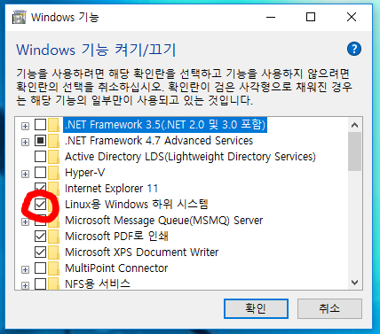

# 윈도우에서 Bash Sehll 사용하기
> 윈도우에서 linux 환경을 설정해 사용하다 보니 여러가지 불편한 점이 많다, 그냥 아이맥이나 맥북을 하나 사는게 나은 것 같다.

## 개발자들은 왜 맥북을 선호할까?

`아주 주관적인 개인적 의견이다.` 개발자들에게 맥북이 필수품(?) 처럼 느껴지는 분위기가 있는 것 같다
꼭 그렇진 않지만 개발자가 윈도우를 쓴다고 하면 좀 안어울리는 것 같기는 하다. 어쨋거나 왜 개발자들은
맥북을 선호할까? 여러가지 자신들 만의 이유가 있겠지만 내가 생각하는 가장 큰 이유는 환경 때문인 것 같다.
기본 OS가 linux를 베이스로 한다는 것, 이 자체가 큰 차이를 만들고 특히 서버개발자 들이 맥북을 선호하는 이유가 되지 않았을까 싶다
만약 이 글을 읽는 당신이 개발을 한다면 반드시 `로컬 -> 서버`로 배포하는 과정을 겪을 것이다.
직접 FTP로 붙어서 작업을 하는 회사들도 있지만 너무 극단적이고 레거시한 방법이니까 없는셈 치면 누구든 서버로 배포를 해야한다.
그런데 작업환경(로컬)과 실제 서비스될 서버환경을 동일하게 세팅하는 것은 굉장히 중요한 부분이다.
window에서는 power을 사용하고 linux를 베이스로 하는 맥북에서는 bash 혹은 zsh, fish 등등의 쉘을 사용한다.
`Window`와 `Mac`은 쉘스크립트의 명령어도 다르고 배포당시 도커를 사용한다면 도커가 실행되는 상황도 다르다.
예를들어 윈도우 에서는 도커를 사용하려면 오라클의 버추얼머신을 사용해 VM 위에서 도커가 동작해야 한다.

<br>

그렇게 쓰면 그만이지 않냐고 생각할수도 있겠지만 로컬에서 개발을 할 때 도커로 mysql과 연결한다면 VM위에서 도커가 동작하고
도커 내에서 컨테이너로 mysql이 동작하는 것이기 때문에 `Oracle VM VirtualBox 앱을 실행 -> 설정 -> 네트워크 -> 고급 -> Port Forwarding`
설정을 해야하는 등의 수고가 필요하다.  
또한 윈도우에서 도커를 실행하는 경우 블루스태과 같은 VM을 사용하는 앱과 충돌이 발생한다.
그리고 윈도우 10 이상의 `Hyper-5`를 지원하는 버전 이어야 하는 등 확인해야 할 조건들이 생기게 된다

이런 설정이 다 끝났다고 해도 쉘스크립트를 bash 환경이 아닌 powershell 환경으로 바꿔주어야 한다.

이러한 이유들로 개발하는 환경이 linux환경이어야 겠다는 생각을 가지게 되었는데 집에서는 개발작업만
하는것이 아니다 보니 window에서 bash쉘을 사용할 수 있으면 좋겠다고 생각해 윈도우에서 bash쉘을 설치해 보았다.

<br>

### 따라해 보자 

이제 window에서 bash를 사용하는 방법을 확인해보자.
먼저 `Windows 10 1607` 버전 이상부터 사용할 수 있다.


키보드에 윈도우키를 눌러보자 그럼 왼쪽 밑에 검색창이 열릴것이다.
그 상태 그대로 검색을하면 위 이미지 처럼 앱이나 사진, 파일이름등을 검색할 수 있다.

그대로 개발자 설정이라고 검색하면


위 이미지처럼 개발자 기능과 관련된 설정이 나올텐데
개발자 모드를 `켬` 으로 변경해 주어야 한다. 이렇게 개발자 모드가 되게되면
기본적으로 `Hyper-5` 모드가 체크 되면서 MS 앱에서 ubuntu를 설치할 수 있는 등 추가적인 기능을
사용할 수 있다.

<br>

이제 이제 WSL을 설치해야 한다.


다시 키보드에 윈도우 키를 누르고 `windows 기능`을 검색한다.
제어판 하위 메뉴인 `Windows 기능 켜기/끄기`를 선택한다.



목록중 `Linux용 Windows` 하위 시스템 이라는 옵션을 체크해 준다.

`Microsoft Store`로 들어가서 `Ubuntu`를 검색해 설치해준다.


전에는 `Ubuntu 16.04LTS` 버전도 별도로 있었던거 같은데
지금은 `Ubuntu`, `Ubuntu 18.04LTS` 두 가지만 나오는 것 같다.

아무거나 설치해도 된다. 나는 이미지처럼 Ubuntu를 설치했다
이미지에서는 설명이 짤렸는데 이걸로 설치하면 `Ubuntu 20.04 LTS`로 설치된다고 설명에 나와있다.
LTS는 2년마다 업데이트되는 안정화버전? 이라고 알고 있다.

시간이 조금 걸리는데 설치가 완료되면 Ubuntu OS에서 사용할 username과 password를 입력하라고 나온다.

참고로 위에서 우리가 체크했던 `Linux용 Windows`를 체크하는 방법 외에도
```
wsl --set-default-version 2
```

이렇게 명령어를 통해 WSL 버전을 설정하는 것도 가능하다.
MS Docs에 보면 `Linux용 Windows 하위 시스템과 상호 작용하는 가장 좋은 방법은 wsl.exe 명령을 사용하는 것입니다.`
라고 안내해 준다, 정확하지 않은데 처음 내 컴퓨터에 위 설정을 할 때 window10 Home 버전이여서
wsl 설정을 2가 아닌 1로 변경해야 했나 그랬던 것으로 기억한다, 앞으로 컴퓨터 사는 사람들은 이런일 없을테니 크게 신경쓰지 않아도 될 것 같다.

[MS docs 설명](https://docs.microsoft.com/ko-kr/windows/wsl/reference)

<br>

이제 powerShell을 열어 bash를 입력해 제대로 동작하는지 확인해 보자


### 그럼 이제 맥북은 필요 없을까?

집에서 사용하는 윈도우 컴퓨터에 bash를 설치한 후 개인용 프로젝트를 시험삼아
배포해 보았다, 그런데 분명 맥북에서 배포했을 때는 전혀 발생하지 않는 오류들이 발생했었다.
지금은 이미 전부 처리된 이후여서 에러메세지는 기억나지 않지만 대략적인 내용이 띄어쓰기나 줄바꿈과 관련된 내용이었던
것으로 기억난다. 구글에서 검색을 통해 해결되긴 했지만 결국 맥에서의 환경과 100% 동일하지는 않을 것이라고 생각되고 다른 문제가
또 발생할 것이라고 생각한다. 개발과 관련된 에러가 아닌 OS 환경이 다름으로 인해 발생하는 에러가 싫고  
위에서 언급 했지만 블루스택이나 퍼플같은 VM을 사용하는 앱을 설치하는 경우 도커나 우분투같은 것들을 사용할 때 문제가
종종 생기는 경우가 있었다, 지식이 짧아 무슨이유인지 정확히 모르겠다. 전에는 리니지m을 플레이하는데 도커가 실행이 안되고
멈춰서 구글 검색을 통해 해결을 하고 보니 기존 도커 이미지와 컨테이너가 모두 지워져 있는 경우가 있었다.

<br>


윈도우에서 개발자도구를 켜고 wsl을 설치하는 등의 방식으로 linux 환경과 window 환경의 간극을
완벽히 해결하지는 못한다고 생각한다, 앞으로도 그럴 것 같다.  
개인적으로 맥북은 너무 비싸고 레노버 노트북을 구매하고 Ubuntu OS를 설치해 사용할 계획이다  
이 글을 읽고있는 독자도 window환경에서 linux처럼 사용할 수 없을까 생각한다면 그냥 개발용 노트북을 사라고
추천하고 싶다.


## 윈도우에서 쉘스크립트 실행시 유의사항

### 개행 방식에 따른 오류
윈도우에서 ubuntu 환경으로 세팅후 bash에서 쉘스크립트를 통해 배포할 때


위 내용같은 에러가 발생하는 경우가 있다 (아마 99% 발생 할 것)

> 발생 원인은 DOS와 UNIX의 개행 방식이 다르기 때문입니다.
윈도우는 개행 문자를 CR LF를 사용하고 리눅스는 LF를 사용합니다.
CR은 Carriage Return으로 커서를 제일 앞으로 이동합니다.  LF는 Line Feed로 줄 바꿈을 의미합니다.
정규표현식으로는 각각 \r, \n으로 표현됩니다. 윈도우는 \r\n, 리눅스는 \n입니다.

라고 하는데 무슨말인지 모르겠다.

```
$ sed -i -e 's/\r$//' [대상 파일]

# ex)
$ sed -i -e 's/\r$//' deploy.sh
```
결과 적으로 bash 쉘에서 위 내용을 입력해 개행하는 방식에 차이 때문에 발생하는 오류를 해결 할 수 있다.

<br>

### docker Daemon이 안켜졌다는 오류

이상하게 도커도 정상적으로 설치되었고 Docker Desktop 에서도 문제가 없는데
막상 도커가 안되는 경우를 만났다 윈도우에서 bash를 사용하는 경우에는 Ubuntu를 실행해 그 안에서
동작시키는 환경이다, 파워쉘에서 `bash`를 입력하면 `/mnt/c/Users/`안에서 구동된다는 것을 알 수 있다 그런데 표준의 Linux 환경과 동일하지가 않기 때문에 여러가지 문제들이 생긴다.
도커데몬을 실행하면 되는데 `sudo service docker start`를 사용할 수 없다 service를 통해 시스템을 구동하는게 안된다고 한다.

```
$ wsl.exe -l -v
```
`Windows PowerShell` 에서 위 명령어를 입력해 보자 나의 경우에는 Ubuntu에서 사용하는 WSL의 버전이 1버전을 사용하는 문제가 있었다

```
# (distro name) 부분에 버전을 변경할 WSL의 name을 입력해야 된다
$ wsl.exe --set-version (distro name) 2

# 기본 버전도 2로 변경한다.
$ wsl.exe --set-default-version 2
$ wsl --set-default Ubuntu
```
이 문제를 해결하기 위해 위 명령어를 입력해 주고
ubuntu bash 에서 다시 도커를 사용하려고 하면 아직도 도커 데몬이 동작중이 아니라고
나올것 이다, 그 땐 `$ dockerd`를 통해 도커데몬을 직접 실행시킨다. 새 터미널을 열어 배포나 도커를 실행하면 정상적으로 실행 된다.