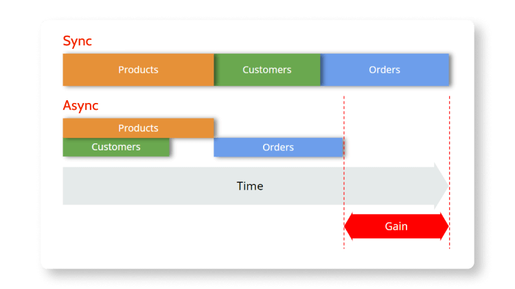
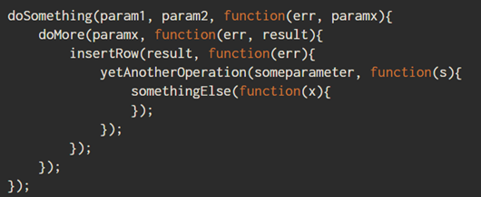
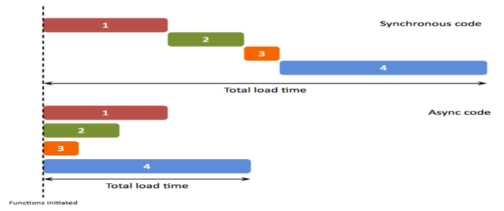

# async/await

## 자바스크립트에게 비동기란?
자바스크립트는 싱드스레드로 동작한다, 많이 들어보았을 것이다 하나의 스레드이기 때문에
한번에 하나의 작업만을 수행할 수 있다. 특히 Node.js 에서 웹서버를 구현할 때
모든 동작을 비동기로 처리하는 것은 매우 중요하다. 만약 동기로 처리하면 해당 처리가 완료될 때 까지
마치 서버가 멈춘 것처럼 다른 요청을 처리하지 못한다.

<br>

## 비동기가 대체 뭘까?

> 우리는 편의에 의해 금융/철학/과학/수학/역사/자연 등의 분야로 세상을 분리하지만  
> 이 모든일은 동시에 일어난다.

어디서 이 문장을 봤는지 기억이 않나는데 유발 하라리의 [사피엔스](http://www.yes24.com/Product/Goods/23030284) 라는 책에서
봤던 것 같다.. 검색으로 정확한 책이름을 찾고 싶은데 않나온다.

<br>

아무튼 실제 세상에는 모든것이 동시에 일어나는 일종의 비동기 이다. 하지만 프로그래밍에서는 동기/비동기의 개념이 있다.


이미지: https://www.outsystems.com/blog/posts/asynchronous-vs-synchronous-programming/

#### 동기
예를들어 카드결제를 생각해보자 쇼핑몰에서 카드를 결제할 때에는 결제를 진행하는 동안 아무동작도 할 수 없다
하나의 작업이 끝날때 까지 다른작업이 중지되는 개념이다.

#### 비동기
동기 방식과 다르게 먼저 시작된 작업의 완료 여부와 상관없이 다음 프로세스를 실행한다.

#### 비동기가 왜 필요할까?
여러 이유와 사례가 있겠지만 이메일을 예로 들어보자, 만약 이메일을 발송하는데 1초가 걸리는데 1만명의 사람들에게 이메일을 발송하는데
이걸 동기로만 처리할 수 있다면 10,000초 동안 아무동작도 하지 못할것이다, 하지만 비동기로 처리한다면 10,000초 라는 시간이 걸리는 것은 동일하지만
다른 동작을 할 수 있게 해준다.

## callBack Hell



자바스크립트에서는 비동기로 동작하기 때문에 동기로 동작해줘야 하는 경우에는 콜백으로 처리를 해왔다.
위 이미지 처럼 어떠한 동작이 완료된 이후에 코드를 실행해야 할 때 callBack Hell이 펼쳐진다.
이런 코드구조는 가독성도 떨어지지만 코드를 관리하기도 어렵다.

## Promise

Promise는 콜백헬을 피하기 위한 해결책이다. 비동기 연산이 종료된 이후의 결과값이나 실패 이유를 처리하기 위한
처리기를 연결할 수 있도록 한다. 프로미스를 사용하면 비동기 메서드에서 마치 동기 메서드처럼 값을 반환할 수 있게 해준다.
다만 최종 결과를 반환하는 것은 아니고 프로미스를 반환한다.

Promise를 처음 공부할 때 azu라는 저자의 [JavaScript Promise](http://www.yes24.com/Product/Goods/17945480)를 추천하고 싶다.
후반부에 나오는 예제들이 나에겐 조금 어려웠는데 그래도 디테일하고 잘 설명해 놓은 책인 것 같다. ebook으로 나와있고 무료라서 도서관 안가도 된다.


<br>



Promise는 다음 중 하나의 상태를 가진다.

* 대기(pending): 이행하거나 거부되지 않은 초기 상태
* 이행(fulfilled): 연산이 성공적으로 완료됨
* 거부(rejected): 연산 실패함

pending상태 였다가  fulfilled 상태가되면 `.then` 으로 처리해주면 되고 실패를 의미하는 rejected 상태를 처리하기 위해서
`.catch`를 사용하면 된다.

```
let test = () => {
console.log(1)
setTimeout(() => {
    console.log(2)
}, 5000)
console.log(3)
}

test()
```

위 코드를 실행해보면 5초 뒤에 3이라는 콘솔이 나오는 것이 아닌 3이라는 콘솔 이후 5초 뒤에 2가 출력될 것이다.

```
let myPromise = () => {
  return new Promise((resolve, reject) => {
    setTimeout(() => {
      console.log(2)
      resolve()
    }, 5000)
  })
}

let test = () => {
  console.log(1)
  myPromise().then(() => {
console.log(3)
})
  
}

test()
```

위 코드를 실행해 보면 처음 의도한 대로 5초간 대기후 2라는 값이 출력된 이후에 3이 촐력된다.
별로 실용적인 코드는 아니지만, 처음 예제를 처리하기위해 어떻게 하면 비동기를 동기처럼 실행할 수 있는지를 예시로 들어보고 싶었다.

<br>

#### Promise 고급 예제

MDN Web docs 에서 예제를 가져와 봤다.
https://developer.mozilla.org/ko/docs/Web/JavaScript/Reference/Global_Objects/Promise

HTML
```
<button id="btn">프로미스 만들기!</button>
<div id="log"></div>
```

javascript
```
'use strict';
var promiseCount = 0;

function testPromise() {
    var thisPromiseCount = ++promiseCount;

    var log = document.getElementById('log');
    log.insertAdjacentHTML('beforeend', thisPromiseCount +
        ') 시작 (<small>동기적 코드 시작</small>)<br/>');

    // 새 프로미스 생성 - 프로미스의 생성 순서를 전달하겠다는 약속을 함 (3초 기다린 후)
    var p1 = new Promise(
        // 실행 함수는 프로미스를 이행(resolve)하거나
        // 거부(reject)할 수 있음
        function(resolve, reject) {
            log.insertAdjacentHTML('beforeend', thisPromiseCount +
                ') 프로미스 시작 (<small>비동기적 코드 시작</small>)<br/>');
            // setTimeout은 비동기적 코드를 만드는 예제에 불과
            window.setTimeout(
                function() {
                    // 프로미스 이행 !
                    resolve(thisPromiseCount);
                }, Math.random() * 2000 + 1000);
        }
    );

    // 프로미스를 이행했을 때 할 일은 then() 호출로 정의하고,
    // 거부됐을 때 할 일은 catch() 호출로 정의
    p1.then(
        // 이행 값 기록
        function(val) {
            log.insertAdjacentHTML('beforeend', val +
                ') 프로미스 이행 (<small>비동기적 코드 종료</small>)<br/>');
        })
    .catch(
        // 거부 이유 기록
        function(reason) {
            console.log('여기서 거부된 프로미스(' + reason + ')를 처리하세요.');
        });

    log.insertAdjacentHTML('beforeend', thisPromiseCount +
        ') 프로미스 생성 (<small>동기적 코드 종료</small>)<br/>');
}

if ("Promise" in window) {
  var btn = document.getElementById("btn");
  btn.addEventListener("click", testPromise);
} else {
  log = document.getElementById('log');
  log.innerHTML = "Live example not available as your browser doesn't support the <code>Promise<code> interface.";
}
```

<br>

#### 왜 이런 처리가 필요한가?

실제 개발을 할 때는 이런 기능을 어디에서 사용할까?
주로 이미지 같은 리소스를 받아와야 하거나, 혹은 로그인이 처리된 이후에 동작되어야 하는 경우 처럼 사전에 어떠한 동작이 처리되어야 하는 경우 사용되고
실제 개발을 하다보면 동기적으로 순서가 보장되어야 하는 경우가 많이 있다.

#### Promise.all() 메서드

배열을 반복하는 map() 같은 메서드 내부에서 .then 혹은 await을 사용하고 싶은 경우가 있다, 이런경우
for of 문을 사용하거나 Promise.all() 메서드를 사용해야 한다.
```
const array = ['a','b','c','d']

// await 키워드를 사용해도 동기적으로 동작하지 않는다.
array.map((value) => {
    await someMathod(value)
})

// for-of 문을 사용하거나
for(const value of array){
    await someMathod(value) 
}

// Promise.all()을 사용해야 한다.
await Promise.all(
    array.map((value) => {
      await someMathod(value)
    })
)
```
위 코드처럼 for-of를 사용하거나 Promise.all()을 사용해야 한다. 최대한 짧게 표현하기 위해
무의미한 array나 someMathod로 표현했다, Promise.all() 메서드는 파라미터로 전달된 모든 프로미스가 fulfilled 상태가 될 때 까지 다른 코드를 실행하지 않는다.

<br>


## useEffect 함수에서 async/await 사용하기

```
updateUser = () => {
    return new Promise(async (resolve, reject) => {
        try {
            const url = "/getUser";
            const response = await fetch(url);
            if (response.ok) {
                const user = await response.json();
                //
                // Do something with user object...
                //
            } else {
                console.log("response", response);
                window.location = "/admin";
            }
            resolve();
        } catch (error) {
            console.log("error: ", error);
            reject(error);
        }
    });
};
```

위 코드처럼 `useEffect` 콜백 함수에 `async`를 선언하면 안된다 `useEffect`에 return 값으로 오는 함수는 `componentWillUnmount`의 역할을 하기 때문이다. `async`를 선언하면
`Promise`를 반환하기 때문에 사용하면 안된다.

```
const updateUser = async () => {
    const url = "/getUser";
    let response;

    try {
        response = await fetch(url);
    } catch (error) {
        Promise.reject(error);
    }

    return Promise.resolve(response);
}
```
위 내용처럼 `useEffect` 내부에서는 함수를 호출하기만 하고 `then()`, `catch`로 처리해 주어야 한다.
