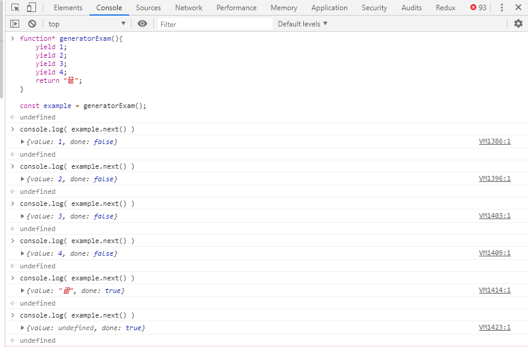

# redux-saga 배우기

## redux란 무엇인가?

redux는 react와 가장 많이 사용되지만 redux자체로 존재할 수 있다, 리액트에서 가장많이 쓰이지만 노드나 vue에서도 사용가능하다.

#### redux 와 react 연결하기 - app.js

```
import React from 'react';
import Head from 'next/head';
import withRedux from 'next-redux-wrapper';
import withReduxSaga from 'next-redux-saga';
import { applyMiddleware, compose, createStore } from 'redux';
import { Provider } from 'react-redux';
import createSagaMiddleware from 'redux-saga';

import AppLayout from '../components/AppLayout';
import reducer from '../reducers/index';
import rootSaga from '../sagas';

const luaBlog = ({ Component, store }) => {
    return (
        <>
            <Provider store={store}>
                <Head>
                    <title>Lua - Blog</title>
                    <link rel="stylesheet" href="https://cdn.jsdelivr.net/npm/react-draft-wysiwyg@1.13.2/dist/react-draft-wysiwyg.css" />
                    <link rel="stylesheet" href="https://cdnjs.cloudflare.com/ajax/libs/antd/3.16.2/antd.css" />
                </Head>

                <AppLayout>
                    <Component children={Component} />
                </AppLayout>
            </Provider>
        </>
    );
};

const configureStore = (initialState, options) => { // 02. next-redux-wrapper모듈이 root컴포넌트가 store를 prop로 받을 수 있게 해준다.
    const sagaMiddleware = createSagaMiddleware();
    const middlewares = [sagaMiddleware];
    const enhancer = process.env.NODE_ENV === 'production'
    ? compose(applyMiddleware(...middlewares))
    : compose(
        applyMiddleware(...middlewares),
        !options.isServer && typeof window.__REDUX_DEVTOOLS_EXTENSION__ !== 'undefined' ? window.__REDUX_DEVTOOLS_EXTENSION__() : f => f,
    );
    const store = createStore(reducer, initialState, enhancer); // 01. redux모듈이 사용자가 만든 reducer를 토대로 store를 생성
    store.sagaTask = sagaMiddleware.run(rootSaga);
    return store;
};


export default withRedux(configureStore)(withReduxSaga(luaBlog));
```

내가 블로그를 직접 만들려고 했었을 때 사용했던 코드의 일부이다. 일반 react를 사용할때 redux의 구현과 next를 사용하는 react의 redux 구현은 조금다르다.
`npm i next-redux-wrapper` 를 설치해야한다. app.js ( react root 컴포넌트)에서 redux를 사용하기위해 store를 props 형태로 받아야하는데 그일을 해주는것이 next-redux-wrapper이다.


## redux-saga란 무엇인가?

redux는 어플리케이션 전체에서 데이터 혹은 캐시를 다루는 과정에서 비동기의 동작을 손쉽게 하기위한 라이브러리 이다.
결국 순수하지 않은 비동기 동작들을, 더 쉽고 좋게 만들기 위함이다. 그리고 쉽고 좋게 만들기위한 방법으로 제너레이터를 사용한다.
 
 
## 제너레이터(Generator)란 무엇인가?
 
 제너레이터를 이해해야 하는 이유는 redux-saga가 비동기를 효과적으로 구현하기 위해 제너레이터를 사용하기 때문이다.
 
 ES6에서 도입된 제너레이터(Generator) 함수는 이터러블을 생성하는 함수이다.
 제너레이터 함수를 사용하면 이터레이션 프로토콜을 준수해 이터러블을 생성하는 방식보다 간편하게 이터러블을 구현할 수 있다. 또한 제너레이터 함수는 비동기 처리에 유용하게 사용된다.
 쉽게 표현하자면 제너레이터는 함수의 동작을 멈췄다가 다시 동작하게 했다가 하는등의 동작을 가능하게 한다.
 
 
```
function* generatorExam(){
	yield 1;
	yield 2;
	yield 3;
	yield 4;
	return "끝";
}

const example = generatorExam();

console.log( example.next() ) // 1
console.log( example.next() ) // 2
console.log( example.next() ) // 3
console.log( example.next() ) // 4
console.log( example.next() ) // 5
console.log( example.next() ) // 끝
```

제너레이터는 `function*` 로 선언한다. 펑션뒤에 별이 붙는다. 오타가 아니다
제너레이터함수를 실행한 결과를 변수에 담고 .next를 하면 yield 뒤에 값을 반환한다.
다시 .next를 하면 그다음번 yeild 뒤 값을 반환한다. 



위에 실행결과를 보자 `example.next()`를 하고나면 `{value: 1, done: false}` 라는 결과가 나오게 된다. 이렇게 제너레이터는 yield를 통해 함수의 실행을 멈추는 것이 가능하게 해준다.

<br>

## react 컴포넌트에서 redux 사용하기 - pages/index.js 

```
import React, { useEffect } from 'react';
import PostForm from '../components/PostForm';
import PostCard from '../components/PostCard';
import { useDispatch, useSelector } from 'react-redux';
import { LOG_IN, LOG_OUT } from '../reducers/user';

const dummy = {
    isLoggedIn: true,
    imagePaths: [],
    mainPosts: [{
        User: {
            id: 1,
            nickname: 'LUA',
        },
        content: '첫 번째 게시글',
        img: 'https://t1.daumcdn.net/cfile/tistory/274FCA495215649B02'
    }],
};

const Home = () => {
    const dispatch = useDispatch(); // react-redux 모듈에서 useDispatch를 통해 dispatch를 사용할 수 있다.
    const { isLoggedIn, user } = useSelector(state => state.user); // react-redux 모듈에서 useSelector 통해 state값을 가져올 수 있다.

    useEffect(() => {
        dispatch({
            type: LOG_IN,
            data: {
                nickname: '루아',
            }
        })
    }, [])
    
    return (
        <>
            {user ? <div>로그인 했습니다: {user.nickname}</div> : <div>로그아웃 했습니다.</div>}
            {dummy.isLoggedIn && <PostForm />}
            {dummy.mainPosts.map((c) => {
                return (
                    <PostCard key={c} post={c} />
                );
            })}
        </>
    );
};

export default Home;
```

redux를 사용해 action을 dispatch하게되면 무조건 동기로 작동하게된다, 예를들어 로그인에 대한 action을 한다면 로그인action을 dispath하는순간 바로 state가
변경되어 버린다. 실제로는 로그인을 위한 서버에 요청을 보내고 응답을 받은뒤 state의 변경이 이루어져야 하는데 모두 동기로만 작동하기 때문에 action을 비동기적으로
사용하기 위해 redux-saga 를 이용해 redux를 통한 action을 할때 미들웨어를 이용해 비동기로 실행하도록 구현한다. 그과정에서 generator 를 사용한다.


## rootSaga 설정하기 - front/sagas/index.js
 
```
import {all, call} from 'redux-saga/effects';
import user from './user';
import post from './post';

export default function* rootSaga() {
    yield all([
        call(user),
        call(post),
    ]);
};
```

## login을 위한 saga 코드 - front/sagas/user.js

```
import { all, fork, takeLatest, takeEvery, call, put, delay } from 'redux-saga/effects';
import {
	LOG_IN_REQUEST, LOG_IN_SUCCESS, LOG_IN_FAILURE,
	SIGN_UP_REQUEST, SIGN_UP_SUCCESS, SIGN_UP_FAILURE,
	LOG_OUT_REQUEST, LOG_OUT_SUCCESS, LOG_OUT_FAILURE,
	LOAD_USER_REQUEST, LOAD_USER_SUCCESS, LOAD_USER_FAILURE,
	FOLLOW_USER_REQUEST, FOLLOW_USER_SUCCESS, FOLLOW_USER_FAILURE,
	UNFOLLOW_USER_REQUEST, UNFOLLOW_USER_SUCCESS, UNFOLLOW_USER_FAILURE,
	LOAD_FOLLOWERS_REQUEST, LOAD_FOLLOWERS_SUCCESS, LOAD_FOLLOWERS_FAILURE,
	LOAD_FOLLOWINGS_REQUEST, LOAD_FOLLOWINGS_SUCCESS, LOAD_FOLLOWINGS_FAILURE,
	REMOVE_FOLLOWER_REQUEST, REMOVE_FOLLOWER_SUCCESS, REMOVE_FOLLOWER_FAILURE,
	EDIT_NICKNAME_REQUEST, EDIT_NICKNAME_SUCCESS, EDIT_NICKNAME_FAILURE,
} from '../reducers/user';
import axios from 'axios';

// 로그인
function logInAPI(loginData){
	return axios.post('/user/login', loginData, {
		// 쿠키를 주고받는 옵션, 서버에서도 옵션을 설정해야가능.
		withCredentials: true
	});
};
function* logIn(action){
	try{
		const result = yield call(logInAPI, action.data);
		yield put({
			type: LOG_IN_SUCCESS,
			data: result.data,
		});
	}catch(e){
		console.error(e);
		yield put({
			type: LOG_IN_FAILURE,
			reason: e.response && e.response.data,
		});
	}
};
function* watchLogIn(){
	yield takeLatest(LOG_IN_REQUEST, logIn);
}

 // 회원가입
function signUpAPI(singupData){
	return axios.post('/user/', singupData);
};
function* signUp(action){
	try{
		yield call(signUpAPI, action.data);
		alert('회원가입 완료');
		yield put({
			type: SIGN_UP_SUCCESS,
		});
	} catch(e){
		console.error(e);
		yield put({
			type: SIGN_UP_FAILURE,
			error: e
		});
	}
};
function* watchSingUp(){
	yield takeEvery(SIGN_UP_REQUEST, signUp)
};

// 로그아웃
function logOutAPI(){
	// post요청은 data를 의미하는데 비어있는 경우 빈객체라도 넣어야함
	return axios.post('/user/logout/', {}, {
		withCredentials: true,
	});
};
function* logOut(){
	try{
		yield call(logOutAPI);
		yield put({
			type: LOG_OUT_SUCCESS,
		});
	} catch(e){
		console.error(e);
		yield put({
			type: LOG_OUT_FAILURE,
			error: e
		});
	}
};
function* watchLogOut(){
	yield takeLatest(LOG_OUT_REQUEST, logOut)
};

// 로드유저
function loadUserAPI(userId){
	// get요청은 data가 없어 두번째 인자가 옵션이 된다.
	return axios.get(userId ? `/user/${userId}` : '/user/', {
		withCredentials: true,
	});
};
function* loadUser(action) {
	try {
		const result = yield call(loadUserAPI, action.data);
		yield put({
			type: LOAD_USER_SUCCESS,
			data: result.data,
			me: !action.data,
		});
	} catch (e) {
		console.error(e);
		yield put({
			type: LOAD_USER_FAILURE,
			error: e,
		});
	}
};
function* watchLoadUser(){
	yield takeEvery(LOAD_USER_REQUEST, loadUser)
};

// 팔로우
function followAPI(userId) {
	return axios.post(`/user/${userId}/follow`, {}, {
		withCredentials: true
	});
  }
function* follow(action) {
	try {
		const result = yield call(followAPI, action.data);
		yield put({
			type: FOLLOW_USER_SUCCESS,
			data: result.data,
		});
	} catch (e) {
		console.error(e);
		yield put({
			type: FOLLOW_USER_FAILURE,
			error: e,
		});
		alert(e.response && e.response.data);
	}
};
function* watchFollow(){
	yield takeLatest(FOLLOW_USER_REQUEST, follow);
};

// 언팔로우
function unfollowAPI(userId) {
	return axios.delete(`/user/${userId}/follow`, {
		withCredentials: true
	});
  }
function* unfollow(action) {
	try {
		const result = yield call(unfollowAPI, action.data);
		yield put({
			type: UNFOLLOW_USER_SUCCESS,
			data: result.data,
		});
	} catch (e) {
		console.error(e);
		yield put({
			type: UNFOLLOW_USER_FAILURE,
			error: e,
		});
		alert(e.response && e.response.data);
	}
};
function* watchUnfollow(){
	yield takeLatest(UNFOLLOW_USER_REQUEST, unfollow);
};

// 나를 팔로워한 목록
function loadFollowersAPI(userId, offset = 0, limit = 3) {
	return axios.get(`/user/${userId || 0}/followers?offset=${offset}&limit=${limit}`, {
		withCredentials: true
	});
  }
function* loadFollowers(action) {
	try {
		const result = yield call(loadFollowersAPI, action.data, action.offset);
		yield put({
			type: LOAD_FOLLOWERS_SUCCESS,
			data: result.data,
		});
	} catch (e) {
		console.error(e);
		yield put({
			type: LOAD_FOLLOWERS_FAILURE,
			error: e,
		});
	}
};
function* watchLoadFollower(){
	yield takeLatest(LOAD_FOLLOWERS_REQUEST, loadFollowers);
};

// 내가 팔로잉한 목록
function loadFollowingsAPI(userId, offset = 0, limit = 3) {
	return axios.get(`/user/${userId || 0}/followings?offset=${offset}&limit=${limit}`, {
		withCredentials: true
	});
  }
function* loadFollowings(action) {
	try {
		const result = yield call(loadFollowingsAPI, action.data, action.offset);
		yield put({
			type: LOAD_FOLLOWINGS_SUCCESS,
			data: result.data,
		});
	} catch (e) {
		console.error(e);
		yield put({
			type: LOAD_FOLLOWINGS_FAILURE,
			error: e,
		});
	}
};
function* watchLoadFollowings(){
	yield takeLatest(LOAD_FOLLOWINGS_REQUEST, loadFollowings);
};

// 팔로잉 삭제
function removeFollowerAPI(userId) {
	return axios.delete(`/user/${userId}/follower`, {
		withCredentials: true
	});
  }
function* removeFollower(action) {
	try {
		const result = yield call(removeFollowerAPI, action.data);
		yield put({
			type: REMOVE_FOLLOWER_SUCCESS,
			data: result.data,
		});
	} catch (e) {
		console.error(e);
		yield put({
			type: REMOVE_FOLLOWER_FAILURE,
			error: e,
		});
		alert(e.response && e.response.data);
	}
};
function* watchRemoveFollower(){
	yield takeLatest(REMOVE_FOLLOWER_REQUEST, removeFollower);
};

// 닉네임 수정
function editNicknameAPI(nickname) {
	return axios.patch(`/user/nickname`, { nickname }, {
		withCredentials: true
	});
  }
function* editNickname(action) {
	try {
		const result = yield call(editNicknameAPI, action.data);
		yield put({
			type: EDIT_NICKNAME_SUCCESS,
			data: result.data,
		});
	} catch (e) {
		console.error(e);
		yield put({
			type: EDIT_NICKNAME_FAILURE,
			error: e,
		});
		alert(e.response && e.response.data);
	}
};
function* watchEditNickname(){
	yield takeLatest(EDIT_NICKNAME_REQUEST, editNickname);
};

export default function* userSaga (){
	yield all([
		fork(watchLogIn),
		fork(watchLogOut),
		fork(watchSingUp),
		fork(watchLoadUser),
		fork(watchFollow),
		fork(watchUnfollow),
		fork(watchLoadFollower),
		fork(watchLoadFollowings),
		fork(watchRemoveFollower),
		fork(watchEditNickname),
	]);
};

/*
	all: 
	call: 함수를 동기로 호출한다.
	fork: 함수를 비동기로 호출한다.
	take: 인자로 들어온 Actions이 실행되면 next()를 통해 함수를 재개한다. 실행후 함수재호출 불가능 ( done: true )
	takeEvery: 대부분의 Action은 여러번 실행이 가능해야 하기때문에 done: false가 유지되도록 해준다, 반복실행가능
	takeLatest: Action이 동시적으로 여러번 실행될 경우 최근실행된 Action만 유효하게 취급한다.
	delay: 타이머기능, ms 단위로 딜레이를 만든다.
	race:
	cancel:
	select:
	throttle: 같은 함수가 계속 호출되는것은 막아준다(request 요청 중복을 방지함), scroll 이벤트에 많이사용
*/
```

예를들어 버튼을 클릭함으로 인해 `LOG_IN` 타입을 dispatch 하게되면 `watchLogIn`이라는 watch함수가 `LOG_IN`이라는 dispatch가 발생하는지 아닌지 계속 감시하다가
logIn함수를 실행시키고 logIn 함수가 logInAPI를 실행시킨다. 그럼 logInAPI는 궁극적으로 axios를 통해 backend API로 요청을 보낸다, 예제에서의 노드 백엔드 코드를 보고싶다면 [여기](https://github.com/lua928908/react-sns-publish/tree/master/back)를 참고하자
axios 요청이 성공하게되면 다음줄인 LOG_IN_SUCCESS가 실행되고 reducers에 있는 LOG_IN_SUCCESS가 switch문에 걸리며 redux에 값이 삽입되게된다. 그래서 redux-saga로 비동기 함수를 만들때
watch 함수와 axios요청함수 그리고 요청이후 success인지 fail인지에 따라 동작을 해줄 3가지의 함수가 셋트처럼 만들어져야 한다. 다소 번거로울수 있어도 나중에는 오류를 해결하거나 상황을 파악하는게 많은 도움이 된다.

__버튼클릭  ->  dispatch({type: LOG_IN})  ->  watchLogIn  ->  logIn  ->  logInAPI  ->  success or fail (another dispatch)  ->  reducer <br>__

이런 형태로 기억해주면 될것 같다.

전체 코드는 [여기](https://github.com/lua928908/react-sns-publish)에서 천천히 살펴보길 바란다.

<br>


## 다른 비동기 처리방법

회사에 면접을 보러 다닐때 면접관 분들이 많이 했던 질문이 왜 redux-saga를 써야하냐라는 질문이였다. 이건 내나름대로의 답변이지만 결과적으로
redux-saga를 안쓰면안되는건 아니다. react나 vue를 쓰지않고 SPA를 만들거나 어플리케이션을 만들 수 있듯 redux-saga를 사용하지 않아도 비동기코드를 처리하는건
가능하다. 다만 조금더 체계적이고 일관성있는 관리를 하는데 유리하다고 생각한다.

현재 근무중인 회사에서 액션함수 개념을 경험하기전에는 redux-saga를 사용한 관리만 알고있었다. 그래서 처음 지금회사에 입사해서 적응하기까지
hook대신 class컴포넌트를 사용하거나 redux-form을 사용하거나 redux-saga대신 액션함수를 통해 dispatch를 하는등등이 스트레스 였다. 결국 두가지에 다 적응하면서
오히려 구체적으로 어떤식으로 관리되고 있는지 이해하는데 도움이 되었다.
아래 나오는 코드들은 redux-saga를 사용하지않고 promise를 통해 비동기 코드를 실행시키는 방식을 조금이나마 이해하는데 도움이 될까 싶어 적어보았다. 

<br>

#### Login 컴포넌트
```
import React, {Component} from 'react';
import {Link} from "react-router-dom"
import {Field, reduxForm} from "redux-form"
import {connect} from "react-redux"
import {formValueSelector} from "redux-form"

import {Header, Footer} from "../index"
import {withRequireNotAuth} from "../../hocs/"
import InputField, {inputFieldWithButton, authNumberInput} from "../shared/InputField"
import {company, email, password} from "../../lib/validation"
import {loginAction} from "../../actions/auth"
import Alert from "../common/Modal/Alert"
import styled from "styled-components"

const Register = styled.div`
  display: inline-block;
`

const loginSelector = formValueSelector("login")

class Login extends Component {
  constructor(props){
    super(props)

    this.state = {
      notFoundId: false,
      invalidPassword: false,
    }
  }

  handleSubmit = async (values) => {
    try {
      const {loginAction, history} = this.props
      await loginAction({accountId: values.id, password: values.password})

      // if(this.props.history.location.pathname === "/login") {
      //   await history.push("/")
      // }
    }

    catch(e){
      console.error(e)
      console.log(e.statusCode);
      if(e.status === 404){
        this.setState({notFoundId: true})
        //password is incorrect logic
      }else if(e.status === 409){
        this.setState({invalidPassword: true})
      }
    }
  }

  closeModal = () => {
    this.setState({notFoundId: false})
    this.setState({invalidPassword: false})
  }

  componentDidUpdate(prevProps, prevState, snapshot) {
    if (prevProps.idValue !== this.props.idValue) {
      this.setState({notFoundId: false})
    }else if(prevProps.pwValue !== this.props.pwValue){
      this.setState({invalidPassword: false})
    }


  }

  render() {
    const {closeModal} = this
    const {notFoundId, invalidPassword} = this.state
    const {idValue, pwValue} = this.props
    return (
        <>
          <Header />
          <div id="container">
            <form onSubmit={ this.props.handleSubmit(this.handleSubmit.bind(this))}>
              <div id="login" className="bg_in">
                <div className="layout_fix">
                  <div className="account_tc">
                    <div className="account_cont">
                      <div className="layer_panel">
                        <div className="con">
                          <div className="intro_banner">
                            <div className="d_pc">
                              <div className="img_bx">
                                
                              </div>
                            </div>
                            <div className="o_mo" style={{display: "none"}}>
                              <div className="img_bx">
                                
                              </div>
                            </div>
                          </div>
                          <div className="login_form">
                            <div className="heading">
                              <h2 className="tit">쉽다에서 더 많은 서비스를 이용해보세요!</h2>
                              <hr/>
                            </div>
                            <div className="inp_fld">
                              <div className="inp_bx">
                                <Field
                                    component={InputField}
                                    name="id"
                                    title="아이디"
                                    placeholder="6~20자리 영문/숫자를 입력하세요."
                                    maxLength="20"
                                    errorClass="error"
                                />
                              </div>
                              <div className="inp_bx">
                                <Field
                                    component={InputField}
                                    name="password"
                                    title="비밀번호"
                                    type="password"
                                    placeholder="비밀번호를 입력하세요."
                                    errorClass="error"
                                />
                              </div>
                              <div className="link_bx">
                                <ul className="find_account">
                                  <li>
                                    <Link to="/register">회원가입</Link>
                                  </li>
                                  <li>
                                    <Link to="/login/id">아이디 찾기</Link>
                                  </li>
                                  <li style={{paddingLeft: "10px", marginLeft: "10px", background: "transparent url(../../assets/images/li_line.png) no-repeat 0 50%"}}>
                                    <Link to="/login/password">비밀번호 찾기</Link>
                                  </li>
                                </ul>
                              </div>
                              <div className="btn_primary">
                                <button style={{width: "100%"}}><a>로그인</a></button>
                              </div>
                            </div>
                          </div>
                        </div>
                      </div>
                    </div>
                  </div>
                </div>
              </div>

              {
                notFoundId &&
                <Alert
                    message={["가입되지 않은 아이디입니다.", "확인 후 다시 시도해주세요."]}
                    toggleAlert={closeModal}
                />
              }
              {
                invalidPassword &&
                <Alert
                    message={["아이디 또는 패스워드가 틀렸습니다.", "확인 후 다시 시도해주세요."]}
                    toggleAlert={closeModal}
                />
              }
            </form>
          </div>
          <Footer />
        </>
    );
  }
}

function validate(values){
  const errors = {}
  if(!values.id) errors.id = "아이디를 입력해주세요."
  if(!values.password) errors.password = "비밀번호를 입력해주세요."

  return errors
}

const mapStateToProps = (state) => ({
  idValue: loginSelector(state, "id"),
  pwValue: loginSelector(state, "password")
})
const mapDispatchToProps = {
  loginAction,
}

export default connect(mapStateToProps, mapDispatchToProps)(reduxForm({
  form: "login",
  validate,
})(withRequireNotAuth(Login)));
```

로그인 버튼을 누르면 `actions`하위에 있는 `auth.js` 파일에 `loginAction` 액션함수를 실행시킨다. 

#### actions/auth - 액션함수

```
import {ApiRoute} from './index'
import {SubmissionError} from 'redux-form'
import _ from 'lodash'
import {history} from '../index'

export const AUTH_SIGN_OUT_SUCCESS = "AUTH_SIGN_OUT_SUCCESS" // ApiRoute 에서 기본적으로 필요
export const REGISTER_SUCCESS = "REGISTER_SUCCESS"
export const CHECK_ID_DUPLICATE_SUCCESS = "CHECK_ID_DUPLICATE_SUCCESS"
export const CHECK_COMPANY_NUMBER_SUCCESS = "CHECK_COMPANY_NUMBER_SUCCESS"
export const CHECK_ID_DUPLICATE_FAIL = "CHECK_ID_DUPLICATE_FAIL"
export const GET_FOWARDER_LIST_SUCCESS = "GET_FOWARDER_LIST_SUCCESS"
export const GET_CUSTOMS_LIST_SUCCESS = "GET_CUSTOMS_LIST_SUCCESS"
export const LOGIN_SUCCESS = "LOGIN_SUCCESS"
export const LOGOUT_SUCCESS = "LOGOUT_SUCCESS"
export const TOKEN_EXPIRED = "TOKEN_EXPIRED"
export const REFRESH_TOKEN = "REFRESH_TOKEN"

// 만료된 토큰 리프래쉬 하기
export function refreshTokenAction(values) {
  return async (dispatch, state) => {
    try {
      const {result} = await new ApiRoute({
        path: '/api/auth/refresh',
        method: 'post',
        data: values,
      }).request(dispatch, state, true)
      dispatch({type: REFRESH_TOKEN, payload: result})
      return result
    } catch (e) {
      return e
    }
  }
}

export function deleteAuth() {
  return async (dispatch, state) => {
    try {
      await new ApiRoute({
        path: '/auth',
        method: 'delete'
      }).request(dispatch, state)
      dispatch({type: AUTH_SIGN_OUT_SUCCESS})
      history.replace('/')
    } catch (e) {
      throw e
    }
  }
}

export function putTempPassword() {
  return async (dispatch, state) => {
    try {
      await new ApiRoute({
        path: '/auth/password/temp',
        method: 'put'
      }).request(dispatch, state)
      dispatch({type: AUTH_SIGN_OUT_SUCCESS})
    } catch (e) {
      console.error(e)
    }
  }
}

// check duplicate id
export function checkDuplicateId(userId){
  return async(dispatch, state) => {
    try{
      await new ApiRoute({
        path: '/api/auth/register',
        method: 'get',
        params: {accountId: userId},
      }).request(dispatch, state)
      dispatch({type: CHECK_ID_DUPLICATE_SUCCESS})
    }catch(e){
      dispatch({type: CHECK_ID_DUPLICATE_FAIL})
      throw e
    }
  }
}

// check business number
export function checkCompanyNumber(companyNumber){
  return async(dispatch, state) => {
    try{
      await new ApiRoute({
        path: '/api/auth/check/brn',
        method: 'get',
        params: {brn: companyNumber},
      }).request(dispatch, state)
      dispatch({type: CHECK_COMPANY_NUMBER_SUCCESS})
    }catch(e){
      throw e
    }
  }
}

// register
export function registerSubmit(values){
  return async (dispatch, state) => {
    try{
      const {result} = await new ApiRoute({
        path: '/api/auth/register',
        method: 'post',
        data: values,
      }).request(dispatch, state)
      window.localStorage.setItem("accessToken", result.accessToken)
      window.localStorage.setItem("refreshToken", result.refreshToken)
      await dispatch({type: REGISTER_SUCCESS, payload: result})
      return result
    }catch(e){
      console.error(e)
      throw e
    }
  }
}

// register - 담당자 등록
export function managersRegister(values){
  return async (dispatch, state) => {
    try{
      const {result} = await new ApiRoute({
        path: '/api/users/managers/register',
        method: 'post',
        data: values,
      }).request(dispatch, state)
    }catch(e){
      throw e
    }
  }
}

// register - 추가정보 - Consignee
export function addInfoConsignee(values){
  return async (dispatch, state) => {
    try{
      const {result} = await new ApiRoute({
        path: '/api/users/consignee',
        method: 'put',
        data: values,
      }).request(dispatch, state)
      return result
    }catch(e){
      throw e
    }
  }
}

// register - Fowarder list 가져오기
export function getForwarderList(values){
  return async (dispatch, state) => {
    try{
      const {result} = await new ApiRoute({
        path: '/api/users/forwarder',
        method: 'get',
      }).request(dispatch, state)
      dispatch({type: GET_FOWARDER_LIST_SUCCESS, payload: result})
      return result
    }catch(e){
      throw e
    }
  }
}

// register - 추가정보 - Fowarder
export function addInfoFowarder(values){
  return async (dispatch, state) => {
    try{
      const {result} = await new ApiRoute({
        path: '/api/users/forwarder',
        method: 'put',
        data: values,
      }).request(dispatch, state)
      return result
    }catch(e){
      throw e
    }
  }
}

export function getCustomsList(values){
  return async (dispatch, state) => {
    try{
      const {result} = await new ApiRoute({
        path: '/api/users/customs',
        method: 'get',
      }).request(dispatch, state)
      dispatch({type: GET_CUSTOMS_LIST_SUCCESS, payload: result})
      return result
    }catch(e){
      throw e
    }
  }
}

// register - 추가정보 - Customs
export function addInfoCustoms(values){
  return async (dispatch, state) => {
    try{

      const {result} = await new ApiRoute({
        path: '/api/users/customs',
        method: 'put',
        data: values,
      }).request(dispatch, state)
    }catch(e){
      throw e
    }
  }
}

// login
export function loginAction(values){
  return async (dispatch, state) => {
    try{
      const {accountId, password} = values
      const {result} = await new ApiRoute({
        path: '/api/auth',
        method: 'post',
        data: {
          accountId,
          password,
        },
      }).request(dispatch, state)
      const { accessToken, refreshToken } = result
      window.localStorage.setItem('accessToken', accessToken)
      window.localStorage.setItem('refreshToken', refreshToken)
      await dispatch({type: LOGIN_SUCCESS})
      await history.goBack()
      return
    }catch(e){
      throw e
    }
  }
}

// logout
export function logoutAction(){
  return async (dispatch, state) => {
    try{
      window.localStorage.clear()
      await dispatch({type: LOGOUT_SUCCESS})
      window.location.href = '/login'
    }catch(e){
      throw e
    }
  }
}

// find Account Id
export function findId(values){
  return async (dispatch, state) => {
    try{
      const {BRN, email} = values
      const {result} = await new ApiRoute({
        path: '/api/auth/find/id',
        method: 'post',
        data: {
          BRN,
          email,
        },
      }).request(dispatch, state)
      return result
    }catch(e){
      throw e
    }
  }
}

// find Password
export function findPassword(values){
  return async (dispatch, state) => {
    try{
      const {accountId, email} = values
      const {result} = await new ApiRoute({
        path: '/api/auth/find/password',
        method: 'post',
        data: {
          accountId,
          email,
        },
      }).request(dispatch, state)
      return result
    }catch(e){
      throw e
    }
  }
}

// register - get file path
export function getFileUploadPath(values){
  return async (dispatch, state) => {
    try{
      console.log("getFileUploadPath 실행@@@")
      const {result} = await new ApiRoute({
        path: '/api/files/upload',
        method: 'get',
        params: values,
      }).request(dispatch, state)
      return result
    }catch(e){
      throw e
    }
  }
}


// register - S3 file put
export function s3PutUploadFile(values){
  return async (dispatch, state) => {
    try{
      const {file, type} = values
      const fileMimeType = file.type
      const fileName = file.name
      const {url, path} = await dispatch(getFileUploadPath({type, mimeType: fileMimeType}))
      let resultData = null

      let reader = new FileReader();
      reader.readAsDataURL(file);
      reader.onload = async () => {
        let getBase64 = reader.result.split(',')[1];
        resultData = new Buffer.from(getBase64, "base64")

        const {result} = await new ApiRoute({
          method: 'put',
          url,
          data: resultData,
          headers : {"Content-Type" : fileMimeType }
        }).request(dispatch, state)
      }
      return path
    }catch(e){
      throw e
    }
  }
}
```

그럼 `loginActions`함수가 axios 요청으로 백엔드 서버에 api를 보낸이후 `await dispatch({type: LOGIN_SUCCESS})` 부분이 dispatch를 하게된다.


#### reducers/auth.js

```
```

`LOGIN_SUCCESS`라는 타입의 dispatch가 이루어지면 `reducers/auth`에 있는 switch문에 `LOGIN_SUCCESS`가 걸리면서 전달받은 값이 redux에 store에 관리되게된다.

#### redux-saga를 사용할 때

__버튼클릭  ->  dispatch({type: LOG_IN})  ->  watchLogIn  ->  logIn  ->  logInAPI  ->  success or fail (another dispatch)  ->  reducer <br>__

#### action 함수를 사용할 때
__버튼클릭 -> loginActions -> await dispatch({type: LOGIN_SUCCESS}) -> reducer <br>__

라고하는 redux-saga를 사용할 때와 비슷한 흐름의 동작이 이루어진다. 제너레이터를 사용해 코드의 순서를 조율할 것인지 promise를 통해 비동기 코드의 순서를 관리할 것인지에 대한
차이정도만이 있다고 나는 생각한다. 