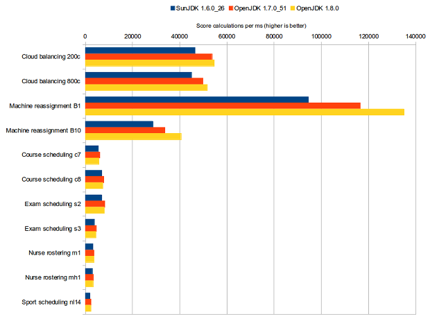

# 자바스크립트 개발자가 배워본 자바의 특징

```
자바스크립트 개발자 라는 표현이 적절한지 모르겠지만 react, vue, node, html만을 사용해본 개발자로써
자바를 배워보며 느꼈던 부분이나 독특했던부분 기억해야할 만한 부분에 대해 정리하였다.
```

## JAVA의 개요
```
썬 마이크로시스템즈에서 1995년에 개발한 객체 지향 프로그래밍 언어. 창시자는 제임스 고슬링이다. 2010년에 썬이 오라클에 인수되어서 현재 Java의 저작권자는 오라클이며, 2019년 1월부터 유료화되었다. 단, Java EE는 이클립스 재단의 소유이다.
```

## JAVA의 버전

자바는 버전이 다양하다, 처음 자바를 접했을때 1.8과 8,12 등등 여러가지의 버전과 EE SE 등등 여러가지의 버전으로 혼란스러웠다.

```
Java SE = 자바 표준안, 문법적 구성과 규칙
Java JDK = 자바개발에 필요한 도구들이 내장되어있고 구성요소를 포함하는 kit이다
Java JRE = 자바로 만든 프로그램을 실행하기 위한 라이브러리와 각종 파일들을 가지고 있다 (JDK 안에 포함되어있음)
Java JVM = 자바가 실제 구동되는 환경, 하드웨어나 운영체에 상관없이 동작할 수 있도록 하는것이 자바의 핵심적인 철학인데 그게 가능하도록 하는 것이 Java Viltual Muchine 이다.

Java SE = 가장 기본적이며 일반적으로 사용하는 자바버전
Java EE = 기업용 시장에서 사용하는 자바 개발환경
Java Me = 모바일 개발을 위해 사용하는 자바버전
```

## JAVA 버젼별 성능비교

- Java5 -> Java6 : 18% 성능향상 - Java6 -> Java7 : 46% 성능향상
- 낮을 수록 좋은 성능

<br>


- Java6 -> Java7 : 평균 16% 성능향상
- Java7 -> Java8 : 평균 1% 성능향상


## 오픈소스나 소스 라이브러리 release 시 GA, SNAPSHOT의 의미
스프링 시큐리티와 관련된 내용들을 읽다보면 GA 및 SNAPSHOT이라는 태그가 있는 것들을 보게된다,
자신에게 필요한 스프링 시큐리티 소스에 맞게 버전을 선택할 필요가 있다.

 - GA (General Availability) - 테스트가 완료된 정식 릴리즈 버전으로 안정적으로 운영되어야 하는 프로젝트에서 사용. 대부분 GA 버전을 가져다 사용하면 된다.
 - RC (Release Candidate) - 베타 버전이다. 정식 릴리즈 버전은 아니므로 기능은 픽스되었으나, 안정적 동작은 보장할 수없다.
 - M (Milestone) - 테스트 버전이다. 아직 기능이 픽스되지 않아 구현될때마다 테스트 버전이 릴리즈 될 수 있다.
 - SNAPSHOT - 스냅샷이 붙으면 아직 개발단계라는 의미이며, 일종의 백업시점인 것이다.
 
## JAVA의 장점
 
1. 기기의 호환성
- 장점으로는, 해당 운영체제에 Java Virtual Machine(JVM)을 설치하면 Java로 만든 프로그램은 어떤 컴퓨터에서도 완벽히 똑같이 동작한다. 가상머신이 각각의 운영체제에 맞춰서 결과적으로 완벽히 똑같이 돌아갈 수 있도록 제작되는 덕. 가상머신 없는 운영체제라면 아예 Java 프로그램을 사용하지 못하겠지만, 썬 마이크로시스템즈는 주요 OS용의 가상 머신을 발표하고 있고, IBM, 휴렛팩커드 등의 회사는 직접 자사 운영체제용 JDK/JVM을 제작하여 발표하며, 이들과 상관없이 독립적으로 특화된 성능향상 기능을 가진 JVM을 만들어서 발표하는 회사도 존재한다.

2. 안정성
- 다른 언어에 비해 높은 안정성을 꼽고 있다. 우선 C나 C++에 안정성 문제가 제기되는 포인터 연산자 및 메모리 직접접근 함수들을 지원하지 않는다. 여기에 C++과는 다르게 다중 상속을 허용하지 않는다. 이는 객체지향의 특성 중 하나인 '상속'의 자유도를 확 떨어트리는 것이기에 언뜻 보기에는 객체지향적 관점에 위배되는 것처럼 보일 수 있으나, 반대로 오히려 이게 더 객체지향적이라고 볼 수도 있다. 객체지향의 목적 자체가 재사용을 통한 생산성의 향상과 관리 상의 이점인데, 다중 상속은 잘못 사용할 시 극도로 복잡하게 꼬인 프로그램을 만들 위험성을 갖고 있다. 물론 코드 관리의 측면에서도 다중상속에 의해 발생하는 문제는 좋지 않다. 수준 높은 프로그래머라면 이 문제도 잘 해결할 수 있지만, Java는 아예 미연에 방지하기 위해 다중상속을 언어 스펙에서 제거하는 방법을 택했다.

3. 가독성
- 고급 프로그래밍 언어가 만들어진 첫째 목적은 '좀 더 인간 친화적인' 코드의 작성을 돕는 데 있다. 기계어가 어셈블리어로 진화하고 그것이 C언어로 진화한 배경에는 '사람이 더 쉽게 읽고 이해할 수 있는 코드'가 있다. Java는 동시기에 발표된 다른 언어에 비해 코드가 명료하고 가독성이 뛰어났다. C++은 어려운 문법으로 인해 코드가 이리저리 꼬이는 경우가 많고, 특히 연산자 오버로딩과 템플릿 기반의 일반화 프로그래밍(Generic Programming) 개념이 코드 난독화에 결정타를 날렸는데 Java는 연산자 오버로딩을 배제하고 오로지 메소드를 통해서만 객체의 조작을 허용함으로써 코드의 일관성을 지켜냈다.
 
## JAVA의 단점

1. 속도 문제
- 여기서 잠시 유의할 점은, 느리다는 내용은 대부분 C/C++, Pascal, Fortran 같은 네이티브 바이너리 코드를 만드는 언어와 비교했을 때의 이야기이다. Java가 C/C++보다 2~3배 느리다고 하지만 다른 고수준 언어들에 비해서는 그리 떨어지지 않는다.[19] 특히 인터프리터/스크립트 언어는 구조적으로 Java에 비해서도 훨씬 느리다는 것을 기억하자. 예를 들어 요즘 인기있는 Python은 C보다 수십 배 느리다. 그나마 빠르다고 하는 JavaScript도 Java에 비해서 2배 정도 느리다.

2. 불편한 예외 처리
- Java 역시 try~catch문으로 대표되는 예외 처리를 할 수 있다. 대부분의 언어에서 차용하고 있는 좋은 기능이지만... 유독 Java는 다른 언어와는 달리 프로그래머의 검사가 필요한 예외(Exception을 직접 상속하는 예외 클래스)가 등장한다면 무조건 프로그래머가 선언을 해줘야 한다. 그렇지 않으면 컴파일조차 거부한다.

