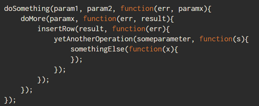

# async/await

## 자바스크립트에게 비동기란?
자바스크립트는 싱드스레드로 동작한다, 많이 들어보았을 것이다 하나의 스레드이기 때문에
한번에 하나의 작업만을 수행할 수 있다. 특히 Node.js 에서 웹서버를 구현할 때
모든 동작을 비동기로 처리하는 것은 매우 중요하다. 만약 동기로 처리하면 해당 처리가 완료될 때 까지
마치 서버가 멈춘 것처럼 다른 요청을 처리하지 못한다.

<br>

## 비동기가 대체 뭘까?

> 우리는 편의에 의해 금융/철학/과학/수학/역사/자연 등의 분야로 세상을 분리하지만  
> 이 모든일은 동시에 일어난다.

어디서 이 문구를 봤는지 기억이 않나는데 유발 하라리의 [사피엔스](http://www.yes24.com/Product/Goods/23030284) 라는 책에서
봤던 것 같다.. 검색으로 정확한 책이름을 찾고 싶은데 않나온다.

<br>

아무튼 실제세상에는 모든것이 동시에 일어나는 일종의 비동기 이다. 하지만 프로그래밍에서는 동기/비동기의 개념이 있다.


이미지: https://www.outsystems.com/blog/posts/asynchronous-vs-synchronous-programming/

#### 동기
예를들어 카드결제를 생각해보자 쇼핑몰에서 카드를 결제할 때에는 결제를 진행하는 동안 아무동작도 할 수 없다
하나의 작업이 끝날때 까지 다른작업이 중지되는 개념이다.

#### 비동기
동기 방식과 다르게 먼저 시작된 작업의 완료 여부와 상관없이 다음 프로세스를 실행한다.

#### 비동기가 왜 필요할까?
여러 이유와 사례가 있겠지만 이메일을 예로 들어보자, 만약 이메일을 발송하는데 1초가 걸리는데 1만명의 사람들에게 이메일을 발송하는데
이걸 동기로만 처리할 수 있다면 10,000초 동안 아무동작도 하지 못할것이다, 하지만 비동기로 처리한다면 10,000초 라는 시간이 걸리는 것은 동일하지만
다른 동작을 할 수 있게 해준다.

## callBack Hell



자바스크립트에서는 비동기로 동작하기 때문에 동기로 동작해줘야 하는 경우에는 콜백으로 처리를 해왔다.
위 이미지 처럼 어떠한 동작이 완료된 이후에 코드를 실행해야 할 때 callBack Hell이 펼쳐진다.
이런 코드구조는 가독성도 떨어지지만 코드를 관리하기도 어렵다.

## Promise

Promise는 콜백헬을 피하기 위한 해결책이다. 비동기 연산이 종료된 이후의 결과값이나 실패 이유를 처리하기 위한
처리기를 연결할 수 있도록 한다. 프로미스를 사용하면 비동기 메서드에서 마치 동기 메서드처럼 값을 반환할 수 있게 해준다.
다만 최종 결과를 반환하는 것은 아니고 프로미스를 반환한다.

<br>

Promise는 다음 중 하나의 상태를 가진다.

* 대기(pending): 이행하거나 거부되지 않은 초기 상태
* 이행(fulfilled): 연산이 성공적으로 완료됨
* 거부(rejected): 연산 실패함

<br>

## await는 최상위 레벨에서 작동하지 않는다.

```
let response = await fetch('/article/promise-chaining/user.json')
let user = await response.json()
```

최상위 레벨에서 await을 사용하려고 하면 문법 에러가 발생한다.

```
(async () => {
  let response = await fetch('/article/promise-chaining/user.json');
  let user = await response.json();
  ...
})();
```
하지만 익명함수로 감싸주게 되면 최상위 레벨에서도 await을 사용하는 것이 가능해 진다.
상당히 유용하다고 생각이 든다. 잘 기억해 놓자.

<br>

## async/await 이 Promise의 대체제 인가?

[여기](https://medium.com/@constell99/%EC%9E%90%EB%B0%94%EC%8A%A4%ED%81%AC%EB%A6%BD%ED%8A%B8%EC%9D%98-async-await-%EA%B0%80-promises%EB%A5%BC-%EC%82%AC%EB%9D%BC%EC%A7%80%EA%B2%8C-%EB%A7%8C%EB%93%A4-%EC%88%98-%EC%9E%88%EB%8A%94-6%EA%B0%80%EC%A7%80-%EC%9D%B4%EC%9C%A0-c5fe0add656c) 글을보면 4~5년 전 글이긴 하지만
async/await 이 promise를 대체하는 신기능 쯤으로 생각하는 것 같다. 내 짧은 지식이 잘못 판단하는 걸짐 모르지만 async/await이 proimse를 대체하기 위한
것은 아니라고 생각된다. 결국 async 함수가 Promise를 반환하는 것이니까 사실 대체 한다는 것은 이상한 말인 것 같다.

```
let myFunc = async () => {
    setTimeout(() => {
      console.log(2)
      return 2
    }, 2000)
}

console.log(1)
await myFunc()
console.log(3)
```
위 코드는 1,3,2가 콘솔에 출력된다 myFunc라는 함수가 콘솔을 출력한 이후 return을 하지만
위 방법으로는 우리가 원하는 대로 동기로 동작하게 할 수 없다.

```
let myFunc = async () => {
  return new Promise((resolve, reject) => {
    setTimeout(() => {
      console.log(2)
      resolve()
    }, 2000)
  })
}

console.log(1)
await myFunc()
console.log(3)
```
동기로 사용하고자 하는 코드가 Promise로 만들어져 있어야 동기적으로 실행하는 것이 가능하다.
실무에 개발하며 별 공수없이 await을 사용하는 라이브러리들도 모두 프로미스를 지원하기 때문에 이러한 사용이 가능한 것이다.